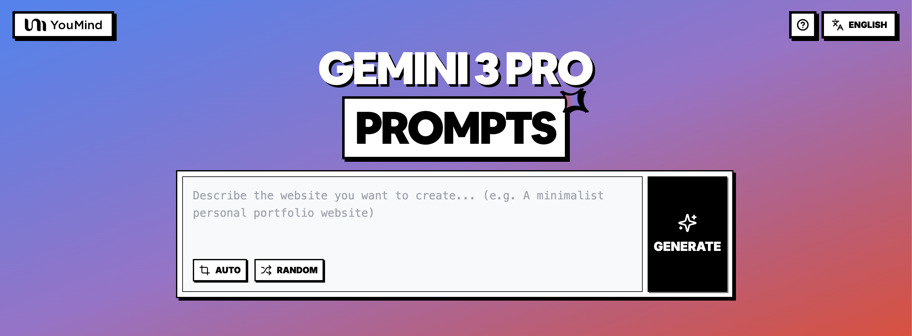
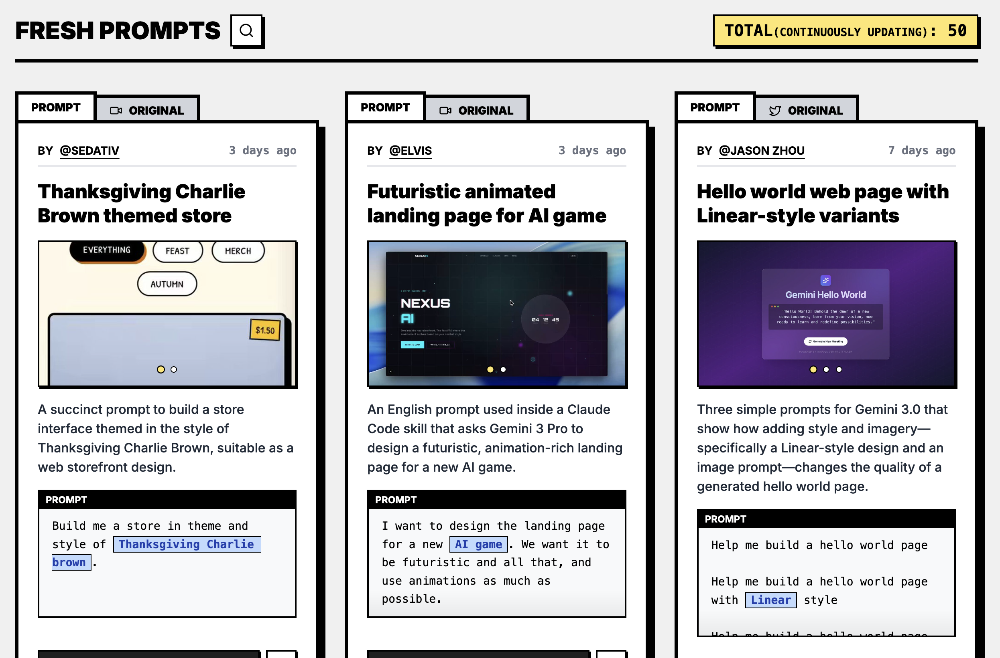

# 🚀 Gemini 3 プロンプト集

[](https://github.com/sindresorhus/awesome)
[](https://github.com/YouMind-OpenLab/awesome-gemini-3-prompts)
[](https://creativecommons.org/licenses/by/4.0/)
[](https://github.com/YouMind-OpenLab/awesome-gemini-3-prompts/actions)
[](docs/CONTRIBUTING.md)

> 🎨 Google Gemini 3 のマルチモーダル AI プロンプトコレクション

> 💡 **Note**: Nano Banana Pro の画像プロンプトに興味がある場合は、500以上の厳選されたプロンプトを含む別のリポジトリをご覧ください：https://github.com/YouMind-OpenLab/awesome-nano-banana-pro-prompts

> ⚠️ **著作権に関する通知**: すべてのプロンプトは教育目的でコミュニティから収集されています。権利を侵害していると思われるコンテンツがある場合は、[issue を作成](https://github.com/YouMind-OpenLab/awesome-gemini-3-prompts/issues/new?template=bug-report.yml)してください。速やかに削除いたします。

---

[](README.md) [](README_zh.md) [](README_zh-TW.md) [](README_ja-JP.md) [](README_ko-KR.md) [](README_th-TH.md) [](README_vi-VN.md) [](README_hi-IN.md) [](README_es-ES.md) [-Click%20to%20View-lightgrey)](README_es-419.md) [](README_de-DE.md) [](README_fr-FR.md) [](README_it-IT.md) [-Click%20to%20View-lightgrey)](README_pt-BR.md) [](README_pt-PT.md) [](README_tr-TR.md)

---

## 🌐 Web ギャラリーで見る

<div align="center">





</div>

**[👉 YouMind Gemini 3 プロンプトギャラリーを見る](https://youmind.com/gemini-3-prompts)**

ギャラリーを使用する理由

| Feature | GitHub README | youmind.com ギャラリー |
|---------|--------------|---------------------|
| 🎨 ビジュアルレイアウト | 線形リスト | 美しいメイソンリグリッド |
| 🔍 検索 | Ctrl+F のみ | 全文検索とフィルター |
| 🤖 AI ワンクリック生成 | - | AI ワンクリック生成 |
| 📱 モバイル | 基本 | 完全レスポンシブ |

---

## 📖 目次

- [🌐 Web ギャラリーで見る](#-view-in-web-gallery)
- [🤔 Gemini 3 とは？](#-what-is-gemini-3)
- [📊 統計](#-statistics)
- [🔥 おすすめプロンプト](#-featured-prompts)
- [📋 すべてのプロンプト](#-all-prompts)
- [🤝 貢献方法](#-how-to-contribute)
- [📄 ライセンス](#-license)
- [🙏 謝辞](#-acknowledgements)
- [⭐ スター履歴](#-star-history)

---

## 🤔 Gemini 3 とは？

**Gemini 3** は、Google がリリースした次世代マルチモーダル大規模言語モデルで、以下の特徴があります：

- 🎯 **超大コンテキストウィンドウ** - 100万トークンをサポートし、包括的な理解を実現
- 🎨 **マルチモーダルインテリジェンス** - テキスト、画像、音声、動画、コードを理解し生成
- ⚡ **実行型 AI** - 自動実行、リアルタイムプレビューでウェブサイトを直接生成、ワンクリックで公開
- 🌈 **強力な推論能力** - 高度な問題解決と複雑なタスク処理

📚 **詳細はこちら**：[Gemini 3: 10 の実例](https://youmind.com/blog/gemini-3-10-real-cases)

### 🚀 Raycast 統合

一部のプロンプトは [Raycast Snippets](https://raycast.com/help/snippets) 構文を使用した**動的引数**をサポートしています。🚀 Raycast Friendly バッジを探してください！

**例：**
```
A quote card with "{argument name="quote" default="Stay hungry, stay foolish"}"
by {argument name="author" default="Steve Jobs"}
```

Raycast で使用すると、引数を動的に置き換えて迅速に反復できます！

---

## 📊 統計

<div align="center">

| 指標 | 数 |
|--------|-------|
| 📝 プロンプト総数 | **49** |
| ⭐ おすすめ | **0** |
| 🔄 最終更新 | **2026年1月18日日曜日 1:40:34 UTC** |

</div>

---

## 📋 すべてのプロンプト

> 📝 公開日でソート（新しい順）

### No. 1: 感謝祭のチャーリー・ブラウンをテーマにしたストア


#### 📖 説明

感謝祭のチャーリー・ブラウンをテーマにした、ウェブストアのフロントデザインに適したストアインターフェースを構築するための簡潔なプロンプト。

#### 📝 プロンプト

```
{argument name="theme_en" default="Thanksgiving Charlie Brown"} のテーマとスタイルでストアを構築してください。
```

#### 🖼️ 示例画像

##### Image 1

<div align="center">

</div>

#### 📌 詳細

- **作者:** [Sedativ](https://x.com/sedgabi)
- **ソース:** [Twitter Post](https://x.com/sedgabi/status/1993326264741146985)
- **公開日:** 2025年11月25日
- **言語:** en

**[👉 今すぐ試す →](https://youmind.com/gemini-3-prompts?prompt=%7Bargument%20name%3D%22theme_en%22%20default%3D%22Thanksgiving%20Charlie%20Brown%22%7D%20%E3%81%AE%E3%83%86%E3%83%BC%E3%83%9E%E3%81%A8%E3%82%B9%E3%82%BF%E3%82%A4%E3%83%AB%E3%81%A7%E3%82%B9%E3%83%88%E3%82%A2%E3%82%92%E6%A7%8B%E7%AF%89%E3%81%97%E3%81%A6%E3%81%8F%E3%81%A0%E3%81%95%E3%81%84%E3%80%82)**

---

### No. 2: AI ゲーム向けの未来的なアニメーションランディングページ


#### 📖 説明

Claude Code スキル内で使用される英語のプロンプト。Gemini 3 Pro に、新しい AI ゲーム向けの未来的でアニメーションが豊富なランディング ページをデザインするよう依頼します。

#### 📝 プロンプト

```
新しい {argument name="product_type_en" default="AI ゲーム"} のランディング ページをデザインしたいと考えています。未来的な見た目にして、できるだけ多くのアニメーションを使用したいです。
```

#### 🖼️ 示例画像

##### Image 1

<div align="center">

</div>

#### 📌 詳細

- **作者:** [elvis](https://x.com/omarsar0)
- **ソース:** [Twitter Post](https://x.com/omarsar0/status/1993101718041903565)
- **公開日:** 2025年11月24日
- **言語:** en

**[👉 今すぐ試す →](https://youmind.com/gemini-3-prompts?prompt=%E6%96%B0%E3%81%97%E3%81%84%20%7Bargument%20name%3D%22product_type_en%22%20default%3D%22AI%20%E3%82%B2%E3%83%BC%E3%83%A0%22%7D%20%E3%81%AE%E3%83%A9%E3%83%B3%E3%83%87%E3%82%A3%E3%83%B3%E3%82%B0%20%E3%83%9A%E3%83%BC%E3%82%B8%E3%82%92%E3%83%87%E3%82%B6%E3%82%A4%E3%83%B3%E3%81%97%E3%81%9F%E3%81%84%E3%81%A8%E8%80%83%E3%81%88%E3%81%A6%E3%81%84%E3%81%BE%E3%81%99%E3%80%82%E6%9C%AA%E6%9D%A5%E7%9A%84%E3%81%AA%E8%A6%8B%E3%81%9F%E7%9B%AE%E3%81%AB%E3%81%97%E3%81%A6%E3%80%81%E3%81%A7%E3%81%8D%E3%82%8B%E3%81%A0%E3%81%91%E5%A4%9A%E3%81%8F%E3%81%AE%E3%82%A2%E3%83%8B%E3%83%A1%E3%83%BC%E3%82%B7%E3%83%A7%E3%83%B3%E3%82%92%E4%BD%BF%E7%94%A8%E3%81%97%E3%81%9F%E3%81%84%E3%81%A7%E3%81%99%E3%80%82)**

---

### No. 3: Linear スタイルのバリアントを使用した Hello world ウェブページ


#### 📖 説明

スタイルとイメージ、特にリニアスタイルのデザインと画像プロンプトを追加することで、生成される「Hello World」ページの品質がどのように変化するかを示す、Gemini 3.0 用の 3 つのシンプルなプロンプトです。

#### 📝 プロンプト

```
「Hello World」ページを作成してください。

{argument name="style_en" default="Linear"} スタイルの「Hello World」ページを作成してください。

{argument name="style_en" default="Linear"} スタイルの「Hello World」ページを作成してください。
```

#### 🖼️ 示例画像

##### Image 1

<div align="center">

</div>

##### Image 2

<div align="center">

</div>

##### Image 3

<div align="center">

</div>

#### 📌 詳細

- **作者:** [Jason Zhou](https://x.com/jasonzhou1993)
- **ソース:** [Twitter Post](https://x.com/jasonzhou1993/status/1991754086417682891)
- **公開日:** 2025年11月21日
- **言語:** en

**[👉 今すぐ試す →](https://youmind.com/gemini-3-prompts?prompt=%E3%80%8CHello%20World%E3%80%8D%E3%83%9A%E3%83%BC%E3%82%B8%E3%82%92%E4%BD%9C%E6%88%90%E3%81%97%E3%81%A6%E3%81%8F%E3%81%A0%E3%81%95%E3%81%84%E3%80%82%0A%0A%7Bargument%20name%3D%22style_en%22%20default%3D%22Linear%22%7D%20%E3%82%B9%E3%82%BF%E3%82%A4%E3%83%AB%E3%81%AE%E3%80%8CHello%20World%E3%80%8D%E3%83%9A%E3%83%BC%E3%82%B8%E3%82%92%E4%BD%9C%E6%88%90%E3%81%97%E3%81%A6%E3%81%8F%E3%81%A0%E3%81%95%E3%81%84%E3%80%82%0A%0A%7Bargument%20name%3D%22style_en%22%20default%3D%22Linear%22%7D%20%E3%82%B9%E3%82%BF%E3%82%A4%E3%83%AB%E3%81%AE%E3%80%8CHello%20World%E3%80%8D%E3%83%9A%E3%83%BC%E3%82%B8%E3%82%92%E4%BD%9C%E6%88%90%E3%81%97%E3%81%A6%E3%81%8F%E3%81%A0%E3%81%95%E3%81%84%E3%80%82)**

---

### No. 4: ラグジュアリー 3D ウォッチ製品体験ページ (Next.js + Three.js)


#### 📖 説明

高級時計向けの豪華な 3D 製品体験ウェブページをデザインするための、詳細な日本語プロンプト。Next.js、Three.js、React Three Fiber、GLSL を使用し、特定のスクロールセクションとシェーダー要件を盛り込む。

#### 📝 プロンプト

```
高級腕時計の 3D プロダクト体験ページをデザインする。
**ターゲットユーザー:** 富裕層の顧客、時計愛好家、30～50 歳のビジネスパーソン。
**ブランドトーン:** ラグジュアリー × テック (モダンで洗練されたハイエンドな雰囲気)。
スクロール体験 (5 セクション):
ヒーローセクション – 腕時計が暗闇から光の中へゆっくりと現れ、回転する。ホログラフィック効果とフレネル反射をカスタムシェーダーで実装する。
詳細ズーム – 文字盤のクローズアップ。GLSL を使用して、金属的な反射、パララックスマッピング、リアルタイムの光沢を実現する。
メカニズム分解 – 時計が分解され、内部のムーブメントが空間に浮かぶ。エネルギーフィールド効果のためにディスプレイスメントシェーダーを使用し、各パーツにグロー効果を追加する。
素材体験 – さまざまな素材のバリエーションを切り替える。金属感、ガラスの屈折、チタンのマットな質感を PBR シェーダーで物理ベースで表現する。
エンディング – 時計が再構築され、カスタムシェーダーで作成された抽象的なグラデーションメッシュの背景が表示される。ブルームや被写界深度などのポストプロセスを適用する。
**技術スタック:** Next.js 15 + Three.js + React Three Fiber + GLSL (カスタムシェーダー) + react-postprocessing + Lenis。
シェーダー要件:
フレネル反射シェーダー (リムライト効果)
PBR マテリアルシェーダー (ラフネス、メタリック、AO)
ホログラフィックシェーダー (玉虫色の干渉効果)
ディスプレイスメントシェーダー (波打ちと歪み効果)
カスタム背景シェーダー (グラデーションノイズ)
ポストプロセス: Bloom、ChromaticAberration、DepthOfField、Vignette。
以下の具体的な数値の提案をお願いします:
各セクションのスクロール範囲 (% または vh 単位)
アニメーションパラメーター (位置、回転、スケールなどの開始/終了値)
イージング関数 (イーズタイプ)
カメラの FOV、位置、ターゲット値
ライティング設定 (強度、色、位置)
各シェーダーのユニフォーム値 (時間進行、スクロール進行、色相、強度など)。
```

#### 🖼️ 示例画像

##### Image 1

<div align="center">

</div>

#### 📌 詳細

- **作者:** [Shin@プログラミングチュートリアル](https://x.com/Shin_Engineer)
- **ソース:** [Twitter Post](https://x.com/Shin_Engineer/status/1991740779652657455)
- **公開日:** 2025年11月21日
- **言語:** ja

**[👉 今すぐ試す →](https://youmind.com/gemini-3-prompts?prompt=%E9%AB%98%E7%B4%9A%E8%85%95%E6%99%82%E8%A8%88%E3%81%AE%203D%20%E3%83%97%E3%83%AD%E3%83%80%E3%82%AF%E3%83%88%E4%BD%93%E9%A8%93%E3%83%9A%E3%83%BC%E3%82%B8%E3%82%92%E3%83%87%E3%82%B6%E3%82%A4%E3%83%B3%E3%81%99%E3%82%8B%E3%80%82%0A**%E3%82%BF%E3%83%BC%E3%82%B2%E3%83%83%E3%83%88%E3%83%A6%E3%83%BC%E3%82%B6%E3%83%BC%3A**%20%E5%AF%8C%E8%A3%95%E5%B1%A4%E3%81%AE%E9%A1%A7%E5%AE%A2%E3%80%81%E6%99%82%E8%A8%88%E6%84%9B%E5%A5%BD%E5%AE%B6%E3%80%8130%EF%BD%9E50%20%E6%AD%B3%E3%81%AE%E3%83%93%E3%82%B8%E3%83%8D%E3%82%B9%E3%83%91%E3%83%BC%E3%82%BD%E3%83%B3%E3%80%82%0A**%E3%83%96%E3%83%A9%E3%83%B3%E3%83%89%E3%83%88%E3%83%BC%E3%83%B3%3A**%20%E3%83%A9%E3%82%B0%E3%82%B8%E3%83%A5%E3%82%A2%E3%83%AA%E3%83%BC%20%C3%97%20%E3%83%86%E3%83%83%E3%82%AF%20(%E3%83%A2%E3%83%80%E3%83%B3%E3%81%A7%E6%B4%97%E7%B7%B4%E3%81%95%E3%82%8C%E3%81%9F%E3%83%8F%E3%82%A4%E3%82%A8%E3%83%B3%E3%83%89%E3%81%AA%E9%9B%B0%E5%9B%B2%E6%B0%97)%E3%80%82%0A%E3%82%B9%E3%82%AF%E3%83%AD%E3%83%BC%E3%83%AB%E4%BD%93%E9%A8%93%20(5%20%E3%82%BB%E3%82%AF%E3%82%B7%E3%83%A7%E3%83%B3)%3A%0A%E3%83%92%E3%83%BC%E3%83%AD%E3%83%BC%E3%82%BB%E3%82%AF%E3%82%B7%E3%83%A7%E3%83%B3%20%E2%80%93%20%E8%85%95%E6%99%82%E8%A8%88%E3%81%8C%E6%9A%97%E9%97%87%E3%81%8B%E3%82%89%E5%85%89%E3%81%AE%E4%B8%AD%E3%81%B8%E3%82%86%E3%81%A3%E3%81%8F%E3%82%8A%E3%81%A8%E7%8F%BE%E3%82%8C%E3%80%81%E5%9B%9E%E8%BB%A2%E3%81%99%E3%82%8B%E3%80%82%E3%83%9B%E3%83%AD%E3%82%B0%E3%83%A9%E3%83%95%E3%82%A3%E3%83%83%E3%82%AF%E5%8A%B9%E6%9E%9C%E3%81%A8%E3%83%95%E3%83%AC%E3%83%8D%E3%83%AB%E5%8F%8D%E5%B0%84%E3%82%92%E3%82%AB%E3%82%B9%E3%82%BF%E3%83%A0%E3%82%B7%E3%82%A7%E3%83%BC%E3%83%80%E3%83%BC%E3%81%A7%E5%AE%9F%E8%A3%85%E3%81%99%E3%82%8B%E3%80%82%0A%E8%A9%B3%E7%B4%B0%E3%82%BA%E3%83%BC%E3%83%A0%20%E2%80%93%20%E6%96%87%E5%AD%97%E7%9B%A4%E3%81%AE%E3%82%AF%E3%83%AD%E3%83%BC%E3%82%BA%E3%82%A2%E3%83%83%E3%83%97%E3%80%82GLSL%20%E3%82%92%E4%BD%BF%E7%94%A8%E3%81%97%E3%81%A6%E3%80%81%E9%87%91%E5%B1%9E%E7%9A%84%E3%81%AA%E5%8F%8D%E5%B0%84%E3%80%81%E3%83%91%E3%83%A9%E3%83%A9%E3%83%83%E3%82%AF%E3%82%B9%E3%83%9E%E3%83%83%E3%83%94%E3%83%B3%E3%82%B0%E3%80%81%E3%83%AA%E3%82%A2%E3%83%AB%E3%82%BF%E3%82%A4%E3%83%A0%E3%81%AE%E5%85%89%E6%B2%A2%E3%82%92%E5%AE%9F%E7%8F%BE%E3%81%99%E3%82%8B%E3%80%82%0A%E3%83%A1%E3%82%AB%E3%83%8B%E3%82%BA%E3%83%A0%E5%88%86%E8%A7%A3%20%E2%80%93%20%E6%99%82%E8%A8%88%E3%81%8C%E5%88%86%E8%A7%A3%E3%81%95%E3%82%8C%E3%80%81%E5%86%85%E9%83%A8%E3%81%AE%E3%83%A0%E3%83%BC%E3%83%96%E3%83%A1%E3%83%B3%E3%83%88%E3%81%8C%E7%A9%BA%E9%96%93%E3%81%AB%E6%B5%AE%E3%81%8B%E3%81%B6%E3%80%82%E3%82%A8%E3%83%8D%E3%83%AB%E3%82%AE%E3%83%BC%E3%83%95%E3%82%A3%E3%83%BC%E3%83%AB%E3%83%89%E5%8A%B9%E6%9E%9C%E3%81%AE%E3%81%9F%E3%82%81%E3%81%AB%E3%83%87%E3%82%A3%E3%82%B9%E3%83%97%E3%83%AC%E3%82%A4%E3%82%B9%E3%83%A1%E3%83%B3%E3%83%88%E3%82%B7%E3%82%A7%E3%83%BC%E3%83%80%E3%83%BC%E3%82%92%E4%BD%BF%E7%94%A8%E3%81%97%E3%80%81%E5%90%84%E3%83%91%E3%83%BC%E3%83%84%E3%81%AB%E3%82%B0%E3%83%AD%E3%83%BC%E5%8A%B9%E6%9E%9C%E3%82%92%E8%BF%BD%E5%8A%A0%E3%81%99%E3%82%8B%E3%80%82%0A%E7%B4%A0%E6%9D%90%E4%BD%93%E9%A8%93%20%E2%80%93%20%E3%81%95%E3%81%BE%E3%81%96%E3%81%BE%E3%81%AA%E7%B4%A0%E6%9D%90%E3%81%AE%E3%83%90%E3%83%AA%E3%82%A8%E3%83%BC%E3%82%B7%E3%83%A7%E3%83%B3%E3%82%92%E5%88%87%E3%82%8A%E6%9B%BF%E3%81%88%E3%82%8B%E3%80%82%E9%87%91%E5%B1%9E%E6%84%9F%E3%80%81%E3%82%AC%E3%83%A9%E3%82%B9%E3%81%AE%E5%B1%88%E6%8A%98%E3%80%81%E3%83%81%E3%82%BF%E3%83%B3%E3%81%AE%E3%83%9E%E3%83%83%E3%83%88%E3%81%AA%E8%B3%AA%E6%84%9F%E3%82%92%20PBR%20%E3%82%B7%E3%82%A7%E3%83%BC%E3%83%80%E3%83%BC%E3%81%A7%E7%89%A9%E7%90%86%E3%83%99%E3%83%BC%E3%82%B9%E3%81%A7%E8%A1%A8%E7%8F%BE%E3%81%99%E3%82%8B%E3%80%82%0A%E3%82%A8%E3%83%B3%E3%83%87%E3%82%A3%E3%83%B3%E3%82%B0%20%E2%80%93%20%E6%99%82%E8%A8%88%E3%81%8C%E5%86%8D%E6%A7%8B%E7%AF%89%E3%81%95%E3%82%8C%E3%80%81%E3%82%AB%E3%82%B9%E3%82%BF%E3%83%A0%E3%82%B7%E3%82%A7%E3%83%BC%E3%83%80%E3%83%BC%E3%81%A7%E4%BD%9C%E6%88%90%E3%81%95%E3%82%8C%E3%81%9F%E6%8A%BD%E8%B1%A1%E7%9A%84%E3%81%AA%E3%82%B0%E3%83%A9%E3%83%87%E3%83%BC%E3%82%B7%E3%83%A7%E3%83%B3%E3%83%A1%E3%83%83%E3%82%B7%E3%83%A5%E3%81%AE%E8%83%8C%E6%99%AF%E3%81%8C%E8%A1%A8%E7%A4%BA%E3%81%95%E3%82%8C%E3%82%8B%E3%80%82%E3%83%96%E3%83%AB%E3%83%BC%E3%83%A0%E3%82%84%E8%A2%AB%E5%86%99%E7%95%8C%E6%B7%B1%E5%BA%A6%E3%81%AA%E3%81%A9%E3%81%AE%E3%83%9D%E3%82%B9%E3%83%88%E3%83%97%E3%83%AD%E3%82%BB%E3%82%B9%E3%82%92%E9%81%A9%E7%94%A8%E3%81%99%E3%82%8B%E3%80%82%0A**%E6%8A%80%E8%A1%93%E3%82%B9%E3%82%BF%E3%83%83%E3%82%AF%3A**%20Next.js%2015%20%2B%20Three.js%20%2B%20React%20Three%20Fiber%20%2B%20GLSL%20(%E3%82%AB%E3%82%B9%E3%82%BF%E3%83%A0%E3%82%B7%E3%82%A7%E3%83%BC%E3%83%80%E3%83%BC)%20%2B%20react-postprocessing%20%2B%20Lenis%E3%80%82%0A%E3%82%B7%E3%82%A7%E3%83%BC%E3%83%80%E3%83%BC%E8%A6%81%E4%BB%B6%3A%0A%E3%83%95%E3%83%AC%E3%83%8D%E3%83%AB%E5%8F%8D%E5%B0%84%E3%82%B7%E3%82%A7%E3%83%BC%E3%83%80%E3%83%BC%20(%E3%83%AA%E3%83%A0%E3%83%A9%E3%82%A4%E3%83%88%E5%8A%B9%E6%9E%9C)%0APBR%20%E3%83%9E%E3%83%86%E3%83%AA%E3%82%A2%E3%83%AB%E3%82%B7%E3%82%A7%E3%83%BC%E3%83%80%E3%83%BC%20(%E3%83%A9%E3%83%95%E3%83%8D%E3%82%B9%E3%80%81%E3%83%A1%E3%82%BF%E3%83%AA%E3%83%83%E3%82%AF%E3%80%81AO)%0A%E3%83%9B%E3%83%AD%E3%82%B0%E3%83%A9%E3%83%95%E3%82%A3%E3%83%83%E3%82%AF%E3%82%B7%E3%82%A7%E3%83%BC%E3%83%80%E3%83%BC%20(%E7%8E%89%E8%99%AB%E8%89%B2%E3%81%AE%E5%B9%B2%E6%B8%89%E5%8A%B9%E6%9E%9C)%0A%E3%83%87%E3%82%A3%E3%82%B9%E3%83%97%E3%83%AC%E3%82%A4%E3%82%B9%E3%83%A1%E3%83%B3%E3%83%88%E3%82%B7%E3%82%A7%E3%83%BC%E3%83%80%E3%83%BC%20(%E6%B3%A2%E6%89%93%E3%81%A1%E3%81%A8%E6%AD%AA%E3%81%BF%E5%8A%B9%E6%9E%9C)%0A%E3%82%AB%E3%82%B9%E3%82%BF%E3%83%A0%E8%83%8C%E6%99%AF%E3%82%B7%E3%82%A7%E3%83%BC%E3%83%80%E3%83%BC%20(%E3%82%B0%E3%83%A9%E3%83%87%E3%83%BC%E3%82%B7%E3%83%A7%E3%83%B3%E3%83%8E%E3%82%A4%E3%82%BA)%0A%E3%83%9D%E3%82%B9%E3%83%88%E3%83%97%E3%83%AD%E3%82%BB%E3%82%B9%3A%20Bloom%E3%80%81ChromaticAberration%E3%80%81DepthOfField%E3%80%81Vignette%E3%80%82%0A%E4%BB%A5%E4%B8%8B%E3%81%AE%E5%85%B7%E4%BD%93%E7%9A%84%E3%81%AA%E6%95%B0%E5%80%A4%E3%81%AE%E6%8F%90%E6%A1%88%E3%82%92%E3%81%8A%E9%A1%98%E3%81%84%E3%81%97%E3%81%BE%E3%81%99%3A%0A%E5%90%84%E3%82%BB%E3%82%AF%E3%82%B7%E3%83%A7%E3%83%B3%E3%81%AE%E3%82%B9%E3%82%AF%E3%83%AD%E3%83%BC%E3%83%AB%E7%AF%84%E5%9B%B2%20(%25%20%E3%81%BE%E3%81%9F%E3%81%AF%20vh%20%E5%8D%98%E4%BD%8D)%0A%E3%82%A2%E3%83%8B%E3%83%A1%E3%83%BC%E3%82%B7%E3%83%A7%E3%83%B3%E3%83%91%E3%83%A9%E3%83%A1%E3%83%BC%E3%82%BF%E3%83%BC%20(%E4%BD%8D%E7%BD%AE%E3%80%81%E5%9B%9E%E8%BB%A2%E3%80%81%E3%82%B9%E3%82%B1%E3%83%BC%E3%83%AB%E3%81%AA%E3%81%A9%E3%81%AE%E9%96%8B%E5%A7%8B%2F%E7%B5%82%E4%BA%86%E5%80%A4)%0A%E3%82%A4%E3%83%BC%E3%82%B8%E3%83%B3%E3%82%B0%E9%96%A2%E6%95%B0%20(%E3%82%A4%E3%83%BC%E3%82%BA%E3%82%BF%E3%82%A4%E3%83%97)%0A%E3%82%AB%E3%83%A1%E3%83%A9%E3%81%AE%20FOV%E3%80%81%E4%BD%8D%E7%BD%AE%E3%80%81%E3%82%BF%E3%83%BC%E3%82%B2%E3%83%83%E3%83%88%E5%80%A4%0A%E3%83%A9%E3%82%A4%E3%83%86%E3%82%A3%E3%83%B3%E3%82%B0%E8%A8%AD%E5%AE%9A%20(%E5%BC%B7%E5%BA%A6%E3%80%81%E8%89%B2%E3%80%81%E4%BD%8D%E7%BD%AE)%0A%E5%90%84%E3%82%B7%E3%82%A7%E3%83%BC%E3%83%80%E3%83%BC%E3%81%AE%E3%83%A6%E3%83%8B%E3%83%95%E3%82%A9%E3%83%BC%E3%83%A0%E5%80%A4%20(%E6%99%82%E9%96%93%E9%80%B2%E8%A1%8C%E3%80%81%E3%82%B9%E3%82%AF%E3%83%AD%E3%83%BC%E3%83%AB%E9%80%B2%E8%A1%8C%E3%80%81%E8%89%B2%E7%9B%B8%E3%80%81%E5%BC%B7%E5%BA%A6%E3%81%AA%E3%81%A9)%E3%80%82)**

---

### No. 5: 遊び心のあるゼルダのビデオキャプチャエディタープロンプト


#### 📖 説明

WebCodecs を使用してエディターを構築し、「ゼルダの伝説 ブレス オブ ザ ワイルド」のゲームプレイをキャプチャする様子を、ベテラン ゲーム プログラミング マスターになりきって描写する、ユーモラスな中国語のプロンプト。

#### 📝 プロンプト

```
あなたはベテランのゲームプログラミングマスターです。WebCodecs をレンダリングモジュールとして使用するエディターの作成を手伝ってください。Switch の電源を入れ、{argument name="game_title_en" default="The Legend of Zelda: Breath of the Wild"} を挿入します。カートリッジをなめないように注意してください。少し苦いです。プロ仕様のキャプチャカードを使用してビデオをキャプチャし、忘れられた神殿のチャレンジを完了し、風の爆弾を使い、これらすべてを 60 秒の時間制限内で行ってください。
```

#### 🖼️ 示例画像

##### Image 1

<div align="center">

</div>

#### 📌 詳細

- **作者:** [海拉鲁编程客](https://x.com/hylarucoder)
- **ソース:** [Twitter Post](https://x.com/hylarucoder/status/1991491913720218098)
- **公開日:** 2025年11月20日
- **言語:** zh

**[👉 今すぐ試す →](https://youmind.com/gemini-3-prompts?prompt=%E3%81%82%E3%81%AA%E3%81%9F%E3%81%AF%E3%83%99%E3%83%86%E3%83%A9%E3%83%B3%E3%81%AE%E3%82%B2%E3%83%BC%E3%83%A0%E3%83%97%E3%83%AD%E3%82%B0%E3%83%A9%E3%83%9F%E3%83%B3%E3%82%B0%E3%83%9E%E3%82%B9%E3%82%BF%E3%83%BC%E3%81%A7%E3%81%99%E3%80%82WebCodecs%20%E3%82%92%E3%83%AC%E3%83%B3%E3%83%80%E3%83%AA%E3%83%B3%E3%82%B0%E3%83%A2%E3%82%B8%E3%83%A5%E3%83%BC%E3%83%AB%E3%81%A8%E3%81%97%E3%81%A6%E4%BD%BF%E7%94%A8%E3%81%99%E3%82%8B%E3%82%A8%E3%83%87%E3%82%A3%E3%82%BF%E3%83%BC%E3%81%AE%E4%BD%9C%E6%88%90%E3%82%92%E6%89%8B%E4%BC%9D%E3%81%A3%E3%81%A6%E3%81%8F%E3%81%A0%E3%81%95%E3%81%84%E3%80%82Switch%20%E3%81%AE%E9%9B%BB%E6%BA%90%E3%82%92%E5%85%A5%E3%82%8C%E3%80%81%7Bargument%20name%3D%22game_title_en%22%20default%3D%22The%20Legend%20of%20Zelda%3A%20Breath%20of%20the%20Wild%22%7D%20%E3%82%92%E6%8C%BF%E5%85%A5%E3%81%97%E3%81%BE%E3%81%99%E3%80%82%E3%82%AB%E3%83%BC%E3%83%88%E3%83%AA%E3%83%83%E3%82%B8%E3%82%92%E3%81%AA%E3%82%81%E3%81%AA%E3%81%84%E3%82%88%E3%81%86%E3%81%AB%E6%B3%A8%E6%84%8F%E3%81%97%E3%81%A6%E3%81%8F%E3%81%A0%E3%81%95%E3%81%84%E3%80%82%E5%B0%91%E3%81%97%E8%8B%A6%E3%81%84%E3%81%A7%E3%81%99%E3%80%82%E3%83%97%E3%83%AD%E4%BB%95%E6%A7%98%E3%81%AE%E3%82%AD%E3%83%A3%E3%83%97%E3%83%81%E3%83%A3%E3%82%AB%E3%83%BC%E3%83%89%E3%82%92%E4%BD%BF%E7%94%A8%E3%81%97%E3%81%A6%E3%83%93%E3%83%87%E3%82%AA%E3%82%92%E3%82%AD%E3%83%A3%E3%83%97%E3%83%81%E3%83%A3%E3%81%97%E3%80%81%E5%BF%98%E3%82%8C%E3%82%89%E3%82%8C%E3%81%9F%E7%A5%9E%E6%AE%BF%E3%81%AE%E3%83%81%E3%83%A3%E3%83%AC%E3%83%B3%E3%82%B8%E3%82%92%E5%AE%8C%E4%BA%86%E3%81%97%E3%80%81%E9%A2%A8%E3%81%AE%E7%88%86%E5%BC%BE%E3%82%92%E4%BD%BF%E3%81%84%E3%80%81%E3%81%93%E3%82%8C%E3%82%89%E3%81%99%E3%81%B9%E3%81%A6%E3%82%92%2060%20%E7%A7%92%E3%81%AE%E6%99%82%E9%96%93%E5%88%B6%E9%99%90%E5%86%85%E3%81%A7%E8%A1%8C%E3%81%A3%E3%81%A6%E3%81%8F%E3%81%A0%E3%81%95%E3%81%84%E3%80%82)**

---

### No. 6: アニメーションセクションを備えたラグジュアリースマートウォッチ Three.js ランディングページ


#### 📖 説明

Gemini 3 Pro を使用して、Three.js、Anime.js、Tailwind で豪華なスマートウォッチのランディングページを構築し、その後、高度なアニメーションとインタラクションを備えた複数セクションのスクロールサイトに改良するための、詳細な多段階プロンプトシーケンス。

#### 📝 プロンプト

```
Three.js、Anime.js、Tailwind を使用して、{argument name="product_type_en" default="高級スマートウォッチ"} ページの HTML ファイルを 1 つ作成してください。3D の {argument name="main_object_en" default="時計"} モデル、{argument name="main_object_background_en" default="ベージュの時計"} を表示する丸い穴のある暗いテクスチャのオーバーレイを作成し、ページ読み込み時にヘッダーと大きな数字がスライドインするようにアニメーション化してください。

ページをよりプロフェッショナルにしてください。静的な穴を、読み込み時に開くアイリスに置き換えてください。{argument name="focus_area_en" default="時計の文字盤"} の上に反射のあるガラスドームを追加し、金属素材を改善し、マウスの視差効果を追加してカーソルに合わせて {argument name="parallax_target_en" default="時計"} が回転するようにし、{argument name="dial_area_en" default="時計の文字盤"} に時刻とフィットネスリングを描画してください。

単一の画面をマルチセクションスクロールサイトに変換してください。ユーザーがスクロールすると、3D の {argument name="scroll_object_en" default="時計"} が各セクションに合わせて移動および回転するようにアニメーション化してください。テキストがそれらの上をスクロールする間、3D キャンバスと背景は固定されたままにし、{argument name="moving_element_en" default="時計"} のみが移動するようにしてください。

- 固定キャンバス: キャンバスを配置する
```

#### 🖼️ 示例画像

##### Image 1

<div align="center">

</div>

#### 📌 詳細

- **作者:** [Harshith](https://x.com/HarshithLucky3)
- **ソース:** [Twitter Post](https://x.com/HarshithLucky3/status/1991474311916580881)
- **公開日:** 2025年11月20日
- **言語:** en

**[👉 今すぐ試す →](https://youmind.com/gemini-3-prompts?prompt=Three.js%E3%80%81Anime.js%E3%80%81Tailwind%20%E3%82%92%E4%BD%BF%E7%94%A8%E3%81%97%E3%81%A6%E3%80%81%7Bargument%20name%3D%22product_type_en%22%20default%3D%22%E9%AB%98%E7%B4%9A%E3%82%B9%E3%83%9E%E3%83%BC%E3%83%88%E3%82%A6%E3%82%A9%E3%83%83%E3%83%81%22%7D%20%E3%83%9A%E3%83%BC%E3%82%B8%E3%81%AE%20HTML%20%E3%83%95%E3%82%A1%E3%82%A4%E3%83%AB%E3%82%92%201%20%E3%81%A4%E4%BD%9C%E6%88%90%E3%81%97%E3%81%A6%E3%81%8F%E3%81%A0%E3%81%95%E3%81%84%E3%80%823D%20%E3%81%AE%20%7Bargument%20name%3D%22main_object_en%22%20default%3D%22%E6%99%82%E8%A8%88%22%7D%20%E3%83%A2%E3%83%87%E3%83%AB%E3%80%81%7Bargument%20name%3D%22main_object_background_en%22%20default%3D%22%E3%83%99%E3%83%BC%E3%82%B8%E3%83%A5%E3%81%AE%E6%99%82%E8%A8%88%22%7D%20%E3%82%92%E8%A1%A8%E7%A4%BA%E3%81%99%E3%82%8B%E4%B8%B8%E3%81%84%E7%A9%B4%E3%81%AE%E3%81%82%E3%82%8B%E6%9A%97%E3%81%84%E3%83%86%E3%82%AF%E3%82%B9%E3%83%81%E3%83%A3%E3%81%AE%E3%82%AA%E3%83%BC%E3%83%90%E3%83%BC%E3%83%AC%E3%82%A4%E3%82%92%E4%BD%9C%E6%88%90%E3%81%97%E3%80%81%E3%83%9A%E3%83%BC%E3%82%B8%E8%AA%AD%E3%81%BF%E8%BE%BC%E3%81%BF%E6%99%82%E3%81%AB%E3%83%98%E3%83%83%E3%83%80%E3%83%BC%E3%81%A8%E5%A4%A7%E3%81%8D%E3%81%AA%E6%95%B0%E5%AD%97%E3%81%8C%E3%82%B9%E3%83%A9%E3%82%A4%E3%83%89%E3%82%A4%E3%83%B3%E3%81%99%E3%82%8B%E3%82%88%E3%81%86%E3%81%AB%E3%82%A2%E3%83%8B%E3%83%A1%E3%83%BC%E3%82%B7%E3%83%A7%E3%83%B3%E5%8C%96%E3%81%97%E3%81%A6%E3%81%8F%E3%81%A0%E3%81%95%E3%81%84%E3%80%82%0A%0A%E3%83%9A%E3%83%BC%E3%82%B8%E3%82%92%E3%82%88%E3%82%8A%E3%83%97%E3%83%AD%E3%83%95%E3%82%A7%E3%83%83%E3%82%B7%E3%83%A7%E3%83%8A%E3%83%AB%E3%81%AB%E3%81%97%E3%81%A6%E3%81%8F%E3%81%A0%E3%81%95%E3%81%84%E3%80%82%E9%9D%99%E7%9A%84%E3%81%AA%E7%A9%B4%E3%82%92%E3%80%81%E8%AA%AD%E3%81%BF%E8%BE%BC%E3%81%BF%E6%99%82%E3%81%AB%E9%96%8B%E3%81%8F%E3%82%A2%E3%82%A4%E3%83%AA%E3%82%B9%E3%81%AB%E7%BD%AE%E3%81%8D%E6%8F%9B%E3%81%88%E3%81%A6%E3%81%8F%E3%81%A0%E3%81%95%E3%81%84%E3%80%82%7Bargument%20name%3D%22focus_area_en%22%20default%3D%22%E6%99%82%E8%A8%88%E3%81%AE%E6%96%87%E5%AD%97%E7%9B%A4%22%7D%20%E3%81%AE%E4%B8%8A%E3%81%AB%E5%8F%8D%E5%B0%84%E3%81%AE%E3%81%82%E3%82%8B%E3%82%AC%E3%83%A9%E3%82%B9%E3%83%89%E3%83%BC%E3%83%A0%E3%82%92%E8%BF%BD%E5%8A%A0%E3%81%97%E3%80%81%E9%87%91%E5%B1%9E%E7%B4%A0%E6%9D%90%E3%82%92%E6%94%B9%E5%96%84%E3%81%97%E3%80%81%E3%83%9E%E3%82%A6%E3%82%B9%E3%81%AE%E8%A6%96%E5%B7%AE%E5%8A%B9%E6%9E%9C%E3%82%92%E8%BF%BD%E5%8A%A0%E3%81%97%E3%81%A6%E3%82%AB%E3%83%BC%E3%82%BD%E3%83%AB%E3%81%AB%E5%90%88%E3%82%8F%E3%81%9B%E3%81%A6%20%7Bargument%20name%3D%22parallax_target_en%22%20default%3D%22%E6%99%82%E8%A8%88%22%7D%20%E3%81%8C%E5%9B%9E%E8%BB%A2%E3%81%99%E3%82%8B%E3%82%88%E3%81%86%E3%81%AB%E3%81%97%E3%80%81%7Bargument%20name%3D%22dial_area_en%22%20default%3D%22%E6%99%82%E8%A8%88%E3%81%AE%E6%96%87%E5%AD%97%E7%9B%A4%22%7D%20%E3%81%AB%E6%99%82%E5%88%BB%E3%81%A8%E3%83%95%E3%82%A3%E3%83%83%E3%83%88%E3%83%8D%E3%82%B9%E3%83%AA%E3%83%B3%E3%82%B0%E3%82%92%E6%8F%8F%E7%94%BB%E3%81%97%E3%81%A6%E3%81%8F%E3%81%A0%E3%81%95%E3%81%84%E3%80%82%0A%0A%E5%8D%98%E4%B8%80%E3%81%AE%E7%94%BB%E9%9D%A2%E3%82%92%E3%83%9E%E3%83%AB%E3%83%81%E3%82%BB%E3%82%AF%E3%82%B7%E3%83%A7%E3%83%B3%E3%82%B9%E3%82%AF%E3%83%AD%E3%83%BC%E3%83%AB%E3%82%B5%E3%82%A4%E3%83%88%E3%81%AB%E5%A4%89%E6%8F%9B%E3%81%97%E3%81%A6%E3%81%8F%E3%81%A0%E3%81%95%E3%81%84%E3%80%82%E3%83%A6%E3%83%BC%E3%82%B6%E3%83%BC%E3%81%8C%E3%82%B9%E3%82%AF%E3%83%AD%E3%83%BC%E3%83%AB%E3%81%99%E3%82%8B%E3%81%A8%E3%80%813D%20%E3%81%AE%20%7Bargument%20name%3D%22scroll_object_en%22%20default%3D%22%E6%99%82%E8%A8%88%22%7D%20%E3%81%8C%E5%90%84%E3%82%BB%E3%82%AF%E3%82%B7%E3%83%A7%E3%83%B3%E3%81%AB%E5%90%88%E3%82%8F%E3%81%9B%E3%81%A6%E7%A7%BB%E5%8B%95%E3%81%8A%E3%82%88%E3%81%B3%E5%9B%9E%E8%BB%A2%E3%81%99%E3%82%8B%E3%82%88%E3%81%86%E3%81%AB%E3%82%A2%E3%83%8B%E3%83%A1%E3%83%BC%E3%82%B7%E3%83%A7%E3%83%B3%E5%8C%96%E3%81%97%E3%81%A6%E3%81%8F%E3%81%A0%E3%81%95%E3%81%84%E3%80%82%E3%83%86%E3%82%AD%E3%82%B9%E3%83%88%E3%81%8C%E3%81%9D%E3%82%8C%E3%82%89%E3%81%AE%E4%B8%8A%E3%82%92%E3%82%B9%E3%82%AF%E3%83%AD%E3%83%BC%E3%83%AB%E3%81%99%E3%82%8B%E9%96%93%E3%80%813D%20%E3%82%AD%E3%83%A3%E3%83%B3%E3%83%90%E3%82%B9%E3%81%A8%E8%83%8C%E6%99%AF%E3%81%AF%E5%9B%BA%E5%AE%9A%E3%81%95%E3%82%8C%E3%81%9F%E3%81%BE%E3%81%BE%E3%81%AB%E3%81%97%E3%80%81%7Bargument%20name%3D%22moving_element_en%22%20default%3D%22%E6%99%82%E8%A8%88%22%7D%20%E3%81%AE%E3%81%BF%E3%81%8C%E7%A7%BB%E5%8B%95%E3%81%99%E3%82%8B%E3%82%88%E3%81%86%E3%81%AB%E3%81%97%E3%81%A6%E3%81%8F%E3%81%A0%E3%81%95%E3%81%84%E3%80%82%0A%0A-%20%E5%9B%BA%E5%AE%9A%E3%82%AD%E3%83%A3%E3%83%B3%E3%83%90%E3%82%B9%3A%20%E3%82%AD%E3%83%A3%E3%83%B3%E3%83%90%E3%82%B9%E3%82%92%E9%85%8D%E7%BD%AE%E3%81%99%E3%82%8B)**

---

### No. 7: ダウンロードボタン付きのシンプルな SVG アイコンを 40 個生成


#### 📖 説明

Gemini に、汎用性の高いシンプルな水色の線画 SVG アイコンを 40 個生成するよう依頼する日本語のプロンプト。各アイコンにはダウンロードボタンを付ける。

#### 📝 プロンプト

```
SVG 形式でシンプルかつ汎用性の高いアイコンを {argument name="icon_count_en" default="40"} 個生成してください。キャンバス上に描画し、色は {argument name="icon_color_en" default="light blue"}、背景は {argument name="background_color_en" default="white"} にしてください。Material Design のような線画スタイルのアイコンを使用してください。各 SVG アイコンを SVG データとしてダウンロードできるボタンも追加してください。
```

#### 🖼️ 示例画像

##### Image 1

<div align="center">

</div>

#### 📌 詳細

- **作者:** [KAWAI](https://x.com/kawai_design)
- **ソース:** [Twitter Post](https://x.com/kawai_design/status/1991461556597715056)
- **公開日:** 2025年11月20日
- **言語:** ja

**[👉 今すぐ試す →](https://youmind.com/gemini-3-prompts?prompt=SVG%20%E5%BD%A2%E5%BC%8F%E3%81%A7%E3%82%B7%E3%83%B3%E3%83%97%E3%83%AB%E3%81%8B%E3%81%A4%E6%B1%8E%E7%94%A8%E6%80%A7%E3%81%AE%E9%AB%98%E3%81%84%E3%82%A2%E3%82%A4%E3%82%B3%E3%83%B3%E3%82%92%20%7Bargument%20name%3D%22icon_count_en%22%20default%3D%2240%22%7D%20%E5%80%8B%E7%94%9F%E6%88%90%E3%81%97%E3%81%A6%E3%81%8F%E3%81%A0%E3%81%95%E3%81%84%E3%80%82%E3%82%AD%E3%83%A3%E3%83%B3%E3%83%90%E3%82%B9%E4%B8%8A%E3%81%AB%E6%8F%8F%E7%94%BB%E3%81%97%E3%80%81%E8%89%B2%E3%81%AF%20%7Bargument%20name%3D%22icon_color_en%22%20default%3D%22light%20blue%22%7D%E3%80%81%E8%83%8C%E6%99%AF%E3%81%AF%20%7Bargument%20name%3D%22background_color_en%22%20default%3D%22white%22%7D%20%E3%81%AB%E3%81%97%E3%81%A6%E3%81%8F%E3%81%A0%E3%81%95%E3%81%84%E3%80%82Material%20Design%20%E3%81%AE%E3%82%88%E3%81%86%E3%81%AA%E7%B7%9A%E7%94%BB%E3%82%B9%E3%82%BF%E3%82%A4%E3%83%AB%E3%81%AE%E3%82%A2%E3%82%A4%E3%82%B3%E3%83%B3%E3%82%92%E4%BD%BF%E7%94%A8%E3%81%97%E3%81%A6%E3%81%8F%E3%81%A0%E3%81%95%E3%81%84%E3%80%82%E5%90%84%20SVG%20%E3%82%A2%E3%82%A4%E3%82%B3%E3%83%B3%E3%82%92%20SVG%20%E3%83%87%E3%83%BC%E3%82%BF%E3%81%A8%E3%81%97%E3%81%A6%E3%83%80%E3%82%A6%E3%83%B3%E3%83%AD%E3%83%BC%E3%83%89%E3%81%A7%E3%81%8D%E3%82%8B%E3%83%9C%E3%82%BF%E3%83%B3%E3%82%82%E8%BF%BD%E5%8A%A0%E3%81%97%E3%81%A6%E3%81%8F%E3%81%A0%E3%81%95%E3%81%84%E3%80%82)**

---

### No. 8: ボクセルアートのパゴダガーデン単一ファイル HTML シーン


#### 📖 説明

Chrome で動作する、完全に自己完結型の HTML ファイルとして、カラフルなボクセルアートのパゴダガーデン環境をデザインするための英語のプロンプト。ボクセル/WebGL ライブラリは任意。

#### 📝 プロンプト

```
華やかな庭園の中に、装飾豊かな{argument name="main_structure_en" default="五重塔"}を配した、精巧なボクセルアート環境をデザインしてください。
特に{argument name="key_tree_en" default="桜の木"}など、多様な植生を含め、構図が生き生きとして色彩豊かで、視覚的に印象的になるようにしてください。
お好みのボクセルまたは WebGL ライブラリを使用してください。ただし、プロジェクト全体を単一の自己完結型 HTML ファイルとして納品してください。そのファイルを Chrome に直接貼り付けて開けるようにします。
```

#### 🖼️ 示例画像

##### Image 1

<div align="center">

</div>

#### 📌 詳細

- **作者:** [老白（每日干货分享✊）](https://x.com/laobaishare)
- **ソース:** [Twitter Post](https://x.com/laobaishare/status/1991427416603128159)
- **公開日:** 2025年11月20日
- **言語:** en

**[👉 今すぐ試す →](https://youmind.com/gemini-3-prompts?prompt=%E8%8F%AF%E3%82%84%E3%81%8B%E3%81%AA%E5%BA%AD%E5%9C%92%E3%81%AE%E4%B8%AD%E3%81%AB%E3%80%81%E8%A3%85%E9%A3%BE%E8%B1%8A%E3%81%8B%E3%81%AA%7Bargument%20name%3D%22main_structure_en%22%20default%3D%22%E4%BA%94%E9%87%8D%E5%A1%94%22%7D%E3%82%92%E9%85%8D%E3%81%97%E3%81%9F%E3%80%81%E7%B2%BE%E5%B7%A7%E3%81%AA%E3%83%9C%E3%82%AF%E3%82%BB%E3%83%AB%E3%82%A2%E3%83%BC%E3%83%88%E7%92%B0%E5%A2%83%E3%82%92%E3%83%87%E3%82%B6%E3%82%A4%E3%83%B3%E3%81%97%E3%81%A6%E3%81%8F%E3%81%A0%E3%81%95%E3%81%84%E3%80%82%0A%E7%89%B9%E3%81%AB%7Bargument%20name%3D%22key_tree_en%22%20default%3D%22%E6%A1%9C%E3%81%AE%E6%9C%A8%22%7D%E3%81%AA%E3%81%A9%E3%80%81%E5%A4%9A%E6%A7%98%E3%81%AA%E6%A4%8D%E7%94%9F%E3%82%92%E5%90%AB%E3%82%81%E3%80%81%E6%A7%8B%E5%9B%B3%E3%81%8C%E7%94%9F%E3%81%8D%E7%94%9F%E3%81%8D%E3%81%A8%E3%81%97%E3%81%A6%E8%89%B2%E5%BD%A9%E8%B1%8A%E3%81%8B%E3%81%A7%E3%80%81%E8%A6%96%E8%A6%9A%E7%9A%84%E3%81%AB%E5%8D%B0%E8%B1%A1%E7%9A%84%E3%81%AB%E3%81%AA%E3%82%8B%E3%82%88%E3%81%86%E3%81%AB%E3%81%97%E3%81%A6%E3%81%8F%E3%81%A0%E3%81%95%E3%81%84%E3%80%82%0A%E3%81%8A%E5%A5%BD%E3%81%BF%E3%81%AE%E3%83%9C%E3%82%AF%E3%82%BB%E3%83%AB%E3%81%BE%E3%81%9F%E3%81%AF%20WebGL%20%E3%83%A9%E3%82%A4%E3%83%96%E3%83%A9%E3%83%AA%E3%82%92%E4%BD%BF%E7%94%A8%E3%81%97%E3%81%A6%E3%81%8F%E3%81%A0%E3%81%95%E3%81%84%E3%80%82%E3%81%9F%E3%81%A0%E3%81%97%E3%80%81%E3%83%97%E3%83%AD%E3%82%B8%E3%82%A7%E3%82%AF%E3%83%88%E5%85%A8%E4%BD%93%E3%82%92%E5%8D%98%E4%B8%80%E3%81%AE%E8%87%AA%E5%B7%B1%E5%AE%8C%E7%B5%90%E5%9E%8B%20HTML%20%E3%83%95%E3%82%A1%E3%82%A4%E3%83%AB%E3%81%A8%E3%81%97%E3%81%A6%E7%B4%8D%E5%93%81%E3%81%97%E3%81%A6%E3%81%8F%E3%81%A0%E3%81%95%E3%81%84%E3%80%82%E3%81%9D%E3%81%AE%E3%83%95%E3%82%A1%E3%82%A4%E3%83%AB%E3%82%92%20Chrome%20%E3%81%AB%E7%9B%B4%E6%8E%A5%E8%B2%BC%E3%82%8A%E4%BB%98%E3%81%91%E3%81%A6%E9%96%8B%E3%81%91%E3%82%8B%E3%82%88%E3%81%86%E3%81%AB%E3%81%97%E3%81%BE%E3%81%99%E3%80%82)**

---

### No. 9: 未来的な暗号通貨ダッシュボード UI


#### 📖 説明

グラスモーフィズム、ネオンのアクセント、洗練された Inter フォントを使用した、未来的なダークモードの暗号通貨データダッシュボードを再現するための中国語プロンプト。

#### 📝 プロンプト

```
未来的なダークモードの暗号通貨データダッシュボードを再現します。全体的に高コントラストのオブシディアン背景、グラデーションのアウトラインを持つグラスモーフィズム UI エレメント、スリムな Inter 書体、ネオンライティング効果のある金融データビジュアライゼーションを使用します。
```

#### 🖼️ 示例画像

##### Image 1

<div align="center">

</div>

#### 📌 詳細

- **作者:** [老白（每日干货分享✊）](https://x.com/laobaishare)
- **ソース:** [Twitter Post](https://x.com/laobaishare/status/1991427411129561513)
- **公開日:** 2025年11月20日
- **言語:** zh

**[👉 今すぐ試す →](https://youmind.com/gemini-3-prompts?prompt=%E6%9C%AA%E6%9D%A5%E7%9A%84%E3%81%AA%E3%83%80%E3%83%BC%E3%82%AF%E3%83%A2%E3%83%BC%E3%83%89%E3%81%AE%E6%9A%97%E5%8F%B7%E9%80%9A%E8%B2%A8%E3%83%87%E3%83%BC%E3%82%BF%E3%83%80%E3%83%83%E3%82%B7%E3%83%A5%E3%83%9C%E3%83%BC%E3%83%89%E3%82%92%E5%86%8D%E7%8F%BE%E3%81%97%E3%81%BE%E3%81%99%E3%80%82%E5%85%A8%E4%BD%93%E7%9A%84%E3%81%AB%E9%AB%98%E3%82%B3%E3%83%B3%E3%83%88%E3%83%A9%E3%82%B9%E3%83%88%E3%81%AE%E3%82%AA%E3%83%96%E3%82%B7%E3%83%87%E3%82%A3%E3%82%A2%E3%83%B3%E8%83%8C%E6%99%AF%E3%80%81%E3%82%B0%E3%83%A9%E3%83%87%E3%83%BC%E3%82%B7%E3%83%A7%E3%83%B3%E3%81%AE%E3%82%A2%E3%82%A6%E3%83%88%E3%83%A9%E3%82%A4%E3%83%B3%E3%82%92%E6%8C%81%E3%81%A4%E3%82%B0%E3%83%A9%E3%82%B9%E3%83%A2%E3%83%BC%E3%83%95%E3%82%A3%E3%82%BA%E3%83%A0%20UI%20%E3%82%A8%E3%83%AC%E3%83%A1%E3%83%B3%E3%83%88%E3%80%81%E3%82%B9%E3%83%AA%E3%83%A0%E3%81%AA%20Inter%20%E6%9B%B8%E4%BD%93%E3%80%81%E3%83%8D%E3%82%AA%E3%83%B3%E3%83%A9%E3%82%A4%E3%83%86%E3%82%A3%E3%83%B3%E3%82%B0%E5%8A%B9%E6%9E%9C%E3%81%AE%E3%81%82%E3%82%8B%E9%87%91%E8%9E%8D%E3%83%87%E3%83%BC%E3%82%BF%E3%83%93%E3%82%B8%E3%83%A5%E3%82%A2%E3%83%A9%E3%82%A4%E3%82%BC%E3%83%BC%E3%82%B7%E3%83%A7%E3%83%B3%E3%82%92%E4%BD%BF%E7%94%A8%E3%81%97%E3%81%BE%E3%81%99%E3%80%82)**

---

### No. 10: HTML で SVG 観覧車の機械式アニメーション


#### 📖 説明

歯車、リンク機構、自動水平調整キャビンを備えた精密な機械式 SVG 観覧車アニメーションを設計し、HTML で出力するためのプロンプト。

#### 📝 プロンプト

```
メインホイール、中央ベアリング、サポートフレーム、駆動ギアセット、および8〜12個のキャビン（水平を保つための逆自動水平調整機構付き）を含む SVG 観覧車の機械式アニメーションを設計してください。すべてのリンケージとギア伝達は正確でなければならず、完全な機械式駆動チェーンと、キャビンを水平に保つ逆回転ロジックを示す必要があります。HTML 形式で出力してください。
```

#### 🖼️ 示例画像

##### Image 1

<div align="center">

</div>

#### 📌 詳細

- **作者:** [老白（每日干货分享✊）](https://x.com/laobaishare)
- **ソース:** [Twitter Post](https://x.com/laobaishare/status/1991427405538554207)
- **公開日:** 2025年11月20日
- **言語:** zh

**[👉 今すぐ試す →](https://youmind.com/gemini-3-prompts?prompt=%E3%83%A1%E3%82%A4%E3%83%B3%E3%83%9B%E3%82%A4%E3%83%BC%E3%83%AB%E3%80%81%E4%B8%AD%E5%A4%AE%E3%83%99%E3%82%A2%E3%83%AA%E3%83%B3%E3%82%B0%E3%80%81%E3%82%B5%E3%83%9D%E3%83%BC%E3%83%88%E3%83%95%E3%83%AC%E3%83%BC%E3%83%A0%E3%80%81%E9%A7%86%E5%8B%95%E3%82%AE%E3%82%A2%E3%82%BB%E3%83%83%E3%83%88%E3%80%81%E3%81%8A%E3%82%88%E3%81%B38%E3%80%9C12%E5%80%8B%E3%81%AE%E3%82%AD%E3%83%A3%E3%83%93%E3%83%B3%EF%BC%88%E6%B0%B4%E5%B9%B3%E3%82%92%E4%BF%9D%E3%81%A4%E3%81%9F%E3%82%81%E3%81%AE%E9%80%86%E8%87%AA%E5%8B%95%E6%B0%B4%E5%B9%B3%E8%AA%BF%E6%95%B4%E6%A9%9F%E6%A7%8B%E4%BB%98%E3%81%8D%EF%BC%89%E3%82%92%E5%90%AB%E3%82%80%20SVG%20%E8%A6%B3%E8%A6%A7%E8%BB%8A%E3%81%AE%E6%A9%9F%E6%A2%B0%E5%BC%8F%E3%82%A2%E3%83%8B%E3%83%A1%E3%83%BC%E3%82%B7%E3%83%A7%E3%83%B3%E3%82%92%E8%A8%AD%E8%A8%88%E3%81%97%E3%81%A6%E3%81%8F%E3%81%A0%E3%81%95%E3%81%84%E3%80%82%E3%81%99%E3%81%B9%E3%81%A6%E3%81%AE%E3%83%AA%E3%83%B3%E3%82%B1%E3%83%BC%E3%82%B8%E3%81%A8%E3%82%AE%E3%82%A2%E4%BC%9D%E9%81%94%E3%81%AF%E6%AD%A3%E7%A2%BA%E3%81%A7%E3%81%AA%E3%81%91%E3%82%8C%E3%81%B0%E3%81%AA%E3%82%89%E3%81%9A%E3%80%81%E5%AE%8C%E5%85%A8%E3%81%AA%E6%A9%9F%E6%A2%B0%E5%BC%8F%E9%A7%86%E5%8B%95%E3%83%81%E3%82%A7%E3%83%BC%E3%83%B3%E3%81%A8%E3%80%81%E3%82%AD%E3%83%A3%E3%83%93%E3%83%B3%E3%82%92%E6%B0%B4%E5%B9%B3%E3%81%AB%E4%BF%9D%E3%81%A4%E9%80%86%E5%9B%9E%E8%BB%A2%E3%83%AD%E3%82%B8%E3%83%83%E3%82%AF%E3%82%92%E7%A4%BA%E3%81%99%E5%BF%85%E8%A6%81%E3%81%8C%E3%81%82%E3%82%8A%E3%81%BE%E3%81%99%E3%80%82HTML%20%E5%BD%A2%E5%BC%8F%E3%81%A7%E5%87%BA%E5%8A%9B%E3%81%97%E3%81%A6%E3%81%8F%E3%81%A0%E3%81%95%E3%81%84%E3%80%82)**

---

### No. 11: Keep-inspired 中国語ワークアウトコースのウェブサイト


#### 📖 説明

Gemini へ。Keep にインスパイアされた中国語のワークアウトコースサイトを構築してください。レスポンシブな Tailwind CSS、コースカード、フィルター、および対応するビデオポップアップを備えたサイトです。

#### 📝 プロンプト

```
{argument name="reference_brand_en" default="Keep"} にインスパイアされた中国語の「ワークアウトコース」ウェブページを構築します。全画面表示のアスリートヒーロー画像、透明な固定ナビゲーション、中国語のカプセルタグカテゴリ、中国語のコースカードのグリッドを含めます。各コースカードはトレーニングプログラムに対応しており、{argument name="instructor_examples_en" default="Pamela, Zhou Liuye, Han Xiaosi, Jojie, Liu Genghong"} などのクリエイターのコーススタイルを参考に、難易度と期間の中国語のタイトルとラベルをデザインします。カードをクリックすると、カード情報と厳密に一致するコースプレビュー動画プレーヤーがページ内に開きます。全体として、ミニマルでありながら詳細なデザインを維持し、スムーズなスクロールとホバーアニメーション、ソフトなグラデーション、洗練されたタイポグラフィを使用して、ハイエンドな中国語体験を創出します。Tailwind CSS を使用して、完全にレスポンシブなレイアウトを実装します。
```

#### 🖼️ 示例画像

##### Image 1

<div align="center">

</div>

#### 📌 詳細

- **作者:** [老白（每日干货分享✊）](https://x.com/laobaishare)
- **ソース:** [Twitter Post](https://x.com/laobaishare/status/1991427408323572067)
- **公開日:** 2025年11月20日
- **言語:** zh

**[👉 今すぐ試す →](https://youmind.com/gemini-3-prompts?prompt=%7Bargument%20name%3D%22reference_brand_en%22%20default%3D%22Keep%22%7D%20%E3%81%AB%E3%82%A4%E3%83%B3%E3%82%B9%E3%83%91%E3%82%A4%E3%82%A2%E3%81%95%E3%82%8C%E3%81%9F%E4%B8%AD%E5%9B%BD%E8%AA%9E%E3%81%AE%E3%80%8C%E3%83%AF%E3%83%BC%E3%82%AF%E3%82%A2%E3%82%A6%E3%83%88%E3%82%B3%E3%83%BC%E3%82%B9%E3%80%8D%E3%82%A6%E3%82%A7%E3%83%96%E3%83%9A%E3%83%BC%E3%82%B8%E3%82%92%E6%A7%8B%E7%AF%89%E3%81%97%E3%81%BE%E3%81%99%E3%80%82%E5%85%A8%E7%94%BB%E9%9D%A2%E8%A1%A8%E7%A4%BA%E3%81%AE%E3%82%A2%E3%82%B9%E3%83%AA%E3%83%BC%E3%83%88%E3%83%92%E3%83%BC%E3%83%AD%E3%83%BC%E7%94%BB%E5%83%8F%E3%80%81%E9%80%8F%E6%98%8E%E3%81%AA%E5%9B%BA%E5%AE%9A%E3%83%8A%E3%83%93%E3%82%B2%E3%83%BC%E3%82%B7%E3%83%A7%E3%83%B3%E3%80%81%E4%B8%AD%E5%9B%BD%E8%AA%9E%E3%81%AE%E3%82%AB%E3%83%97%E3%82%BB%E3%83%AB%E3%82%BF%E3%82%B0%E3%82%AB%E3%83%86%E3%82%B4%E3%83%AA%E3%80%81%E4%B8%AD%E5%9B%BD%E8%AA%9E%E3%81%AE%E3%82%B3%E3%83%BC%E3%82%B9%E3%82%AB%E3%83%BC%E3%83%89%E3%81%AE%E3%82%B0%E3%83%AA%E3%83%83%E3%83%89%E3%82%92%E5%90%AB%E3%82%81%E3%81%BE%E3%81%99%E3%80%82%E5%90%84%E3%82%B3%E3%83%BC%E3%82%B9%E3%82%AB%E3%83%BC%E3%83%89%E3%81%AF%E3%83%88%E3%83%AC%E3%83%BC%E3%83%8B%E3%83%B3%E3%82%B0%E3%83%97%E3%83%AD%E3%82%B0%E3%83%A9%E3%83%A0%E3%81%AB%E5%AF%BE%E5%BF%9C%E3%81%97%E3%81%A6%E3%81%8A%E3%82%8A%E3%80%81%7Bargument%20name%3D%22instructor_examples_en%22%20default%3D%22Pamela%2C%20Zhou%20Liuye%2C%20Han%20Xiaosi%2C%20Jojie%2C%20Liu%20Genghong%22%7D%20%E3%81%AA%E3%81%A9%E3%81%AE%E3%82%AF%E3%83%AA%E3%82%A8%E3%82%A4%E3%82%BF%E3%83%BC%E3%81%AE%E3%82%B3%E3%83%BC%E3%82%B9%E3%82%B9%E3%82%BF%E3%82%A4%E3%83%AB%E3%82%92%E5%8F%82%E8%80%83%E3%81%AB%E3%80%81%E9%9B%A3%E6%98%93%E5%BA%A6%E3%81%A8%E6%9C%9F%E9%96%93%E3%81%AE%E4%B8%AD%E5%9B%BD%E8%AA%9E%E3%81%AE%E3%82%BF%E3%82%A4%E3%83%88%E3%83%AB%E3%81%A8%E3%83%A9%E3%83%99%E3%83%AB%E3%82%92%E3%83%87%E3%82%B6%E3%82%A4%E3%83%B3%E3%81%97%E3%81%BE%E3%81%99%E3%80%82%E3%82%AB%E3%83%BC%E3%83%89%E3%82%92%E3%82%AF%E3%83%AA%E3%83%83%E3%82%AF%E3%81%99%E3%82%8B%E3%81%A8%E3%80%81%E3%82%AB%E3%83%BC%E3%83%89%E6%83%85%E5%A0%B1%E3%81%A8%E5%8E%B3%E5%AF%86%E3%81%AB%E4%B8%80%E8%87%B4%E3%81%99%E3%82%8B%E3%82%B3%E3%83%BC%E3%82%B9%E3%83%97%E3%83%AC%E3%83%93%E3%83%A5%E3%83%BC%E5%8B%95%E7%94%BB%E3%83%97%E3%83%AC%E3%83%BC%E3%83%A4%E3%83%BC%E3%81%8C%E3%83%9A%E3%83%BC%E3%82%B8%E5%86%85%E3%81%AB%E9%96%8B%E3%81%8D%E3%81%BE%E3%81%99%E3%80%82%E5%85%A8%E4%BD%93%E3%81%A8%E3%81%97%E3%81%A6%E3%80%81%E3%83%9F%E3%83%8B%E3%83%9E%E3%83%AB%E3%81%A7%E3%81%82%E3%82%8A%E3%81%AA%E3%81%8C%E3%82%89%E8%A9%B3%E7%B4%B0%E3%81%AA%E3%83%87%E3%82%B6%E3%82%A4%E3%83%B3%E3%82%92%E7%B6%AD%E6%8C%81%E3%81%97%E3%80%81%E3%82%B9%E3%83%A0%E3%83%BC%E3%82%BA%E3%81%AA%E3%82%B9%E3%82%AF%E3%83%AD%E3%83%BC%E3%83%AB%E3%81%A8%E3%83%9B%E3%83%90%E3%83%BC%E3%82%A2%E3%83%8B%E3%83%A1%E3%83%BC%E3%82%B7%E3%83%A7%E3%83%B3%E3%80%81%E3%82%BD%E3%83%95%E3%83%88%E3%81%AA%E3%82%B0%E3%83%A9%E3%83%87%E3%83%BC%E3%82%B7%E3%83%A7%E3%83%B3%E3%80%81%E6%B4%97%E7%B7%B4%E3%81%95%E3%82%8C%E3%81%9F%E3%82%BF%E3%82%A4%E3%83%9D%E3%82%B0%E3%83%A9%E3%83%95%E3%82%A3%E3%82%92%E4%BD%BF%E7%94%A8%E3%81%97%E3%81%A6%E3%80%81%E3%83%8F%E3%82%A4%E3%82%A8%E3%83%B3%E3%83%89%E3%81%AA%E4%B8%AD%E5%9B%BD%E8%AA%9E%E4%BD%93%E9%A8%93%E3%82%92%E5%89%B5%E5%87%BA%E3%81%97%E3%81%BE%E3%81%99%E3%80%82Tailwind%20CSS%20%E3%82%92%E4%BD%BF%E7%94%A8%E3%81%97%E3%81%A6%E3%80%81%E5%AE%8C%E5%85%A8%E3%81%AB%E3%83%AC%E3%82%B9%E3%83%9D%E3%83%B3%E3%82%B7%E3%83%96%E3%81%AA%E3%83%AC%E3%82%A4%E3%82%A2%E3%82%A6%E3%83%88%E3%82%92%E5%AE%9F%E8%A3%85%E3%81%97%E3%81%BE%E3%81%99%E3%80%82)**

---

### No. 12: Keep スタイルの中国フィットネス ページ (単一 HTML)


#### 📖 説明

Tailwind と JavaScript を使用して、インタラクティブな SVG ボディ、フィルター、エクササイズカードを備えた Keep スタイルの中国語フィットネスページを単一の HTML ファイルで構築するための英語のプロンプト。

#### 📝 プロンプト

```
クリーンでモダンな UI、インタラクティブな SVG ボディ（前面/背面ビューで、筋肉をクリックするとハイライト表示される）、中国語のフィルター（性別/レベル/器具）、エクササイズカードを備えた Keep スタイルの中国語フィットネスページを構築します。Tailwind + JavaScript を使用して、単一の HTML ファイルとして提供してください。
```

#### 🖼️ 示例画像

##### Image 1

<div align="center">

</div>

#### 📌 詳細

- **作者:** [老白（每日干货分享✊）](https://x.com/laobaishare)
- **ソース:** [Twitter Post](https://x.com/laobaishare/status/1991427402757730387)
- **公開日:** 2025年11月20日
- **言語:** en

**[👉 今すぐ試す →](https://youmind.com/gemini-3-prompts?prompt=%E3%82%AF%E3%83%AA%E3%83%BC%E3%83%B3%E3%81%A7%E3%83%A2%E3%83%80%E3%83%B3%E3%81%AA%20UI%E3%80%81%E3%82%A4%E3%83%B3%E3%82%BF%E3%83%A9%E3%82%AF%E3%83%86%E3%82%A3%E3%83%96%E3%81%AA%20SVG%20%E3%83%9C%E3%83%87%E3%82%A3%EF%BC%88%E5%89%8D%E9%9D%A2%2F%E8%83%8C%E9%9D%A2%E3%83%93%E3%83%A5%E3%83%BC%E3%81%A7%E3%80%81%E7%AD%8B%E8%82%89%E3%82%92%E3%82%AF%E3%83%AA%E3%83%83%E3%82%AF%E3%81%99%E3%82%8B%E3%81%A8%E3%83%8F%E3%82%A4%E3%83%A9%E3%82%A4%E3%83%88%E8%A1%A8%E7%A4%BA%E3%81%95%E3%82%8C%E3%82%8B%EF%BC%89%E3%80%81%E4%B8%AD%E5%9B%BD%E8%AA%9E%E3%81%AE%E3%83%95%E3%82%A3%E3%83%AB%E3%82%BF%E3%83%BC%EF%BC%88%E6%80%A7%E5%88%A5%2F%E3%83%AC%E3%83%99%E3%83%AB%2F%E5%99%A8%E5%85%B7%EF%BC%89%E3%80%81%E3%82%A8%E3%82%AF%E3%82%B5%E3%82%B5%E3%82%A4%E3%82%BA%E3%82%AB%E3%83%BC%E3%83%89%E3%82%92%E5%82%99%E3%81%88%E3%81%9F%20Keep%20%E3%82%B9%E3%82%BF%E3%82%A4%E3%83%AB%E3%81%AE%E4%B8%AD%E5%9B%BD%E8%AA%9E%E3%83%95%E3%82%A3%E3%83%83%E3%83%88%E3%83%8D%E3%82%B9%E3%83%9A%E3%83%BC%E3%82%B8%E3%82%92%E6%A7%8B%E7%AF%89%E3%81%97%E3%81%BE%E3%81%99%E3%80%82Tailwind%20%2B%20JavaScript%20%E3%82%92%E4%BD%BF%E7%94%A8%E3%81%97%E3%81%A6%E3%80%81%E5%8D%98%E4%B8%80%E3%81%AE%20HTML%20%E3%83%95%E3%82%A1%E3%82%A4%E3%83%AB%E3%81%A8%E3%81%97%E3%81%A6%E6%8F%90%E4%BE%9B%E3%81%97%E3%81%A6%E3%81%8F%E3%81%A0%E3%81%95%E3%81%84%E3%80%82)**

---

### No. 13: ネオ・ブルータリズム ウェブサイトデザイン プロンプト


#### 📖 説明

スムーズなスクロールアニメーション、鮮やかな色彩、レスポンシブな Tailwind ベースのレイアウトを備えたネオブルータリズム様式のウェブサイトを作成するための短い英語プロンプト。

#### 📝 プロンプト

```
創造性の限界を押し広げるネオブルータリズムのウェブサイトを作成しましょう。スムーズなスクロールアニメーション、鮮やかな色彩、Tailwind ES スタイルを取り入れ、完全にレスポンシブに対応させます。
```

#### 🖼️ 示例画像

##### Image 1

<div align="center">

</div>

#### 📌 詳細

- **作者:** [老白（每日干货分享✊）](https://x.com/laobaishare)
- **ソース:** [Twitter Post](https://x.com/laobaishare/status/1991427399884624333)
- **公開日:** 2025年11月20日
- **言語:** en

**[👉 今すぐ試す →](https://youmind.com/gemini-3-prompts?prompt=%E5%89%B5%E9%80%A0%E6%80%A7%E3%81%AE%E9%99%90%E7%95%8C%E3%82%92%E6%8A%BC%E3%81%97%E5%BA%83%E3%81%92%E3%82%8B%E3%83%8D%E3%82%AA%E3%83%96%E3%83%AB%E3%83%BC%E3%82%BF%E3%83%AA%E3%82%BA%E3%83%A0%E3%81%AE%E3%82%A6%E3%82%A7%E3%83%96%E3%82%B5%E3%82%A4%E3%83%88%E3%82%92%E4%BD%9C%E6%88%90%E3%81%97%E3%81%BE%E3%81%97%E3%82%87%E3%81%86%E3%80%82%E3%82%B9%E3%83%A0%E3%83%BC%E3%82%BA%E3%81%AA%E3%82%B9%E3%82%AF%E3%83%AD%E3%83%BC%E3%83%AB%E3%82%A2%E3%83%8B%E3%83%A1%E3%83%BC%E3%82%B7%E3%83%A7%E3%83%B3%E3%80%81%E9%AE%AE%E3%82%84%E3%81%8B%E3%81%AA%E8%89%B2%E5%BD%A9%E3%80%81Tailwind%20ES%20%E3%82%B9%E3%82%BF%E3%82%A4%E3%83%AB%E3%82%92%E5%8F%96%E3%82%8A%E5%85%A5%E3%82%8C%E3%80%81%E5%AE%8C%E5%85%A8%E3%81%AB%E3%83%AC%E3%82%B9%E3%83%9D%E3%83%B3%E3%82%B7%E3%83%96%E3%81%AB%E5%AF%BE%E5%BF%9C%E3%81%95%E3%81%9B%E3%81%BE%E3%81%99%E3%80%82)**

---

### No. 14: 写真ウォール付きレトロポラロイドカメラウェブサイト


#### 📖 説明

レトロなポラロイド風のウェブカメラアプリについて詳細に記述した中国語のプロンプト。ライブウェブカメラのプレビュー、現像中の写真アニメーション、ドラッグ可能な写真でコラージュウォールを形成する機能が含まれています。

#### 📝 プロンプト

```
レトロなポラロイド風のウェブカメラアプリを開発してください。ページの左下隅にポラロイドカメラのモデルを配置し、ユーザーのウェブカメラを呼び出してリアルタイムのプレビューを表示できるようにします。シャッターをクリックすると、カメラの上部から「印画紙」がゆっくりと出てきて、写真が最初はぼやけていた状態から徐々に鮮明に現像されます。完全に現像された写真を、ユーザーはカメラの上からページの任意の位置にドラッグして、「写真コラージュウォール」のような自由なレイアウトを作成できます。
```

#### 🖼️ 示例画像

##### Image 1

<div align="center">

</div>

#### 📌 詳細

- **作者:** [老白（每日干货分享✊）](https://x.com/laobaishare)
- **ソース:** [Twitter Post](https://x.com/laobaishare/status/1991427396625383621)
- **公開日:** 2025年11月20日
- **言語:** zh

**[👉 今すぐ試す →](https://youmind.com/gemini-3-prompts?prompt=%E3%83%AC%E3%83%88%E3%83%AD%E3%81%AA%E3%83%9D%E3%83%A9%E3%83%AD%E3%82%A4%E3%83%89%E9%A2%A8%E3%81%AE%E3%82%A6%E3%82%A7%E3%83%96%E3%82%AB%E3%83%A1%E3%83%A9%E3%82%A2%E3%83%97%E3%83%AA%E3%82%92%E9%96%8B%E7%99%BA%E3%81%97%E3%81%A6%E3%81%8F%E3%81%A0%E3%81%95%E3%81%84%E3%80%82%E3%83%9A%E3%83%BC%E3%82%B8%E3%81%AE%E5%B7%A6%E4%B8%8B%E9%9A%85%E3%81%AB%E3%83%9D%E3%83%A9%E3%83%AD%E3%82%A4%E3%83%89%E3%82%AB%E3%83%A1%E3%83%A9%E3%81%AE%E3%83%A2%E3%83%87%E3%83%AB%E3%82%92%E9%85%8D%E7%BD%AE%E3%81%97%E3%80%81%E3%83%A6%E3%83%BC%E3%82%B6%E3%83%BC%E3%81%AE%E3%82%A6%E3%82%A7%E3%83%96%E3%82%AB%E3%83%A1%E3%83%A9%E3%82%92%E5%91%BC%E3%81%B3%E5%87%BA%E3%81%97%E3%81%A6%E3%83%AA%E3%82%A2%E3%83%AB%E3%82%BF%E3%82%A4%E3%83%A0%E3%81%AE%E3%83%97%E3%83%AC%E3%83%93%E3%83%A5%E3%83%BC%E3%82%92%E8%A1%A8%E7%A4%BA%E3%81%A7%E3%81%8D%E3%82%8B%E3%82%88%E3%81%86%E3%81%AB%E3%81%97%E3%81%BE%E3%81%99%E3%80%82%E3%82%B7%E3%83%A3%E3%83%83%E3%82%BF%E3%83%BC%E3%82%92%E3%82%AF%E3%83%AA%E3%83%83%E3%82%AF%E3%81%99%E3%82%8B%E3%81%A8%E3%80%81%E3%82%AB%E3%83%A1%E3%83%A9%E3%81%AE%E4%B8%8A%E9%83%A8%E3%81%8B%E3%82%89%E3%80%8C%E5%8D%B0%E7%94%BB%E7%B4%99%E3%80%8D%E3%81%8C%E3%82%86%E3%81%A3%E3%81%8F%E3%82%8A%E3%81%A8%E5%87%BA%E3%81%A6%E3%81%8D%E3%81%A6%E3%80%81%E5%86%99%E7%9C%9F%E3%81%8C%E6%9C%80%E5%88%9D%E3%81%AF%E3%81%BC%E3%82%84%E3%81%91%E3%81%A6%E3%81%84%E3%81%9F%E7%8A%B6%E6%85%8B%E3%81%8B%E3%82%89%E5%BE%90%E3%80%85%E3%81%AB%E9%AE%AE%E6%98%8E%E3%81%AB%E7%8F%BE%E5%83%8F%E3%81%95%E3%82%8C%E3%81%BE%E3%81%99%E3%80%82%E5%AE%8C%E5%85%A8%E3%81%AB%E7%8F%BE%E5%83%8F%E3%81%95%E3%82%8C%E3%81%9F%E5%86%99%E7%9C%9F%E3%82%92%E3%80%81%E3%83%A6%E3%83%BC%E3%82%B6%E3%83%BC%E3%81%AF%E3%82%AB%E3%83%A1%E3%83%A9%E3%81%AE%E4%B8%8A%E3%81%8B%E3%82%89%E3%83%9A%E3%83%BC%E3%82%B8%E3%81%AE%E4%BB%BB%E6%84%8F%E3%81%AE%E4%BD%8D%E7%BD%AE%E3%81%AB%E3%83%89%E3%83%A9%E3%83%83%E3%82%B0%E3%81%97%E3%81%A6%E3%80%81%E3%80%8C%E5%86%99%E7%9C%9F%E3%82%B3%E3%83%A9%E3%83%BC%E3%82%B8%E3%83%A5%E3%82%A6%E3%82%A9%E3%83%BC%E3%83%AB%E3%80%8D%E3%81%AE%E3%82%88%E3%81%86%E3%81%AA%E8%87%AA%E7%94%B1%E3%81%AA%E3%83%AC%E3%82%A4%E3%82%A2%E3%82%A6%E3%83%88%E3%82%92%E4%BD%9C%E6%88%90%E3%81%A7%E3%81%8D%E3%81%BE%E3%81%99%E3%80%82)**

---

### No. 15: 夢日記タロット風ウェブアプリ


#### 📖 説明

ユーザーが毎朝夢を記録し、ステッカーイラストをコラージュして、最終的にタロットのような夢のカードを生成する中国語のウェブアプリを構築するためのプロンプト。

#### 📝 プロンプト

```
ユーザーが毎朝夢を記録する中国語のウェブアプリケーションを生成します。このアプリは、夢のシーンをコラージュして再構築するための多数の「イラストステッカー」を提供し、最終的にタロットカードのような夢のカードを生成します。
```

#### 🖼️ 示例画像

##### Image 1

<div align="center">

</div>

#### 📌 詳細

- **作者:** [松果先森](https://x.com/songguoxiansen)
- **ソース:** [Twitter Post](https://x.com/songguoxiansen/status/1991424776473317412)
- **公開日:** 2025年11月20日
- **言語:** zh

**[👉 今すぐ試す →](https://youmind.com/gemini-3-prompts?prompt=%E3%83%A6%E3%83%BC%E3%82%B6%E3%83%BC%E3%81%8C%E6%AF%8E%E6%9C%9D%E5%A4%A2%E3%82%92%E8%A8%98%E9%8C%B2%E3%81%99%E3%82%8B%E4%B8%AD%E5%9B%BD%E8%AA%9E%E3%81%AE%E3%82%A6%E3%82%A7%E3%83%96%E3%82%A2%E3%83%97%E3%83%AA%E3%82%B1%E3%83%BC%E3%82%B7%E3%83%A7%E3%83%B3%E3%82%92%E7%94%9F%E6%88%90%E3%81%97%E3%81%BE%E3%81%99%E3%80%82%E3%81%93%E3%81%AE%E3%82%A2%E3%83%97%E3%83%AA%E3%81%AF%E3%80%81%E5%A4%A2%E3%81%AE%E3%82%B7%E3%83%BC%E3%83%B3%E3%82%92%E3%82%B3%E3%83%A9%E3%83%BC%E3%82%B8%E3%83%A5%E3%81%97%E3%81%A6%E5%86%8D%E6%A7%8B%E7%AF%89%E3%81%99%E3%82%8B%E3%81%9F%E3%82%81%E3%81%AE%E5%A4%9A%E6%95%B0%E3%81%AE%E3%80%8C%E3%82%A4%E3%83%A9%E3%82%B9%E3%83%88%E3%82%B9%E3%83%86%E3%83%83%E3%82%AB%E3%83%BC%E3%80%8D%E3%82%92%E6%8F%90%E4%BE%9B%E3%81%97%E3%80%81%E6%9C%80%E7%B5%82%E7%9A%84%E3%81%AB%E3%82%BF%E3%83%AD%E3%83%83%E3%83%88%E3%82%AB%E3%83%BC%E3%83%89%E3%81%AE%E3%82%88%E3%81%86%E3%81%AA%E5%A4%A2%E3%81%AE%E3%82%AB%E3%83%BC%E3%83%89%E3%82%92%E7%94%9F%E6%88%90%E3%81%97%E3%81%BE%E3%81%99%E3%80%82)**

---

### No. 16: Gemini と React を使用した 3D レンガ積みビルダーアプリ


#### 📖 説明

Gemini に世界クラスのフロントエンド エンジニアとして、React、Three.js、Tailwind CSS、および Gemini API を使用して Minecraft のような 3D レンガ ビルダー アプリを構築させる、英語システム スタイルのプロンプト。

#### 📝 プロンプト

```
世界クラスのフロントエンド エンジニアおよび UX デザイナーとして、React、Three.js (@react-three/fiber)、Tailwind CSS、および Google Gemini API (@google/genai) を使用して、{argument name="application_name_en" default="3D Brick Builder Application"} を構築してください。

## デザイン哲学
- **テーマ**: {argument name="theme_en" default="White Base"} のモダンな美学。
```

#### 🖼️ 示例画像

##### Image 1

<div align="center">

</div>

#### 📌 詳細

- **作者:** [チャエン | デジライズ CEO《重要AIニュースを毎日最速で発信⚡️》](https://x.com/masahirochaen)
- **ソース:** [Twitter Post](https://x.com/masahirochaen/status/1991414295398346786)
- **公開日:** 2025年11月20日
- **言語:** en

**[👉 今すぐ試す →](https://youmind.com/gemini-3-prompts?prompt=%E4%B8%96%E7%95%8C%E3%82%AF%E3%83%A9%E3%82%B9%E3%81%AE%E3%83%95%E3%83%AD%E3%83%B3%E3%83%88%E3%82%A8%E3%83%B3%E3%83%89%20%E3%82%A8%E3%83%B3%E3%82%B8%E3%83%8B%E3%82%A2%E3%81%8A%E3%82%88%E3%81%B3%20UX%20%E3%83%87%E3%82%B6%E3%82%A4%E3%83%8A%E3%83%BC%E3%81%A8%E3%81%97%E3%81%A6%E3%80%81React%E3%80%81Three.js%20(%40react-three%2Ffiber)%E3%80%81Tailwind%20CSS%E3%80%81%E3%81%8A%E3%82%88%E3%81%B3%20Google%20Gemini%20API%20(%40google%2Fgenai)%20%E3%82%92%E4%BD%BF%E7%94%A8%E3%81%97%E3%81%A6%E3%80%81%7Bargument%20name%3D%22application_name_en%22%20default%3D%223D%20Brick%20Builder%20Application%22%7D%20%E3%82%92%E6%A7%8B%E7%AF%89%E3%81%97%E3%81%A6%E3%81%8F%E3%81%A0%E3%81%95%E3%81%84%E3%80%82%0A%0A%23%23%20%E3%83%87%E3%82%B6%E3%82%A4%E3%83%B3%E5%93%B2%E5%AD%A6%0A-%20**%E3%83%86%E3%83%BC%E3%83%9E**%3A%20%7Bargument%20name%3D%22theme_en%22%20default%3D%22White%20Base%22%7D%20%E3%81%AE%E3%83%A2%E3%83%80%E3%83%B3%E3%81%AA%E7%BE%8E%E5%AD%A6%E3%80%82)**

---

### No. 17: X (Twitter) MBTI アナライザー Web アプリ


#### 📖 説明

Gemini を搭載したバックエンドを呼び出してツイートの MBTI タイプを分析する、Linear のダークテーマでスタイル設定された中国語のウェブインターフェースを作成するためのプロンプト。

#### 📝 プロンプト

```
X MBTI 分析ツールを作成する: ユーザーがツイートを貼り付けると、フロントエンドがバックエンドを呼び出し (バックエンドは Gemini API を使用して MBTI タイプを推測します)。
デザインスタイルは Linear に準拠し、ダークモードのみで、ミニマリストでありながら高品質な雰囲気と洗練されたディテールを重視します。インターフェースは中国語とします。
```

#### 🖼️ 示例画像

##### Image 1

<div align="center">

</div>

#### 📌 詳細

- **作者:** [katon](https://x.com/hellokaton)
- **ソース:** [Twitter Post](https://x.com/hellokaton/status/1991413950098075659)
- **公開日:** 2025年11月20日
- **言語:** zh

**[👉 今すぐ試す →](https://youmind.com/gemini-3-prompts?prompt=X%20MBTI%20%E5%88%86%E6%9E%90%E3%83%84%E3%83%BC%E3%83%AB%E3%82%92%E4%BD%9C%E6%88%90%E3%81%99%E3%82%8B%3A%20%E3%83%A6%E3%83%BC%E3%82%B6%E3%83%BC%E3%81%8C%E3%83%84%E3%82%A4%E3%83%BC%E3%83%88%E3%82%92%E8%B2%BC%E3%82%8A%E4%BB%98%E3%81%91%E3%82%8B%E3%81%A8%E3%80%81%E3%83%95%E3%83%AD%E3%83%B3%E3%83%88%E3%82%A8%E3%83%B3%E3%83%89%E3%81%8C%E3%83%90%E3%83%83%E3%82%AF%E3%82%A8%E3%83%B3%E3%83%89%E3%82%92%E5%91%BC%E3%81%B3%E5%87%BA%E3%81%97%20(%E3%83%90%E3%83%83%E3%82%AF%E3%82%A8%E3%83%B3%E3%83%89%E3%81%AF%20Gemini%20API%20%E3%82%92%E4%BD%BF%E7%94%A8%E3%81%97%E3%81%A6%20MBTI%20%E3%82%BF%E3%82%A4%E3%83%97%E3%82%92%E6%8E%A8%E6%B8%AC%E3%81%97%E3%81%BE%E3%81%99)%E3%80%82%0A%E3%83%87%E3%82%B6%E3%82%A4%E3%83%B3%E3%82%B9%E3%82%BF%E3%82%A4%E3%83%AB%E3%81%AF%20Linear%20%E3%81%AB%E6%BA%96%E6%8B%A0%E3%81%97%E3%80%81%E3%83%80%E3%83%BC%E3%82%AF%E3%83%A2%E3%83%BC%E3%83%89%E3%81%AE%E3%81%BF%E3%81%A7%E3%80%81%E3%83%9F%E3%83%8B%E3%83%9E%E3%83%AA%E3%82%B9%E3%83%88%E3%81%A7%E3%81%82%E3%82%8A%E3%81%AA%E3%81%8C%E3%82%89%E9%AB%98%E5%93%81%E8%B3%AA%E3%81%AA%E9%9B%B0%E5%9B%B2%E6%B0%97%E3%81%A8%E6%B4%97%E7%B7%B4%E3%81%95%E3%82%8C%E3%81%9F%E3%83%87%E3%82%A3%E3%83%86%E3%83%BC%E3%83%AB%E3%82%92%E9%87%8D%E8%A6%96%E3%81%97%E3%81%BE%E3%81%99%E3%80%82%E3%82%A4%E3%83%B3%E3%82%BF%E3%83%BC%E3%83%95%E3%82%A7%E3%83%BC%E3%82%B9%E3%81%AF%E4%B8%AD%E5%9B%BD%E8%AA%9E%E3%81%A8%E3%81%97%E3%81%BE%E3%81%99%E3%80%82)**

---

### No. 18: AI 漢服バーチャル試着アプリ


#### 📖 説明

ユーザーが写真をアップロードして、異なる王朝の漢服をバーチャル試着したり、簪やメイクをカスタマイズしたりできる漢服ワードローブ Web アプリを Gemini 3 Pro で生成するための中国語プロンプト。

#### 📝 プロンプト

```
中国語の AI 漢服ワードローブアプリを生成します。AI 顔交換または 3D 体型技術を使用します。ユーザーは写真をアップロードし、ワンクリックで様々な王朝（{argument name="dynasty_1_en" default="Tang"}、{argument name="dynasty_2_en" default="Song"}、{argument name="dynasty_3_en" default="Ming"}）の漢服を「試着」したり、簪やメイクを自分でカスタマイズしたりできます。
```

#### 🖼️ 示例画像

##### Image 1

<div align="center">

</div>

#### 📌 詳細

- **作者:** [松果先森](https://x.com/songguoxiansen)
- **ソース:** [Twitter Post](https://x.com/songguoxiansen/status/1991408418658349419)
- **公開日:** 2025年11月20日
- **言語:** zh

**[👉 今すぐ試す →](https://youmind.com/gemini-3-prompts?prompt=%E4%B8%AD%E5%9B%BD%E8%AA%9E%E3%81%AE%20AI%20%E6%BC%A2%E6%9C%8D%E3%83%AF%E3%83%BC%E3%83%89%E3%83%AD%E3%83%BC%E3%83%96%E3%82%A2%E3%83%97%E3%83%AA%E3%82%92%E7%94%9F%E6%88%90%E3%81%97%E3%81%BE%E3%81%99%E3%80%82AI%20%E9%A1%94%E4%BA%A4%E6%8F%9B%E3%81%BE%E3%81%9F%E3%81%AF%203D%20%E4%BD%93%E5%9E%8B%E6%8A%80%E8%A1%93%E3%82%92%E4%BD%BF%E7%94%A8%E3%81%97%E3%81%BE%E3%81%99%E3%80%82%E3%83%A6%E3%83%BC%E3%82%B6%E3%83%BC%E3%81%AF%E5%86%99%E7%9C%9F%E3%82%92%E3%82%A2%E3%83%83%E3%83%97%E3%83%AD%E3%83%BC%E3%83%89%E3%81%97%E3%80%81%E3%83%AF%E3%83%B3%E3%82%AF%E3%83%AA%E3%83%83%E3%82%AF%E3%81%A7%E6%A7%98%E3%80%85%E3%81%AA%E7%8E%8B%E6%9C%9D%EF%BC%88%7Bargument%20name%3D%22dynasty_1_en%22%20default%3D%22Tang%22%7D%E3%80%81%7Bargument%20name%3D%22dynasty_2_en%22%20default%3D%22Song%22%7D%E3%80%81%7Bargument%20name%3D%22dynasty_3_en%22%20default%3D%22Ming%22%7D%EF%BC%89%E3%81%AE%E6%BC%A2%E6%9C%8D%E3%82%92%E3%80%8C%E8%A9%A6%E7%9D%80%E3%80%8D%E3%81%97%E3%81%9F%E3%82%8A%E3%80%81%E7%B0%AA%E3%82%84%E3%83%A1%E3%82%A4%E3%82%AF%E3%82%92%E8%87%AA%E5%88%86%E3%81%A7%E3%82%AB%E3%82%B9%E3%82%BF%E3%83%9E%E3%82%A4%E3%82%BA%E3%81%97%E3%81%9F%E3%82%8A%E3%81%A7%E3%81%8D%E3%81%BE%E3%81%99%E3%80%82)**

---

### No. 19: レトロな Motorola Fix Beeper タイプライター Web アプリ


#### 📖 説明

Gemini 3 Pro 用の中国語プロンプト。ユーザーが入力したテキストを、ページ中央でゆっくりとタイピングアニメーションをしながらドラッグ可能なカードに変換する、レトロな Motorola Fix Beeper スタイルのウェブタイプライターを構築します。

#### 📝 プロンプト

```
{argument name="device_name_en" default="Motorola Fix Beeper"} をテーマにした、レトロなタイプライターのウェブアプリケーション作成にご協力ください。ページ中央にタイプライターを表示し、ユーザーが入力したテキストを、タイプライターがゆっくりと打つような効果を付けてカードとして生成できるようにします。生成されたカードは、空いている場所にドラッグできるようにしてください。
```

#### 🖼️ 示例画像

##### Image 1

<div align="center">

</div>

#### 📌 詳細

- **作者:** [被减数](https://x.com/Lessnoise365)
- **ソース:** [Twitter Post](https://x.com/Lessnoise365/status/1991391000833716683)
- **公開日:** 2025年11月20日
- **言語:** zh

**[👉 今すぐ試す →](https://youmind.com/gemini-3-prompts?prompt=%7Bargument%20name%3D%22device_name_en%22%20default%3D%22Motorola%20Fix%20Beeper%22%7D%20%E3%82%92%E3%83%86%E3%83%BC%E3%83%9E%E3%81%AB%E3%81%97%E3%81%9F%E3%80%81%E3%83%AC%E3%83%88%E3%83%AD%E3%81%AA%E3%82%BF%E3%82%A4%E3%83%97%E3%83%A9%E3%82%A4%E3%82%BF%E3%83%BC%E3%81%AE%E3%82%A6%E3%82%A7%E3%83%96%E3%82%A2%E3%83%97%E3%83%AA%E3%82%B1%E3%83%BC%E3%82%B7%E3%83%A7%E3%83%B3%E4%BD%9C%E6%88%90%E3%81%AB%E3%81%94%E5%8D%94%E5%8A%9B%E3%81%8F%E3%81%A0%E3%81%95%E3%81%84%E3%80%82%E3%83%9A%E3%83%BC%E3%82%B8%E4%B8%AD%E5%A4%AE%E3%81%AB%E3%82%BF%E3%82%A4%E3%83%97%E3%83%A9%E3%82%A4%E3%82%BF%E3%83%BC%E3%82%92%E8%A1%A8%E7%A4%BA%E3%81%97%E3%80%81%E3%83%A6%E3%83%BC%E3%82%B6%E3%83%BC%E3%81%8C%E5%85%A5%E5%8A%9B%E3%81%97%E3%81%9F%E3%83%86%E3%82%AD%E3%82%B9%E3%83%88%E3%82%92%E3%80%81%E3%82%BF%E3%82%A4%E3%83%97%E3%83%A9%E3%82%A4%E3%82%BF%E3%83%BC%E3%81%8C%E3%82%86%E3%81%A3%E3%81%8F%E3%82%8A%E3%81%A8%E6%89%93%E3%81%A4%E3%82%88%E3%81%86%E3%81%AA%E5%8A%B9%E6%9E%9C%E3%82%92%E4%BB%98%E3%81%91%E3%81%A6%E3%82%AB%E3%83%BC%E3%83%89%E3%81%A8%E3%81%97%E3%81%A6%E7%94%9F%E6%88%90%E3%81%A7%E3%81%8D%E3%82%8B%E3%82%88%E3%81%86%E3%81%AB%E3%81%97%E3%81%BE%E3%81%99%E3%80%82%E7%94%9F%E6%88%90%E3%81%95%E3%82%8C%E3%81%9F%E3%82%AB%E3%83%BC%E3%83%89%E3%81%AF%E3%80%81%E7%A9%BA%E3%81%84%E3%81%A6%E3%81%84%E3%82%8B%E5%A0%B4%E6%89%80%E3%81%AB%E3%83%89%E3%83%A9%E3%83%83%E3%82%B0%E3%81%A7%E3%81%8D%E3%82%8B%E3%82%88%E3%81%86%E3%81%AB%E3%81%97%E3%81%A6%E3%81%8F%E3%81%A0%E3%81%95%E3%81%84%E3%80%82)**

---

### No. 20: ギリシャ神話の星座をテーマにした中国のウェブアプリ


#### 📖 説明

Gemini 3 Pro 用プロンプト：各星や星座を絵本のように表現し、星座の線と神話の登場人物のイラストを組み合わせたシングルページの中国語 Web アプリを構築する。

#### 📝 プロンプト

```
ギリシャ神話に登場する星や星座の物語を絵本の形式で伝える Web アプリケーションを生成してください。星座の結び線だけでなく、神話の登場人物のイラストも表示するようにしてください。
```

#### 🖼️ 示例画像

##### Image 1

<div align="center">

</div>

#### 📌 詳細

- **作者:** [松果先森](https://x.com/songguoxiansen)
- **ソース:** [Twitter Post](https://x.com/songguoxiansen/status/1991329649419530336)
- **公開日:** 2025年11月20日
- **言語:** zh

**[👉 今すぐ試す →](https://youmind.com/gemini-3-prompts?prompt=%E3%82%AE%E3%83%AA%E3%82%B7%E3%83%A3%E7%A5%9E%E8%A9%B1%E3%81%AB%E7%99%BB%E5%A0%B4%E3%81%99%E3%82%8B%E6%98%9F%E3%82%84%E6%98%9F%E5%BA%A7%E3%81%AE%E7%89%A9%E8%AA%9E%E3%82%92%E7%B5%B5%E6%9C%AC%E3%81%AE%E5%BD%A2%E5%BC%8F%E3%81%A7%E4%BC%9D%E3%81%88%E3%82%8B%20Web%20%E3%82%A2%E3%83%97%E3%83%AA%E3%82%B1%E3%83%BC%E3%82%B7%E3%83%A7%E3%83%B3%E3%82%92%E7%94%9F%E6%88%90%E3%81%97%E3%81%A6%E3%81%8F%E3%81%A0%E3%81%95%E3%81%84%E3%80%82%E6%98%9F%E5%BA%A7%E3%81%AE%E7%B5%90%E3%81%B3%E7%B7%9A%E3%81%A0%E3%81%91%E3%81%A7%E3%81%AA%E3%81%8F%E3%80%81%E7%A5%9E%E8%A9%B1%E3%81%AE%E7%99%BB%E5%A0%B4%E4%BA%BA%E7%89%A9%E3%81%AE%E3%82%A4%E3%83%A9%E3%82%B9%E3%83%88%E3%82%82%E8%A1%A8%E7%A4%BA%E3%81%99%E3%82%8B%E3%82%88%E3%81%86%E3%81%AB%E3%81%97%E3%81%A6%E3%81%8F%E3%81%A0%E3%81%95%E3%81%84%E3%80%82)**

---

### No. 21: サイバースタイルの現代中国暦ウェブアプリ


#### 📖 説明

若者のライフスタイルに合わせた現代的な日替わりおみくじカードを生成する、サイバーテーマの中国語ウェブアプリを作成するための Gemini プロンプト。

#### 📝 プロンプト

```
若者向けの現代的な日めくりカレンダーとして、サイバーパンク調の中国語ウェブアプリケーションを生成してください。「結婚に良い日」のような伝統的な項目ではなく、現代の生活シナリオを反映したものにしてください。例えば、「今日の吉：{argument name="today_do_example_1_en" default="仕事サボる"}、{argument name="today_do_example_2_en" default="ミルクティー飲む"}、{argument name="today_do_example_3_en" default="告白する"}；今日の凶：{argument name="today_avoid_example_1_en" default="会議"}、{argument name="today_avoid_example_2_en" default="徹夜"}、{argument name="today_avoid_example_3_en" default="大きな決意をする"}。」のように。
```

#### 🖼️ 示例画像

##### Image 1

<div align="center">

</div>

#### 📌 詳細

- **作者:** [松果先森](https://x.com/songguoxiansen)
- **ソース:** [Twitter Post](https://x.com/songguoxiansen/status/1991315808338014231)
- **公開日:** 2025年11月20日
- **言語:** zh

**[👉 今すぐ試す →](https://youmind.com/gemini-3-prompts?prompt=%E8%8B%A5%E8%80%85%E5%90%91%E3%81%91%E3%81%AE%E7%8F%BE%E4%BB%A3%E7%9A%84%E3%81%AA%E6%97%A5%E3%82%81%E3%81%8F%E3%82%8A%E3%82%AB%E3%83%AC%E3%83%B3%E3%83%80%E3%83%BC%E3%81%A8%E3%81%97%E3%81%A6%E3%80%81%E3%82%B5%E3%82%A4%E3%83%90%E3%83%BC%E3%83%91%E3%83%B3%E3%82%AF%E8%AA%BF%E3%81%AE%E4%B8%AD%E5%9B%BD%E8%AA%9E%E3%82%A6%E3%82%A7%E3%83%96%E3%82%A2%E3%83%97%E3%83%AA%E3%82%B1%E3%83%BC%E3%82%B7%E3%83%A7%E3%83%B3%E3%82%92%E7%94%9F%E6%88%90%E3%81%97%E3%81%A6%E3%81%8F%E3%81%A0%E3%81%95%E3%81%84%E3%80%82%E3%80%8C%E7%B5%90%E5%A9%9A%E3%81%AB%E8%89%AF%E3%81%84%E6%97%A5%E3%80%8D%E3%81%AE%E3%82%88%E3%81%86%E3%81%AA%E4%BC%9D%E7%B5%B1%E7%9A%84%E3%81%AA%E9%A0%85%E7%9B%AE%E3%81%A7%E3%81%AF%E3%81%AA%E3%81%8F%E3%80%81%E7%8F%BE%E4%BB%A3%E3%81%AE%E7%94%9F%E6%B4%BB%E3%82%B7%E3%83%8A%E3%83%AA%E3%82%AA%E3%82%92%E5%8F%8D%E6%98%A0%E3%81%97%E3%81%9F%E3%82%82%E3%81%AE%E3%81%AB%E3%81%97%E3%81%A6%E3%81%8F%E3%81%A0%E3%81%95%E3%81%84%E3%80%82%E4%BE%8B%E3%81%88%E3%81%B0%E3%80%81%E3%80%8C%E4%BB%8A%E6%97%A5%E3%81%AE%E5%90%89%EF%BC%9A%7Bargument%20name%3D%22today_do_example_1_en%22%20default%3D%22%E4%BB%95%E4%BA%8B%E3%82%B5%E3%83%9C%E3%82%8B%22%7D%E3%80%81%7Bargument%20name%3D%22today_do_example_2_en%22%20default%3D%22%E3%83%9F%E3%83%AB%E3%82%AF%E3%83%86%E3%82%A3%E3%83%BC%E9%A3%B2%E3%82%80%22%7D%E3%80%81%7Bargument%20name%3D%22today_do_example_3_en%22%20default%3D%22%E5%91%8A%E7%99%BD%E3%81%99%E3%82%8B%22%7D%EF%BC%9B%E4%BB%8A%E6%97%A5%E3%81%AE%E5%87%B6%EF%BC%9A%7Bargument%20name%3D%22today_avoid_example_1_en%22%20default%3D%22%E4%BC%9A%E8%AD%B0%22%7D%E3%80%81%7Bargument%20name%3D%22today_avoid_example_2_en%22%20default%3D%22%E5%BE%B9%E5%A4%9C%22%7D%E3%80%81%7Bargument%20name%3D%22today_avoid_example_3_en%22%20default%3D%22%E5%A4%A7%E3%81%8D%E3%81%AA%E6%B1%BA%E6%84%8F%E3%82%92%E3%81%99%E3%82%8B%22%7D%E3%80%82%E3%80%8D%E3%81%AE%E3%82%88%E3%81%86%E3%81%AB%E3%80%82)**

---

### No. 22: レトロなポラロイド風カメラ Web アプリ


#### 📖 説明

左下にカメラがあり、ウェブカメラに接続して現像中の写真を排出し、ユーザーがそれらをドラッグしてフォトウォールを形成できる、レトロなポラロイドカメラのウェブアプリを構築するための中国語のプロンプト。

#### 📝 プロンプト

```
レトロなポラロイド風カメラのウェブアプリケーション作成にご協力ください。ページの左下隅に、ウェブカメラに接続してリアルタイムプレビューを表示できるカメラを表示します。シャッターボタンをクリックすると、カメラの上部から印画紙がゆっくりと現れ、写真がぼやけた状態から鮮明に変化していきます。ユーザーは、現像された写真をカメラの上からカメラ以外のページ領域にドラッグして、フォトウォールのような効果を作成できます。
```

#### 🖼️ 示例画像

##### Image 1

<div align="center">

</div>

#### 📌 詳細

- **作者:** [饼干哥哥AGI（2.0）](https://x.com/bggg_ai)
- **ソース:** [Twitter Post](https://x.com/bggg_ai/status/1991310988201849346)
- **公開日:** 2025年11月20日
- **言語:** zh

**[👉 今すぐ試す →](https://youmind.com/gemini-3-prompts?prompt=%E3%83%AC%E3%83%88%E3%83%AD%E3%81%AA%E3%83%9D%E3%83%A9%E3%83%AD%E3%82%A4%E3%83%89%E9%A2%A8%E3%82%AB%E3%83%A1%E3%83%A9%E3%81%AE%E3%82%A6%E3%82%A7%E3%83%96%E3%82%A2%E3%83%97%E3%83%AA%E3%82%B1%E3%83%BC%E3%82%B7%E3%83%A7%E3%83%B3%E4%BD%9C%E6%88%90%E3%81%AB%E3%81%94%E5%8D%94%E5%8A%9B%E3%81%8F%E3%81%A0%E3%81%95%E3%81%84%E3%80%82%E3%83%9A%E3%83%BC%E3%82%B8%E3%81%AE%E5%B7%A6%E4%B8%8B%E9%9A%85%E3%81%AB%E3%80%81%E3%82%A6%E3%82%A7%E3%83%96%E3%82%AB%E3%83%A1%E3%83%A9%E3%81%AB%E6%8E%A5%E7%B6%9A%E3%81%97%E3%81%A6%E3%83%AA%E3%82%A2%E3%83%AB%E3%82%BF%E3%82%A4%E3%83%A0%E3%83%97%E3%83%AC%E3%83%93%E3%83%A5%E3%83%BC%E3%82%92%E8%A1%A8%E7%A4%BA%E3%81%A7%E3%81%8D%E3%82%8B%E3%82%AB%E3%83%A1%E3%83%A9%E3%82%92%E8%A1%A8%E7%A4%BA%E3%81%97%E3%81%BE%E3%81%99%E3%80%82%E3%82%B7%E3%83%A3%E3%83%83%E3%82%BF%E3%83%BC%E3%83%9C%E3%82%BF%E3%83%B3%E3%82%92%E3%82%AF%E3%83%AA%E3%83%83%E3%82%AF%E3%81%99%E3%82%8B%E3%81%A8%E3%80%81%E3%82%AB%E3%83%A1%E3%83%A9%E3%81%AE%E4%B8%8A%E9%83%A8%E3%81%8B%E3%82%89%E5%8D%B0%E7%94%BB%E7%B4%99%E3%81%8C%E3%82%86%E3%81%A3%E3%81%8F%E3%82%8A%E3%81%A8%E7%8F%BE%E3%82%8C%E3%80%81%E5%86%99%E7%9C%9F%E3%81%8C%E3%81%BC%E3%82%84%E3%81%91%E3%81%9F%E7%8A%B6%E6%85%8B%E3%81%8B%E3%82%89%E9%AE%AE%E6%98%8E%E3%81%AB%E5%A4%89%E5%8C%96%E3%81%97%E3%81%A6%E3%81%84%E3%81%8D%E3%81%BE%E3%81%99%E3%80%82%E3%83%A6%E3%83%BC%E3%82%B6%E3%83%BC%E3%81%AF%E3%80%81%E7%8F%BE%E5%83%8F%E3%81%95%E3%82%8C%E3%81%9F%E5%86%99%E7%9C%9F%E3%82%92%E3%82%AB%E3%83%A1%E3%83%A9%E3%81%AE%E4%B8%8A%E3%81%8B%E3%82%89%E3%82%AB%E3%83%A1%E3%83%A9%E4%BB%A5%E5%A4%96%E3%81%AE%E3%83%9A%E3%83%BC%E3%82%B8%E9%A0%98%E5%9F%9F%E3%81%AB%E3%83%89%E3%83%A9%E3%83%83%E3%82%B0%E3%81%97%E3%81%A6%E3%80%81%E3%83%95%E3%82%A9%E3%83%88%E3%82%A6%E3%82%A9%E3%83%BC%E3%83%AB%E3%81%AE%E3%82%88%E3%81%86%E3%81%AA%E5%8A%B9%E6%9E%9C%E3%82%92%E4%BD%9C%E6%88%90%E3%81%A7%E3%81%8D%E3%81%BE%E3%81%99%E3%80%82)**

---

### No. 23: マキシマリストなデジタルホットドッグスタートアップのウェブサイト


#### 📖 説明

デジタルホットドッグを販売する架空のスタートアップ向けに、マキシマリストでシェーダーを多用した波打つグラデーションのウェブサイトをデザインする、Gemini 3.0 Pro 向けの遊び心のあるプロンプト。マウスホバーに反応して美しくアニメーションするヒーローテキストも含む。

#### 📝 プロンプト

```
「デジタルホットドッグ」を販売する架空のスタートアップ向けに、マキシマリストなウェブサイトをデザインしてください。マウスオーバーに反応するシェーダーを使った、美しくアニメーションするヒーローテキストと、たくさんのディザリングと波打つグルーヴィーなグラデーションが欲しいです。
```

#### 🖼️ 示例画像

##### Image 1

<div align="center">

</div>

#### 📌 詳細

- **作者:** [ben](https://x.com/benhylak)
- **ソース:** [Twitter Post](https://x.com/benhylak/status/1991225744194691289)
- **公開日:** 2025年11月19日
- **言語:** en

**[👉 今すぐ試す →](https://youmind.com/gemini-3-prompts?prompt=%E3%80%8C%E3%83%87%E3%82%B8%E3%82%BF%E3%83%AB%E3%83%9B%E3%83%83%E3%83%88%E3%83%89%E3%83%83%E3%82%B0%E3%80%8D%E3%82%92%E8%B2%A9%E5%A3%B2%E3%81%99%E3%82%8B%E6%9E%B6%E7%A9%BA%E3%81%AE%E3%82%B9%E3%82%BF%E3%83%BC%E3%83%88%E3%82%A2%E3%83%83%E3%83%97%E5%90%91%E3%81%91%E3%81%AB%E3%80%81%E3%83%9E%E3%82%AD%E3%82%B7%E3%83%9E%E3%83%AA%E3%82%B9%E3%83%88%E3%81%AA%E3%82%A6%E3%82%A7%E3%83%96%E3%82%B5%E3%82%A4%E3%83%88%E3%82%92%E3%83%87%E3%82%B6%E3%82%A4%E3%83%B3%E3%81%97%E3%81%A6%E3%81%8F%E3%81%A0%E3%81%95%E3%81%84%E3%80%82%E3%83%9E%E3%82%A6%E3%82%B9%E3%82%AA%E3%83%BC%E3%83%90%E3%83%BC%E3%81%AB%E5%8F%8D%E5%BF%9C%E3%81%99%E3%82%8B%E3%82%B7%E3%82%A7%E3%83%BC%E3%83%80%E3%83%BC%E3%82%92%E4%BD%BF%E3%81%A3%E3%81%9F%E3%80%81%E7%BE%8E%E3%81%97%E3%81%8F%E3%82%A2%E3%83%8B%E3%83%A1%E3%83%BC%E3%82%B7%E3%83%A7%E3%83%B3%E3%81%99%E3%82%8B%E3%83%92%E3%83%BC%E3%83%AD%E3%83%BC%E3%83%86%E3%82%AD%E3%82%B9%E3%83%88%E3%81%A8%E3%80%81%E3%81%9F%E3%81%8F%E3%81%95%E3%82%93%E3%81%AE%E3%83%87%E3%82%A3%E3%82%B6%E3%83%AA%E3%83%B3%E3%82%B0%E3%81%A8%E6%B3%A2%E6%89%93%E3%81%A4%E3%82%B0%E3%83%AB%E3%83%BC%E3%83%B4%E3%82%A3%E3%83%BC%E3%81%AA%E3%82%B0%E3%83%A9%E3%83%87%E3%83%BC%E3%82%B7%E3%83%A7%E3%83%B3%E3%81%8C%E6%AC%B2%E3%81%97%E3%81%84%E3%81%A7%E3%81%99%E3%80%82)**

---

### No. 24: Three.js でオーディオリアクティブなパーティクルを持つレイマーチされたマンデルバルブフラクタル


#### 📖 説明

Gemini 3 Pro に、Unreal Bloom を適用した何千ものオーディオ反応型インスタンス化パーティクルに囲まれたレイマーチングのマンデルバルブ・フラクタルを、単一ファイルで作成するよう依頼する、コンパクトな Three.js/GLSL プロンプト。

#### 📝 プロンプト

```
GLSL でレイマーチングのマンデルバルブ・フラクタルを作成し、{argument name="particle_count_en" default="12,000"} 個のインスタンス化されたパーティクルで囲み、マイクにオーディオ反応させ、Unreal Bloom を追加します。
```

#### 🖼️ 示例画像

##### Image 1

<div align="center">

</div>

#### 📌 詳細

- **作者:** [SRKDAN](https://x.com/SRKDAN)
- **ソース:** [Twitter Post](https://x.com/SRKDAN/status/1991210377179234355)
- **公開日:** 2025年11月19日
- **言語:** en

**[👉 今すぐ試す →](https://youmind.com/gemini-3-prompts?prompt=GLSL%20%E3%81%A7%E3%83%AC%E3%82%A4%E3%83%9E%E3%83%BC%E3%83%81%E3%83%B3%E3%82%B0%E3%81%AE%E3%83%9E%E3%83%B3%E3%83%87%E3%83%AB%E3%83%90%E3%83%AB%E3%83%96%E3%83%BB%E3%83%95%E3%83%A9%E3%82%AF%E3%82%BF%E3%83%AB%E3%82%92%E4%BD%9C%E6%88%90%E3%81%97%E3%80%81%7Bargument%20name%3D%22particle_count_en%22%20default%3D%2212%2C000%22%7D%20%E5%80%8B%E3%81%AE%E3%82%A4%E3%83%B3%E3%82%B9%E3%82%BF%E3%83%B3%E3%82%B9%E5%8C%96%E3%81%95%E3%82%8C%E3%81%9F%E3%83%91%E3%83%BC%E3%83%86%E3%82%A3%E3%82%AF%E3%83%AB%E3%81%A7%E5%9B%B2%E3%81%BF%E3%80%81%E3%83%9E%E3%82%A4%E3%82%AF%E3%81%AB%E3%82%AA%E3%83%BC%E3%83%87%E3%82%A3%E3%82%AA%E5%8F%8D%E5%BF%9C%E3%81%95%E3%81%9B%E3%80%81Unreal%20Bloom%20%E3%82%92%E8%BF%BD%E5%8A%A0%E3%81%97%E3%81%BE%E3%81%99%E3%80%82)**

---

### No. 25: AP 社のクライアント向け代理店スタイル ウェブサイト


#### 📖 説明

Gemini 3 Pro に、スタジオ makemepulse として振る舞い、AP というクライアントのために、慎重な実行に焦点を当ててウェブサイトを構築するよう指示する、シンプルな指示形式のプロンプト。

#### 📝 プロンプト

```
あなたはスタジオ {argument name="studio_name_en" default="makemepulse"} です。{argument name="client_name_en" default="AP"} のウェブサイトを構築してください。慎重に検討し、間違いがないようにしてください。
```

#### 🖼️ 示例画像

##### Image 1

<div align="center">

</div>

#### 📌 詳細

- **作者:** [arda](https://x.com/ardadoteth)
- **ソース:** [Twitter Post](https://x.com/ardadoteth/status/1991203658269090295)
- **公開日:** 2025年11月19日
- **言語:** en

**[👉 今すぐ試す →](https://youmind.com/gemini-3-prompts?prompt=%E3%81%82%E3%81%AA%E3%81%9F%E3%81%AF%E3%82%B9%E3%82%BF%E3%82%B8%E3%82%AA%20%7Bargument%20name%3D%22studio_name_en%22%20default%3D%22makemepulse%22%7D%20%E3%81%A7%E3%81%99%E3%80%82%7Bargument%20name%3D%22client_name_en%22%20default%3D%22AP%22%7D%20%E3%81%AE%E3%82%A6%E3%82%A7%E3%83%96%E3%82%B5%E3%82%A4%E3%83%88%E3%82%92%E6%A7%8B%E7%AF%89%E3%81%97%E3%81%A6%E3%81%8F%E3%81%A0%E3%81%95%E3%81%84%E3%80%82%E6%85%8E%E9%87%8D%E3%81%AB%E6%A4%9C%E8%A8%8E%E3%81%97%E3%80%81%E9%96%93%E9%81%95%E3%81%84%E3%81%8C%E3%81%AA%E3%81%84%E3%82%88%E3%81%86%E3%81%AB%E3%81%97%E3%81%A6%E3%81%8F%E3%81%A0%E3%81%95%E3%81%84%E3%80%82)**

---

### No. 26: Mediapipe と Three.js を使ったレーザーアイエフェクトの Web デモ


#### 📖 説明

Gemini 3 向けの簡潔な技術プロンプト。フロントカメラと MediaPipe の顔のランドマークを使用して、Three.js 経由でリアルタイムの 3D レーザーアイエフェクトを適用するウェブエクスペリエンスを構築します。

#### 📝 プロンプト

```
コンピューターの前面カメラを使用します。
`mediapipe` ライブラリを使用して顔のランドマークをキャプチャします。
`mediapipe` が提供するリアルタイム 3D ランドマーク情報に基づいて、`threejs` を使用してカメラでキャプチャした顔に LASER EYE エフェクトを適用します。
```

#### 🖼️ 示例画像

##### Image 1

<div align="center">

</div>

#### 📌 詳細

- **作者:** [愚瞳 | winterx](https://x.com/fangyex)
- **ソース:** [Twitter Post](https://x.com/fangyex/status/1991186281704173931)
- **公開日:** 2025年11月19日
- **言語:** en

**[👉 今すぐ試す →](https://youmind.com/gemini-3-prompts?prompt=%E3%82%B3%E3%83%B3%E3%83%94%E3%83%A5%E3%83%BC%E3%82%BF%E3%83%BC%E3%81%AE%E5%89%8D%E9%9D%A2%E3%82%AB%E3%83%A1%E3%83%A9%E3%82%92%E4%BD%BF%E7%94%A8%E3%81%97%E3%81%BE%E3%81%99%E3%80%82%0A%60mediapipe%60%20%E3%83%A9%E3%82%A4%E3%83%96%E3%83%A9%E3%83%AA%E3%82%92%E4%BD%BF%E7%94%A8%E3%81%97%E3%81%A6%E9%A1%94%E3%81%AE%E3%83%A9%E3%83%B3%E3%83%89%E3%83%9E%E3%83%BC%E3%82%AF%E3%82%92%E3%82%AD%E3%83%A3%E3%83%97%E3%83%81%E3%83%A3%E3%81%97%E3%81%BE%E3%81%99%E3%80%82%0A%60mediapipe%60%20%E3%81%8C%E6%8F%90%E4%BE%9B%E3%81%99%E3%82%8B%E3%83%AA%E3%82%A2%E3%83%AB%E3%82%BF%E3%82%A4%E3%83%A0%203D%20%E3%83%A9%E3%83%B3%E3%83%89%E3%83%9E%E3%83%BC%E3%82%AF%E6%83%85%E5%A0%B1%E3%81%AB%E5%9F%BA%E3%81%A5%E3%81%84%E3%81%A6%E3%80%81%60threejs%60%20%E3%82%92%E4%BD%BF%E7%94%A8%E3%81%97%E3%81%A6%E3%82%AB%E3%83%A1%E3%83%A9%E3%81%A7%E3%82%AD%E3%83%A3%E3%83%97%E3%83%81%E3%83%A3%E3%81%97%E3%81%9F%E9%A1%94%E3%81%AB%20LASER%20EYE%20%E3%82%A8%E3%83%95%E3%82%A7%E3%82%AF%E3%83%88%E3%82%92%E9%81%A9%E7%94%A8%E3%81%97%E3%81%BE%E3%81%99%E3%80%82)**

---

### No. 27: Three.js で作った Minecraft サバイバルモードのレプリカ


#### 📖 説明

Gemini 3 Pro に、Three.js を使用してウェブ用の Minecraft の完全なサバイバルモードレプリカを設計するよう指示するプロンプト。

#### 📝 プロンプト

```
{argument name="tech_stack_en" default="Three.js"} を使用して、{argument name="game_name_en" default="Minecraft"} のサバイバルモードの完全なレプリカを設計してください。
```

#### 🖼️ 示例画像

##### Image 1

<div align="center">

</div>

#### 📌 詳細

- **作者:** [Vardhan Agnihotri](https://x.com/agno_three)
- **ソース:** [Twitter Post](https://x.com/agno_three/status/1991176488289223136)
- **公開日:** 2025年11月19日
- **言語:** en

**[👉 今すぐ試す →](https://youmind.com/gemini-3-prompts?prompt=%7Bargument%20name%3D%22tech_stack_en%22%20default%3D%22Three.js%22%7D%20%E3%82%92%E4%BD%BF%E7%94%A8%E3%81%97%E3%81%A6%E3%80%81%7Bargument%20name%3D%22game_name_en%22%20default%3D%22Minecraft%22%7D%20%E3%81%AE%E3%82%B5%E3%83%90%E3%82%A4%E3%83%90%E3%83%AB%E3%83%A2%E3%83%BC%E3%83%89%E3%81%AE%E5%AE%8C%E5%85%A8%E3%81%AA%E3%83%AC%E3%83%97%E3%83%AA%E3%82%AB%E3%82%92%E8%A8%AD%E8%A8%88%E3%81%97%E3%81%A6%E3%81%8F%E3%81%A0%E3%81%95%E3%81%84%E3%80%82)**

---

### No. 28: インタラクティブなレスポンシブデザインを備えたエンタープライズランディングページ


#### 📖 説明

あらゆる業種に対応可能な、レスポンシブ レイアウト、アニメーション、インタラクティブ要素を備えたプロフェッショナルな企業向けランディング ページを生成するための Gemini プロンプト。

#### 📝 プロンプト

```
{argument name="business_description_en" default="[DESCRIBE YOUR BUSINESS]"} のためのエンタープライズグレードのプロフェッショナルなランディングページを生成してください。

インタラクティブな要素、アニメーションを追加し、完全にレスポンシブにしてください。

私を驚かせ、創造性を発揮し、この作業を段階的に実行してください。
```

#### 🖼️ 示例画像

##### Image 1

<div align="center">

</div>

#### 📌 詳細

- **作者:** [God of Prompt](https://x.com/godofprompt)
- **ソース:** [Twitter Post](https://x.com/godofprompt/status/1991146150859039013)
- **公開日:** 2025年11月19日
- **言語:** en

**[👉 今すぐ試す →](https://youmind.com/gemini-3-prompts?prompt=%7Bargument%20name%3D%22business_description_en%22%20default%3D%22%5BDESCRIBE%20YOUR%20BUSINESS%5D%22%7D%20%E3%81%AE%E3%81%9F%E3%82%81%E3%81%AE%E3%82%A8%E3%83%B3%E3%82%BF%E3%83%BC%E3%83%97%E3%83%A9%E3%82%A4%E3%82%BA%E3%82%B0%E3%83%AC%E3%83%BC%E3%83%89%E3%81%AE%E3%83%97%E3%83%AD%E3%83%95%E3%82%A7%E3%83%83%E3%82%B7%E3%83%A7%E3%83%8A%E3%83%AB%E3%81%AA%E3%83%A9%E3%83%B3%E3%83%87%E3%82%A3%E3%83%B3%E3%82%B0%E3%83%9A%E3%83%BC%E3%82%B8%E3%82%92%E7%94%9F%E6%88%90%E3%81%97%E3%81%A6%E3%81%8F%E3%81%A0%E3%81%95%E3%81%84%E3%80%82%0A%0A%E3%82%A4%E3%83%B3%E3%82%BF%E3%83%A9%E3%82%AF%E3%83%86%E3%82%A3%E3%83%96%E3%81%AA%E8%A6%81%E7%B4%A0%E3%80%81%E3%82%A2%E3%83%8B%E3%83%A1%E3%83%BC%E3%82%B7%E3%83%A7%E3%83%B3%E3%82%92%E8%BF%BD%E5%8A%A0%E3%81%97%E3%80%81%E5%AE%8C%E5%85%A8%E3%81%AB%E3%83%AC%E3%82%B9%E3%83%9D%E3%83%B3%E3%82%B7%E3%83%96%E3%81%AB%E3%81%97%E3%81%A6%E3%81%8F%E3%81%A0%E3%81%95%E3%81%84%E3%80%82%0A%0A%E7%A7%81%E3%82%92%E9%A9%9A%E3%81%8B%E3%81%9B%E3%80%81%E5%89%B5%E9%80%A0%E6%80%A7%E3%82%92%E7%99%BA%E6%8F%AE%E3%81%97%E3%80%81%E3%81%93%E3%81%AE%E4%BD%9C%E6%A5%AD%E3%82%92%E6%AE%B5%E9%9A%8E%E7%9A%84%E3%81%AB%E5%AE%9F%E8%A1%8C%E3%81%97%E3%81%A6%E3%81%8F%E3%81%A0%E3%81%95%E3%81%84%E3%80%82)**

---

### No. 29: 中国の伝統色 日次 Web アプリ


#### 📖 説明

毎日、中国の伝統色を一つ紹介し、詩や関連するイラスト、風景を添えるウェブアプリを構築するための Gemini プロンプト。

#### 📝 プロンプト

```
毎日、1つの {argument name="color_system_en" default="伝統的な中国の色"}（例：{argument name="example_color_1_en" default="スカイブルー（天青）"}、{argument name="example_color_2_en" default="クリムゾン（胭脂）"}、{argument name="example_color_3_en" default="ダークグリーン（黛螺）"}）を紹介するウェブアプリケーションを生成します。関連する古典詩、工芸品のイラスト、または自然の風景を添えてください。
```

#### 🖼️ 示例画像

##### Image 1

<div align="center">

</div>

#### 📌 詳細

- **作者:** [松果先森](https://x.com/songguoxiansen)
- **ソース:** [Twitter Post](https://x.com/songguoxiansen/status/1991137382876541379)
- **公開日:** 2025年11月19日
- **言語:** zh

**[👉 今すぐ試す →](https://youmind.com/gemini-3-prompts?prompt=%E6%AF%8E%E6%97%A5%E3%80%811%E3%81%A4%E3%81%AE%20%7Bargument%20name%3D%22color_system_en%22%20default%3D%22%E4%BC%9D%E7%B5%B1%E7%9A%84%E3%81%AA%E4%B8%AD%E5%9B%BD%E3%81%AE%E8%89%B2%22%7D%EF%BC%88%E4%BE%8B%EF%BC%9A%7Bargument%20name%3D%22example_color_1_en%22%20default%3D%22%E3%82%B9%E3%82%AB%E3%82%A4%E3%83%96%E3%83%AB%E3%83%BC%EF%BC%88%E5%A4%A9%E9%9D%92%EF%BC%89%22%7D%E3%80%81%7Bargument%20name%3D%22example_color_2_en%22%20default%3D%22%E3%82%AF%E3%83%AA%E3%83%A0%E3%82%BE%E3%83%B3%EF%BC%88%E8%83%AD%E8%84%82%EF%BC%89%22%7D%E3%80%81%7Bargument%20name%3D%22example_color_3_en%22%20default%3D%22%E3%83%80%E3%83%BC%E3%82%AF%E3%82%B0%E3%83%AA%E3%83%BC%E3%83%B3%EF%BC%88%E9%BB%9B%E8%9E%BA%EF%BC%89%22%7D%EF%BC%89%E3%82%92%E7%B4%B9%E4%BB%8B%E3%81%99%E3%82%8B%E3%82%A6%E3%82%A7%E3%83%96%E3%82%A2%E3%83%97%E3%83%AA%E3%82%B1%E3%83%BC%E3%82%B7%E3%83%A7%E3%83%B3%E3%82%92%E7%94%9F%E6%88%90%E3%81%97%E3%81%BE%E3%81%99%E3%80%82%E9%96%A2%E9%80%A3%E3%81%99%E3%82%8B%E5%8F%A4%E5%85%B8%E8%A9%A9%E3%80%81%E5%B7%A5%E8%8A%B8%E5%93%81%E3%81%AE%E3%82%A4%E3%83%A9%E3%82%B9%E3%83%88%E3%80%81%E3%81%BE%E3%81%9F%E3%81%AF%E8%87%AA%E7%84%B6%E3%81%AE%E9%A2%A8%E6%99%AF%E3%82%92%E6%B7%BB%E3%81%88%E3%81%A6%E3%81%8F%E3%81%A0%E3%81%95%E3%81%84%E3%80%82)**

---

### No. 30: 1 つの HTML ファイルに収められた Web ベースの Word ライクなリッチ テキスト エディター


#### 📖 説明

Gemini-3.0-Pro に、主要な書式設定機能とダウンロード オプションを含む Word スタイルのリッチ テキスト エディターを単一の HTML ファイルとして構築させるための中国語プロンプト。

#### 📝 プロンプト

```
{argument name="reference_software_en" default="Word"} のようなウェブベースのリッチテキストエディターを、その主要な機能を含め、単一の HTML ファイルにすべてのコードを記述して作成してください。以下の機能をサポートする必要があります。見出し、段落、左揃え、太字、斜体、右揃え、下線、取り消し線、背景色、文字色、番号付け、元に戻す、そして最後にダウンロード機能です。HTML を直接生成してください。それだけです！
```

#### 🖼️ 示例画像

##### Image 1

<div align="center">

</div>

#### 📌 詳細

- **作者:** [karminski-牙医](https://x.com/karminski3)
- **ソース:** [Twitter Post](https://x.com/karminski3/status/1991136616312963096)
- **公開日:** 2025年11月19日
- **言語:** zh

**[👉 今すぐ試す →](https://youmind.com/gemini-3-prompts?prompt=%7Bargument%20name%3D%22reference_software_en%22%20default%3D%22Word%22%7D%20%E3%81%AE%E3%82%88%E3%81%86%E3%81%AA%E3%82%A6%E3%82%A7%E3%83%96%E3%83%99%E3%83%BC%E3%82%B9%E3%81%AE%E3%83%AA%E3%83%83%E3%83%81%E3%83%86%E3%82%AD%E3%82%B9%E3%83%88%E3%82%A8%E3%83%87%E3%82%A3%E3%82%BF%E3%83%BC%E3%82%92%E3%80%81%E3%81%9D%E3%81%AE%E4%B8%BB%E8%A6%81%E3%81%AA%E6%A9%9F%E8%83%BD%E3%82%92%E5%90%AB%E3%82%81%E3%80%81%E5%8D%98%E4%B8%80%E3%81%AE%20HTML%20%E3%83%95%E3%82%A1%E3%82%A4%E3%83%AB%E3%81%AB%E3%81%99%E3%81%B9%E3%81%A6%E3%81%AE%E3%82%B3%E3%83%BC%E3%83%89%E3%82%92%E8%A8%98%E8%BF%B0%E3%81%97%E3%81%A6%E4%BD%9C%E6%88%90%E3%81%97%E3%81%A6%E3%81%8F%E3%81%A0%E3%81%95%E3%81%84%E3%80%82%E4%BB%A5%E4%B8%8B%E3%81%AE%E6%A9%9F%E8%83%BD%E3%82%92%E3%82%B5%E3%83%9D%E3%83%BC%E3%83%88%E3%81%99%E3%82%8B%E5%BF%85%E8%A6%81%E3%81%8C%E3%81%82%E3%82%8A%E3%81%BE%E3%81%99%E3%80%82%E8%A6%8B%E5%87%BA%E3%81%97%E3%80%81%E6%AE%B5%E8%90%BD%E3%80%81%E5%B7%A6%E6%8F%83%E3%81%88%E3%80%81%E5%A4%AA%E5%AD%97%E3%80%81%E6%96%9C%E4%BD%93%E3%80%81%E5%8F%B3%E6%8F%83%E3%81%88%E3%80%81%E4%B8%8B%E7%B7%9A%E3%80%81%E5%8F%96%E3%82%8A%E6%B6%88%E3%81%97%E7%B7%9A%E3%80%81%E8%83%8C%E6%99%AF%E8%89%B2%E3%80%81%E6%96%87%E5%AD%97%E8%89%B2%E3%80%81%E7%95%AA%E5%8F%B7%E4%BB%98%E3%81%91%E3%80%81%E5%85%83%E3%81%AB%E6%88%BB%E3%81%99%E3%80%81%E3%81%9D%E3%81%97%E3%81%A6%E6%9C%80%E5%BE%8C%E3%81%AB%E3%83%80%E3%82%A6%E3%83%B3%E3%83%AD%E3%83%BC%E3%83%89%E6%A9%9F%E8%83%BD%E3%81%A7%E3%81%99%E3%80%82HTML%20%E3%82%92%E7%9B%B4%E6%8E%A5%E7%94%9F%E6%88%90%E3%81%97%E3%81%A6%E3%81%8F%E3%81%A0%E3%81%95%E3%81%84%E3%80%82%E3%81%9D%E3%82%8C%E3%81%A0%E3%81%91%E3%81%A7%E3%81%99%EF%BC%81)**

---

### No. 31: 中国版 Twitter KOL リーダーボード ランディングページ


#### 📖 説明

Gemini 3.0 に、美的センスのあるフロントエンドエンジニアとして、中国の Twitter KOL ランキングサイト向けに、ウェブからデータを取得し、アニメーション付きの純粋な HTML を出力する、ダークで高コントラストな Tailwind を採用したランディングページを構築するよう依頼する中国語のプロンプト。

#### 📝 プロンプト

```
美意識の高いフロントエンドエンジニアとして、「{argument name="leaderboard_name_en" default="Chinese Twitter KOL Leaderboard"}」のウェブサイトランディングページを作成してください。デザインは、最小限のカラーパレット、ダークモード、高コントラストで、非常に洗練されたものにしてください。データソースはウェブから取得します。
Tailwind CSS + HTML5 を使用し、アニメーションを追加して、HTML コードのみを直接出力してください。
```

#### 🖼️ 示例画像

##### Image 1

<div align="center">

</div>

#### 📌 詳細

- **作者:** [katon](https://x.com/hellokaton)
- **ソース:** [Twitter Post](https://x.com/hellokaton/status/1991044658638840304)
- **公開日:** 2025年11月19日
- **言語:** zh

**[👉 今すぐ試す →](https://youmind.com/gemini-3-prompts?prompt=%E7%BE%8E%E6%84%8F%E8%AD%98%E3%81%AE%E9%AB%98%E3%81%84%E3%83%95%E3%83%AD%E3%83%B3%E3%83%88%E3%82%A8%E3%83%B3%E3%83%89%E3%82%A8%E3%83%B3%E3%82%B8%E3%83%8B%E3%82%A2%E3%81%A8%E3%81%97%E3%81%A6%E3%80%81%E3%80%8C%7Bargument%20name%3D%22leaderboard_name_en%22%20default%3D%22Chinese%20Twitter%20KOL%20Leaderboard%22%7D%E3%80%8D%E3%81%AE%E3%82%A6%E3%82%A7%E3%83%96%E3%82%B5%E3%82%A4%E3%83%88%E3%83%A9%E3%83%B3%E3%83%87%E3%82%A3%E3%83%B3%E3%82%B0%E3%83%9A%E3%83%BC%E3%82%B8%E3%82%92%E4%BD%9C%E6%88%90%E3%81%97%E3%81%A6%E3%81%8F%E3%81%A0%E3%81%95%E3%81%84%E3%80%82%E3%83%87%E3%82%B6%E3%82%A4%E3%83%B3%E3%81%AF%E3%80%81%E6%9C%80%E5%B0%8F%E9%99%90%E3%81%AE%E3%82%AB%E3%83%A9%E3%83%BC%E3%83%91%E3%83%AC%E3%83%83%E3%83%88%E3%80%81%E3%83%80%E3%83%BC%E3%82%AF%E3%83%A2%E3%83%BC%E3%83%89%E3%80%81%E9%AB%98%E3%82%B3%E3%83%B3%E3%83%88%E3%83%A9%E3%82%B9%E3%83%88%E3%81%A7%E3%80%81%E9%9D%9E%E5%B8%B8%E3%81%AB%E6%B4%97%E7%B7%B4%E3%81%95%E3%82%8C%E3%81%9F%E3%82%82%E3%81%AE%E3%81%AB%E3%81%97%E3%81%A6%E3%81%8F%E3%81%A0%E3%81%95%E3%81%84%E3%80%82%E3%83%87%E3%83%BC%E3%82%BF%E3%82%BD%E3%83%BC%E3%82%B9%E3%81%AF%E3%82%A6%E3%82%A7%E3%83%96%E3%81%8B%E3%82%89%E5%8F%96%E5%BE%97%E3%81%97%E3%81%BE%E3%81%99%E3%80%82%0ATailwind%20CSS%20%2B%20HTML5%20%E3%82%92%E4%BD%BF%E7%94%A8%E3%81%97%E3%80%81%E3%82%A2%E3%83%8B%E3%83%A1%E3%83%BC%E3%82%B7%E3%83%A7%E3%83%B3%E3%82%92%E8%BF%BD%E5%8A%A0%E3%81%97%E3%81%A6%E3%80%81HTML%20%E3%82%B3%E3%83%BC%E3%83%89%E3%81%AE%E3%81%BF%E3%82%92%E7%9B%B4%E6%8E%A5%E5%87%BA%E5%8A%9B%E3%81%97%E3%81%A6%E3%81%8F%E3%81%A0%E3%81%95%E3%81%84%E3%80%82)**

---

### No. 32: 英語絵本学習ウェブアプリ


#### 📖 説明

絵本で英語を学べるウェブアプリケーションを生成するためのシンプルな Gemini プロンプトです。このアプリは、後からインタラクティブな Gemini 搭載レッスンで強化できます。

#### 📝 プロンプト

```
{argument name="learning_subject" default="英語"}学習用の絵本を作成する。
```

#### 🖼️ 示例画像

##### Image 1

<div align="center">

</div>

#### 📌 詳細

- **作者:** [松果先森](https://x.com/songguoxiansen)
- **ソース:** [Twitter Post](https://x.com/songguoxiansen/status/1991039234632003693)
- **公開日:** 2025年11月19日
- **言語:** zh

**[👉 今すぐ試す →](https://youmind.com/gemini-3-prompts?prompt=%7Bargument%20name%3D%22learning_subject%22%20default%3D%22%E8%8B%B1%E8%AA%9E%22%7D%E5%AD%A6%E7%BF%92%E7%94%A8%E3%81%AE%E7%B5%B5%E6%9C%AC%E3%82%92%E4%BD%9C%E6%88%90%E3%81%99%E3%82%8B%E3%80%82)**

---

### No. 33: Douyin レコメンデーション アルゴリズム デモ アニメーション


#### 📖 説明

Douyin のレコメンデーションアルゴリズムのアニメーションデモを生成するための短い中国語プロンプト。アニメーションに焦点を当てていますが、ウェブコンテキスト内で使用できます。

#### 📝 プロンプト

```
{argument name="platform_name_en" default="Douyin"} のレコメンデーションアルゴリズムのデモアニメーションを作成する。
```

#### 🖼️ 示例画像

##### Image 1

<div align="center">

</div>

#### 📌 詳細

- **作者:** [松果先森](https://x.com/songguoxiansen)
- **ソース:** [Twitter Post](https://x.com/songguoxiansen/status/1991030405198458940)
- **公開日:** 2025年11月19日
- **言語:** zh

**[👉 今すぐ試す →](https://youmind.com/gemini-3-prompts?prompt=%7Bargument%20name%3D%22platform_name_en%22%20default%3D%22Douyin%22%7D%20%E3%81%AE%E3%83%AC%E3%82%B3%E3%83%A1%E3%83%B3%E3%83%87%E3%83%BC%E3%82%B7%E3%83%A7%E3%83%B3%E3%82%A2%E3%83%AB%E3%82%B4%E3%83%AA%E3%82%BA%E3%83%A0%E3%81%AE%E3%83%87%E3%83%A2%E3%82%A2%E3%83%8B%E3%83%A1%E3%83%BC%E3%82%B7%E3%83%A7%E3%83%B3%E3%82%92%E4%BD%9C%E6%88%90%E3%81%99%E3%82%8B%E3%80%82)**

---

### No. 34: 多段ギア連動システムのアニメーション


#### 📖 説明

SVG または Canvas デモに適した、メインギアを回すと他のすべてのギアが比例して駆動する、アニメーション化された多段階ギア連動システムを生成するための簡潔な Gemini プロンプト。

#### 📝 プロンプト

```
メインギアを回転させると、すべてのギアが自動的に連動して動く多段ギア連動システム。
```

#### 🖼️ 示例画像

##### Image 1

<div align="center">

</div>

#### 📌 詳細

- **作者:** [余温](https://x.com/gkxspace)
- **ソース:** [Twitter Post](https://x.com/gkxspace/status/1990963691433701755)
- **公開日:** 2025年11月19日
- **言語:** zh

**[👉 今すぐ試す →](https://youmind.com/gemini-3-prompts?prompt=%E3%83%A1%E3%82%A4%E3%83%B3%E3%82%AE%E3%82%A2%E3%82%92%E5%9B%9E%E8%BB%A2%E3%81%95%E3%81%9B%E3%82%8B%E3%81%A8%E3%80%81%E3%81%99%E3%81%B9%E3%81%A6%E3%81%AE%E3%82%AE%E3%82%A2%E3%81%8C%E8%87%AA%E5%8B%95%E7%9A%84%E3%81%AB%E9%80%A3%E5%8B%95%E3%81%97%E3%81%A6%E5%8B%95%E3%81%8F%E5%A4%9A%E6%AE%B5%E3%82%AE%E3%82%A2%E9%80%A3%E5%8B%95%E3%82%B7%E3%82%B9%E3%83%86%E3%83%A0%E3%80%82)**

---

### No. 35: 爆発的な視覚効果を持つパララックススクロールのホームページ


#### 📖 説明

レイヤー化された背景、スムーズなトランジション、インタラクティブなアニメーション要素を備えた、視覚的に印象的なパララックススクロールウェブサイトのホームページを生成するための英語のプロンプト。

#### 📝 プロンプト

```
視覚的にインパクトのあるパララックススクロールウェブサイトを作成しましょう。スクロール時に異なる速度で動くレイヤー化された背景、スムーズなトランジション、アニメーションで飛び出すインタラクティブな要素などを盛り込みます。
```

#### 🖼️ 示例画像

##### Image 1

<div align="center">

</div>

#### 📌 詳細

- **作者:** [木子不写代码](https://x.com/ai_muzi)
- **ソース:** [Twitter Post](https://x.com/ai_muzi/status/1990905917735317857)
- **公開日:** 2025年11月18日
- **言語:** en

**[👉 今すぐ試す →](https://youmind.com/gemini-3-prompts?prompt=%E8%A6%96%E8%A6%9A%E7%9A%84%E3%81%AB%E3%82%A4%E3%83%B3%E3%83%91%E3%82%AF%E3%83%88%E3%81%AE%E3%81%82%E3%82%8B%E3%83%91%E3%83%A9%E3%83%A9%E3%83%83%E3%82%AF%E3%82%B9%E3%82%B9%E3%82%AF%E3%83%AD%E3%83%BC%E3%83%AB%E3%82%A6%E3%82%A7%E3%83%96%E3%82%B5%E3%82%A4%E3%83%88%E3%82%92%E4%BD%9C%E6%88%90%E3%81%97%E3%81%BE%E3%81%97%E3%82%87%E3%81%86%E3%80%82%E3%82%B9%E3%82%AF%E3%83%AD%E3%83%BC%E3%83%AB%E6%99%82%E3%81%AB%E7%95%B0%E3%81%AA%E3%82%8B%E9%80%9F%E5%BA%A6%E3%81%A7%E5%8B%95%E3%81%8F%E3%83%AC%E3%82%A4%E3%83%A4%E3%83%BC%E5%8C%96%E3%81%95%E3%82%8C%E3%81%9F%E8%83%8C%E6%99%AF%E3%80%81%E3%82%B9%E3%83%A0%E3%83%BC%E3%82%BA%E3%81%AA%E3%83%88%E3%83%A9%E3%83%B3%E3%82%B8%E3%82%B7%E3%83%A7%E3%83%B3%E3%80%81%E3%82%A2%E3%83%8B%E3%83%A1%E3%83%BC%E3%82%B7%E3%83%A7%E3%83%B3%E3%81%A7%E9%A3%9B%E3%81%B3%E5%87%BA%E3%81%99%E3%82%A4%E3%83%B3%E3%82%BF%E3%83%A9%E3%82%AF%E3%83%86%E3%82%A3%E3%83%96%E3%81%AA%E8%A6%81%E7%B4%A0%E3%81%AA%E3%81%A9%E3%82%92%E7%9B%9B%E3%82%8A%E8%BE%BC%E3%81%BF%E3%81%BE%E3%81%99%E3%80%82)**

---

### No. 36: React で作られた、ハイエンドなスイススタイル ランディング ページ ジェネレーター


#### 📖 説明

Gemini に、厳格な仕様に従い、スイスモダンと弁当箱レイアウトのコンセプトを用いて、ハイエンドなスイスモダンスタイルのランディングページを単一ファイル React コンポーネントとして実装するよう指示する英語のプロンプトスニペット。

#### 📝 プロンプト

```
{argument name="generator_name_en" default="High-End LP Generator (Swiss Style)"}

後ほど提供される {argument name="input_text_en" default="Input Text"} に基づき、以下の仕様に厳密に従い、React で高品質なランディングページ（単一ファイル）を実装してください。

1. デザインコンセプト: {argument name="design_concept_en" default="Swiss Modern & Bento"}

スタイル: {argument name="style_en" default="Apple/Linear-like Swiss modern style"}。装飾を排除し、余白とタイポグラフィを用いて魅力を創出します。
```

#### 🖼️ 示例画像

##### Image 1

<div align="center">

</div>

##### Image 2

<div align="center">

</div>

##### Image 3

<div align="center">

</div>

##### Image 4

<div align="center">

</div>

#### 📌 詳細

- **作者:** [チャエン | デジライズ CEO《重要AIニュースを毎日最速で発信⚡️》](https://x.com/masahirochaen)
- **ソース:** [Twitter Post](https://x.com/masahirochaen/status/1990905875104739689)
- **公開日:** 2025年11月18日
- **言語:** en

**[👉 今すぐ試す →](https://youmind.com/gemini-3-prompts?prompt=%7Bargument%20name%3D%22generator_name_en%22%20default%3D%22High-End%20LP%20Generator%20(Swiss%20Style)%22%7D%0A%0A%E5%BE%8C%E3%81%BB%E3%81%A9%E6%8F%90%E4%BE%9B%E3%81%95%E3%82%8C%E3%82%8B%20%7Bargument%20name%3D%22input_text_en%22%20default%3D%22Input%20Text%22%7D%20%E3%81%AB%E5%9F%BA%E3%81%A5%E3%81%8D%E3%80%81%E4%BB%A5%E4%B8%8B%E3%81%AE%E4%BB%95%E6%A7%98%E3%81%AB%E5%8E%B3%E5%AF%86%E3%81%AB%E5%BE%93%E3%81%84%E3%80%81React%20%E3%81%A7%E9%AB%98%E5%93%81%E8%B3%AA%E3%81%AA%E3%83%A9%E3%83%B3%E3%83%87%E3%82%A3%E3%83%B3%E3%82%B0%E3%83%9A%E3%83%BC%E3%82%B8%EF%BC%88%E5%8D%98%E4%B8%80%E3%83%95%E3%82%A1%E3%82%A4%E3%83%AB%EF%BC%89%E3%82%92%E5%AE%9F%E8%A3%85%E3%81%97%E3%81%A6%E3%81%8F%E3%81%A0%E3%81%95%E3%81%84%E3%80%82%0A%0A1.%20%E3%83%87%E3%82%B6%E3%82%A4%E3%83%B3%E3%82%B3%E3%83%B3%E3%82%BB%E3%83%97%E3%83%88%3A%20%7Bargument%20name%3D%22design_concept_en%22%20default%3D%22Swiss%20Modern%20%26%20Bento%22%7D%0A%0A%E3%82%B9%E3%82%BF%E3%82%A4%E3%83%AB%3A%20%7Bargument%20name%3D%22style_en%22%20default%3D%22Apple%2FLinear-like%20Swiss%20modern%20style%22%7D%E3%80%82%E8%A3%85%E9%A3%BE%E3%82%92%E6%8E%92%E9%99%A4%E3%81%97%E3%80%81%E4%BD%99%E7%99%BD%E3%81%A8%E3%82%BF%E3%82%A4%E3%83%9D%E3%82%B0%E3%83%A9%E3%83%95%E3%82%A3%E3%82%92%E7%94%A8%E3%81%84%E3%81%A6%E9%AD%85%E5%8A%9B%E3%82%92%E5%89%B5%E5%87%BA%E3%81%97%E3%81%BE%E3%81%99%E3%80%82)**

---

### No. 37: グラスモーフィズム ネオン インターフェース UI


#### 📖 説明

半透明のパネルを備えた、グラスモーフィズムとネオンのような超モダンな UI を記述する短いスタイルプロンプト。ウェブインターフェースのレイアウトのガイダンスに適しています。

#### 📝 プロンプト

```
超モダンな UI 照明効果と半透明のガラスパネルを備えた、グラスモーフィズムのネオンインターフェース。
```

#### 🖼️ 示例画像

##### Image 1

<div align="center">

</div>

#### 📌 詳細

- **作者:** [余温](https://x.com/gkxspace)
- **ソース:** [Twitter Post](https://x.com/gkxspace/status/1990890398005219692)
- **公開日:** 2025年11月18日
- **言語:** zh

**[👉 今すぐ試す →](https://youmind.com/gemini-3-prompts?prompt=%E8%B6%85%E3%83%A2%E3%83%80%E3%83%B3%E3%81%AA%20UI%20%E7%85%A7%E6%98%8E%E5%8A%B9%E6%9E%9C%E3%81%A8%E5%8D%8A%E9%80%8F%E6%98%8E%E3%81%AE%E3%82%AC%E3%83%A9%E3%82%B9%E3%83%91%E3%83%8D%E3%83%AB%E3%82%92%E5%82%99%E3%81%88%E3%81%9F%E3%80%81%E3%82%B0%E3%83%A9%E3%82%B9%E3%83%A2%E3%83%BC%E3%83%95%E3%82%A3%E3%82%BA%E3%83%A0%E3%81%AE%E3%83%8D%E3%82%AA%E3%83%B3%E3%82%A4%E3%83%B3%E3%82%BF%E3%83%BC%E3%83%95%E3%82%A7%E3%83%BC%E3%82%B9%E3%80%82)**

---

### No. 38: Tesla FSD の道路認識を示すインタラクティブな SVG デモ


#### 📖 説明

Tesla FSD が道路を認識する方法を、SVG を使用して動的かつインタラクティブなデモンストレーションで描画するよう Gemini に指示するプロンプト。

#### 📝 プロンプト

```
SVG を使用して、Tesla FSD が道路を認識する方法を動的かつインタラクティブにデモンストレーションします。
```

#### 🖼️ 示例画像

##### Image 1

<div align="center">

</div>

#### 📌 詳細

- **作者:** [余温](https://x.com/gkxspace)
- **ソース:** [Twitter Post](https://x.com/gkxspace/status/1990845658706612581)
- **公開日:** 2025年11月18日
- **言語:** zh

**[👉 今すぐ試す →](https://youmind.com/gemini-3-prompts?prompt=SVG%20%E3%82%92%E4%BD%BF%E7%94%A8%E3%81%97%E3%81%A6%E3%80%81Tesla%20FSD%20%E3%81%8C%E9%81%93%E8%B7%AF%E3%82%92%E8%AA%8D%E8%AD%98%E3%81%99%E3%82%8B%E6%96%B9%E6%B3%95%E3%82%92%E5%8B%95%E7%9A%84%E3%81%8B%E3%81%A4%E3%82%A4%E3%83%B3%E3%82%BF%E3%83%A9%E3%82%AF%E3%83%86%E3%82%A3%E3%83%96%E3%81%AB%E3%83%87%E3%83%A2%E3%83%B3%E3%82%B9%E3%83%88%E3%83%AC%E3%83%BC%E3%82%B7%E3%83%A7%E3%83%B3%E3%81%97%E3%81%BE%E3%81%99%E3%80%82)**

---

### No. 39: GitHub の React プロジェクト ページの UI を再構築する


#### 📖 説明

Gemini 3 Pro に React の GitHub ページを作成するよう促す非常に短いプロンプトで、React リポジトリの GitHub UI を効果的に再現します。

#### 📝 プロンプト

```
{argument name="project_name_en" default="React"} の GitHub ページを構築する。
```

#### 🖼️ 示例画像

##### Image 1

<div align="center">

</div>

#### 📌 詳細

- **作者:** [Samro ✨](https://x.com/jacobsamro)
- **ソース:** [Twitter Post](https://x.com/jacobsamro/status/1990844468996813279)
- **公開日:** 2025年11月18日
- **言語:** en

**[👉 今すぐ試す →](https://youmind.com/gemini-3-prompts?prompt=%7Bargument%20name%3D%22project_name_en%22%20default%3D%22React%22%7D%20%E3%81%AE%20GitHub%20%E3%83%9A%E3%83%BC%E3%82%B8%E3%82%92%E6%A7%8B%E7%AF%89%E3%81%99%E3%82%8B%E3%80%82)**

---

### No. 40: Three.js ミュージアム ウォークスルー シーン


#### 📖 説明

Gemini に、白い壁と床、ガラスの天井、ホールにブロックがある、小さな一人称視点のウェブゲーム環境のような、three.js で作成された歩行可能な 3D 美術館シーンを作るよう指示する英語のプロンプト。

#### 📝 プロンプト

```
three.js でシーンを作成します。
壁に絵画が飾られた美術館で、ゲームのように館内を歩き回れるようにします。
壁と床は白にします。
天井にはガラスがあり、その向こうに空が見えるようにします。
また、ホールの真ん中には白いブロックを配置します。
```

#### 🖼️ 示例画像

##### Image 1

<div align="center">

</div>

#### 📌 詳細

- **作者:** [Sabo Sugi ✦](https://x.com/sabosugi)
- **ソース:** [Twitter Post](https://x.com/sabosugi/status/1990840115984294112)
- **公開日:** 2025年11月18日
- **言語:** en

**[👉 今すぐ試す →](https://youmind.com/gemini-3-prompts?prompt=three.js%20%E3%81%A7%E3%82%B7%E3%83%BC%E3%83%B3%E3%82%92%E4%BD%9C%E6%88%90%E3%81%97%E3%81%BE%E3%81%99%E3%80%82%0A%E5%A3%81%E3%81%AB%E7%B5%B5%E7%94%BB%E3%81%8C%E9%A3%BE%E3%82%89%E3%82%8C%E3%81%9F%E7%BE%8E%E8%A1%93%E9%A4%A8%E3%81%A7%E3%80%81%E3%82%B2%E3%83%BC%E3%83%A0%E3%81%AE%E3%82%88%E3%81%86%E3%81%AB%E9%A4%A8%E5%86%85%E3%82%92%E6%AD%A9%E3%81%8D%E5%9B%9E%E3%82%8C%E3%82%8B%E3%82%88%E3%81%86%E3%81%AB%E3%81%97%E3%81%BE%E3%81%99%E3%80%82%0A%E5%A3%81%E3%81%A8%E5%BA%8A%E3%81%AF%E7%99%BD%E3%81%AB%E3%81%97%E3%81%BE%E3%81%99%E3%80%82%0A%E5%A4%A9%E4%BA%95%E3%81%AB%E3%81%AF%E3%82%AC%E3%83%A9%E3%82%B9%E3%81%8C%E3%81%82%E3%82%8A%E3%80%81%E3%81%9D%E3%81%AE%E5%90%91%E3%81%93%E3%81%86%E3%81%AB%E7%A9%BA%E3%81%8C%E8%A6%8B%E3%81%88%E3%82%8B%E3%82%88%E3%81%86%E3%81%AB%E3%81%97%E3%81%BE%E3%81%99%E3%80%82%0A%E3%81%BE%E3%81%9F%E3%80%81%E3%83%9B%E3%83%BC%E3%83%AB%E3%81%AE%E7%9C%9F%E3%82%93%E4%B8%AD%E3%81%AB%E3%81%AF%E7%99%BD%E3%81%84%E3%83%96%E3%83%AD%E3%83%83%E3%82%AF%E3%82%92%E9%85%8D%E7%BD%AE%E3%81%97%E3%81%BE%E3%81%99%E3%80%82)**

---

### No. 41: 画像からの Voxel アート Three.js シーン生成プロンプト


#### 📖 説明

アップロードされた画像にインスパイアされた Three.js のボクセルアートシーンを生成するための Gemini 3 用コーディングプロンプト。すべてのコードは単一ページファイルとして出力されます。

#### 📝 プロンプト

```
画像を提供しました。この画像にインスパイアされた美しいボクセルアートシーンをコーディングしてください。three.js コードをシングルページで記述してください。
```

#### 🖼️ 示例画像

##### Image 1

<div align="center">

</div>

#### 📌 詳細

- **作者:** [Ian Goodfellow](https://x.com/goodfellow_ian)
- **ソース:** [Twitter Post](https://x.com/goodfellow_ian/status/1990839056331337797)
- **公開日:** 2025年11月18日
- **言語:** en

**[👉 今すぐ試す →](https://youmind.com/gemini-3-prompts?prompt=%E7%94%BB%E5%83%8F%E3%82%92%E6%8F%90%E4%BE%9B%E3%81%97%E3%81%BE%E3%81%97%E3%81%9F%E3%80%82%E3%81%93%E3%81%AE%E7%94%BB%E5%83%8F%E3%81%AB%E3%82%A4%E3%83%B3%E3%82%B9%E3%83%91%E3%82%A4%E3%82%A2%E3%81%95%E3%82%8C%E3%81%9F%E7%BE%8E%E3%81%97%E3%81%84%E3%83%9C%E3%82%AF%E3%82%BB%E3%83%AB%E3%82%A2%E3%83%BC%E3%83%88%E3%82%B7%E3%83%BC%E3%83%B3%E3%82%92%E3%82%B3%E3%83%BC%E3%83%87%E3%82%A3%E3%83%B3%E3%82%B0%E3%81%97%E3%81%A6%E3%81%8F%E3%81%A0%E3%81%95%E3%81%84%E3%80%82three.js%20%E3%82%B3%E3%83%BC%E3%83%89%E3%82%92%E3%82%B7%E3%83%B3%E3%82%B0%E3%83%AB%E3%83%9A%E3%83%BC%E3%82%B8%E3%81%A7%E8%A8%98%E8%BF%B0%E3%81%97%E3%81%A6%E3%81%8F%E3%81%A0%E3%81%95%E3%81%84%E3%80%82)**

---

### No. 42: ミックス＆ソルブコントロール付き 3D ルービックキューブ Web アプリ


#### 📖 説明

ユーザーがシャッフル、自動解決、手動操作できる 3D ルービックキューブのウェブインターフェースのプロンプト。

#### 📝 プロンプト

```
3D の {argument name="puzzle_type_en" default="ルービックキューブ"} を作成し、キューブをシャッフルするミックスボタンと、パズルを解くボタンを含めます。また、ユーザーが手動で操作して自分で解くこともできるようにします。
```

#### 🖼️ 示例画像

##### Image 1

<div align="center">

</div>

#### 📌 詳細

- **作者:** [Alan Shiflett](https://x.com/AlanShiflett)
- **ソース:** [Twitter Post](https://x.com/AlanShiflett/status/1990834197414785280)
- **公開日:** 2025年11月18日
- **言語:** en

**[👉 今すぐ試す →](https://youmind.com/gemini-3-prompts?prompt=3D%20%E3%81%AE%20%7Bargument%20name%3D%22puzzle_type_en%22%20default%3D%22%E3%83%AB%E3%83%BC%E3%83%93%E3%83%83%E3%82%AF%E3%82%AD%E3%83%A5%E3%83%BC%E3%83%96%22%7D%20%E3%82%92%E4%BD%9C%E6%88%90%E3%81%97%E3%80%81%E3%82%AD%E3%83%A5%E3%83%BC%E3%83%96%E3%82%92%E3%82%B7%E3%83%A3%E3%83%83%E3%83%95%E3%83%AB%E3%81%99%E3%82%8B%E3%83%9F%E3%83%83%E3%82%AF%E3%82%B9%E3%83%9C%E3%82%BF%E3%83%B3%E3%81%A8%E3%80%81%E3%83%91%E3%82%BA%E3%83%AB%E3%82%92%E8%A7%A3%E3%81%8F%E3%83%9C%E3%82%BF%E3%83%B3%E3%82%92%E5%90%AB%E3%82%81%E3%81%BE%E3%81%99%E3%80%82%E3%81%BE%E3%81%9F%E3%80%81%E3%83%A6%E3%83%BC%E3%82%B6%E3%83%BC%E3%81%8C%E6%89%8B%E5%8B%95%E3%81%A7%E6%93%8D%E4%BD%9C%E3%81%97%E3%81%A6%E8%87%AA%E5%88%86%E3%81%A7%E8%A7%A3%E3%81%8F%E3%81%93%E3%81%A8%E3%82%82%E3%81%A7%E3%81%8D%E3%82%8B%E3%82%88%E3%81%86%E3%81%AB%E3%81%97%E3%81%BE%E3%81%99%E3%80%82)**

---

### No. 43: Gemini の CapCut のような動画エディター UI


#### 📖 説明

Gemini を使用して CapCut スタイルの動画編集アプリケーションのインターフェースをデザインするための、非常にシンプルで高レベルなプロンプト。

#### 📝 プロンプト

```
{argument name="app_name_en" default="CapCut"} をデザインする。
```

#### 🖼️ 示例画像

##### Image 1

<div align="center">

</div>

#### 📌 詳細

- **作者:** [padphone](https://x.com/lepadphone)
- **ソース:** [Twitter Post](https://x.com/lepadphone/status/1990834118511505486)
- **公開日:** 2025年11月18日
- **言語:** en

**[👉 今すぐ試す →](https://youmind.com/gemini-3-prompts?prompt=%7Bargument%20name%3D%22app_name_en%22%20default%3D%22CapCut%22%7D%20%E3%82%92%E3%83%87%E3%82%B6%E3%82%A4%E3%83%B3%E3%81%99%E3%82%8B%E3%80%82)**

---

### No. 44: 単一ファイル HTML ビリヤードゲーム


#### 📖 説明

単一の HTML ファイル内に実装された、完全に機能するビリヤードゲームを要求する直接的なプロンプト。

#### 📝 プロンプト

```
単一の HTML ファイルで、完全に機能する {argument name="game_type_en" default="ビリヤード ゲーム"} を作成してください。
```

#### 🖼️ 示例画像

##### Image 1

<div align="center">

</div>

#### 📌 詳細

- **作者:** [余温](https://x.com/gkxspace)
- **ソース:** [Twitter Post](https://x.com/gkxspace/status/1990822470308221043)
- **公開日:** 2025年11月18日
- **言語:** zh

**[👉 今すぐ試す →](https://youmind.com/gemini-3-prompts?prompt=%E5%8D%98%E4%B8%80%E3%81%AE%20HTML%20%E3%83%95%E3%82%A1%E3%82%A4%E3%83%AB%E3%81%A7%E3%80%81%E5%AE%8C%E5%85%A8%E3%81%AB%E6%A9%9F%E8%83%BD%E3%81%99%E3%82%8B%20%7Bargument%20name%3D%22game_type_en%22%20default%3D%22%E3%83%93%E3%83%AA%E3%83%A4%E3%83%BC%E3%83%89%20%E3%82%B2%E3%83%BC%E3%83%A0%22%7D%20%E3%82%92%E4%BD%9C%E6%88%90%E3%81%97%E3%81%A6%E3%81%8F%E3%81%A0%E3%81%95%E3%81%84%E3%80%82)**

---

### No. 45: Quantum core monitoring シングルページ HTML


#### 📖 説明

「量子コア監視システム」の UI を表す単一ページの HTML（SVG を使用）を生成するよう Gemini に依頼する簡潔なプロンプト。

#### 📝 プロンプト

```
「{argument name="system_name_en" default="Quantum Core Monitoring System"}」のシングルページ HTML (SVG) を生成してください。
```

#### 🖼️ 示例画像

##### Image 1

<div align="center">

</div>

#### 📌 詳細

- **作者:** [余温](https://x.com/gkxspace)
- **ソース:** [Twitter Post](https://x.com/gkxspace/status/1990818141610324361)
- **公開日:** 2025年11月18日
- **言語:** zh

**[👉 今すぐ試す →](https://youmind.com/gemini-3-prompts?prompt=%E3%80%8C%7Bargument%20name%3D%22system_name_en%22%20default%3D%22Quantum%20Core%20Monitoring%20System%22%7D%E3%80%8D%E3%81%AE%E3%82%B7%E3%83%B3%E3%82%B0%E3%83%AB%E3%83%9A%E3%83%BC%E3%82%B8%20HTML%20(SVG)%20%E3%82%92%E7%94%9F%E6%88%90%E3%81%97%E3%81%A6%E3%81%8F%E3%81%A0%E3%81%95%E3%81%84%E3%80%82)**

---

### No. 46: 動的点群特殊相対性理論ウェブページ


#### 📖 説明

特殊相対性理論を説明するためにクールな点群エフェクトを使用し、インタラクティブな物理デモに最適な動的ウェブページを作成するよう Gemini に指示する簡潔な中国語プロンプト。

#### 📝 プロンプト

```
特殊相対性理論を説明するために、クールな点群スタイルを使用した動的なウェブページを作成する。
```

#### 🖼️ 示例画像

##### Image 1

<div align="center">

</div>

#### 📌 詳細

- **作者:** [-Zho-](https://x.com/ZHO_ZHO_ZHO)
- **ソース:** [Twitter Post](https://x.com/ZHO_ZHO_ZHO/status/1990812808112419198)
- **公開日:** 2025年11月18日
- **言語:** zh

**[👉 今すぐ試す →](https://youmind.com/gemini-3-prompts?prompt=%E7%89%B9%E6%AE%8A%E7%9B%B8%E5%AF%BE%E6%80%A7%E7%90%86%E8%AB%96%E3%82%92%E8%AA%AC%E6%98%8E%E3%81%99%E3%82%8B%E3%81%9F%E3%82%81%E3%81%AB%E3%80%81%E3%82%AF%E3%83%BC%E3%83%AB%E3%81%AA%E7%82%B9%E7%BE%A4%E3%82%B9%E3%82%BF%E3%82%A4%E3%83%AB%E3%82%92%E4%BD%BF%E7%94%A8%E3%81%97%E3%81%9F%E5%8B%95%E7%9A%84%E3%81%AA%E3%82%A6%E3%82%A7%E3%83%96%E3%83%9A%E3%83%BC%E3%82%B8%E3%82%92%E4%BD%9C%E6%88%90%E3%81%99%E3%82%8B%E3%80%82)**

---

### No. 47: Xbox コントローラーの単一ファイル SVG


#### 📖 説明

Gemini 3.0 Pro に、Web ページや UI コンポーネントへの埋め込みに適した Xbox コントローラーの SVG 表現を作成するよう促すプロンプト。

#### 📝 プロンプト

```
{argument name="controller_type_en" default="Xbox コントローラー"}の SVG を作成します。
```

#### 🖼️ 示例画像

##### Image 1

<div align="center">

</div>

#### 📌 詳細

- **作者:** [Singularity](https://x.com/SingulCore)
- **ソース:** [Twitter Post](https://x.com/SingulCore/status/1990765115785031961)
- **公開日:** 2025年11月18日
- **言語:** en

**[👉 今すぐ試す →](https://youmind.com/gemini-3-prompts?prompt=%7Bargument%20name%3D%22controller_type_en%22%20default%3D%22Xbox%20%E3%82%B3%E3%83%B3%E3%83%88%E3%83%AD%E3%83%BC%E3%83%A9%E3%83%BC%22%7D%E3%81%AE%20SVG%20%E3%82%92%E4%BD%9C%E6%88%90%E3%81%97%E3%81%BE%E3%81%99%E3%80%82)**

---

### No. 48: ネオブルータリズム ウェブページ生成プロンプト


#### 📖 説明

dorksense と題された、非常にクリエイティブでネオブランタリズムな、スムーズなスクロールアニメーション、ファンシーな色、および Tailwind CSS を備えたレスポンシブなウェブページを生成するためのプロンプト。

#### 📝 プロンプト

```
ネオブルータリズムのウェブページを、極めてクリエイティブに、限界まで挑戦して作成してください。スムーズなスクロールアニメーション、派手な色、および Tailwind CSS スタイルを追加してください。完全にレスポンシブにしてください。ページのタイトルは {argument name="page_title" default="dorksense"} です。
```

#### 🖼️ 示例画像

##### Image 1

<div align="center">

</div>

#### 📌 詳細

- **作者:** [Dorksense](https://x.com/Dork_sense)
- **ソース:** [Twitter Post](https://x.com/Dork_sense/status/1988965641890787793)
- **公開日:** 2025年11月13日
- **言語:** en

**[👉 今すぐ試す →](https://youmind.com/gemini-3-prompts?prompt=%E3%83%8D%E3%82%AA%E3%83%96%E3%83%AB%E3%83%BC%E3%82%BF%E3%83%AA%E3%82%BA%E3%83%A0%E3%81%AE%E3%82%A6%E3%82%A7%E3%83%96%E3%83%9A%E3%83%BC%E3%82%B8%E3%82%92%E3%80%81%E6%A5%B5%E3%82%81%E3%81%A6%E3%82%AF%E3%83%AA%E3%82%A8%E3%82%A4%E3%83%86%E3%82%A3%E3%83%96%E3%81%AB%E3%80%81%E9%99%90%E7%95%8C%E3%81%BE%E3%81%A7%E6%8C%91%E6%88%A6%E3%81%97%E3%81%A6%E4%BD%9C%E6%88%90%E3%81%97%E3%81%A6%E3%81%8F%E3%81%A0%E3%81%95%E3%81%84%E3%80%82%E3%82%B9%E3%83%A0%E3%83%BC%E3%82%BA%E3%81%AA%E3%82%B9%E3%82%AF%E3%83%AD%E3%83%BC%E3%83%AB%E3%82%A2%E3%83%8B%E3%83%A1%E3%83%BC%E3%82%B7%E3%83%A7%E3%83%B3%E3%80%81%E6%B4%BE%E6%89%8B%E3%81%AA%E8%89%B2%E3%80%81%E3%81%8A%E3%82%88%E3%81%B3%20Tailwind%20CSS%20%E3%82%B9%E3%82%BF%E3%82%A4%E3%83%AB%E3%82%92%E8%BF%BD%E5%8A%A0%E3%81%97%E3%81%A6%E3%81%8F%E3%81%A0%E3%81%95%E3%81%84%E3%80%82%E5%AE%8C%E5%85%A8%E3%81%AB%E3%83%AC%E3%82%B9%E3%83%9D%E3%83%B3%E3%82%B7%E3%83%96%E3%81%AB%E3%81%97%E3%81%A6%E3%81%8F%E3%81%A0%E3%81%95%E3%81%84%E3%80%82%E3%83%9A%E3%83%BC%E3%82%B8%E3%81%AE%E3%82%BF%E3%82%A4%E3%83%88%E3%83%AB%E3%81%AF%20%7Bargument%20name%3D%22page_title%22%20default%3D%22dorksense%22%7D%20%E3%81%A7%E3%81%99%E3%80%82)**

---

### No. 49: ニューヨークのスカイライン SVG シングル HTML シーン


#### 📖 説明

ニューヨークのスカイラインを、単一の HTML ファイルとして貼り付け、Chrome で開くことができる、非常に詳細でクリエイティブな SVG を生成するよう Gemini に依頼する英語のプロンプト。

#### 📝 プロンプト

```
{argument name="city_skyline_en" default="ニューヨークのスカイライン"} の SVG。これを実現するために必要なライブラリは何でも使用して構いませんが、すべてを単一の HTML ファイルに貼り付けて Chrome で開けるようにしてください。面白く、非常に詳細で、予期せぬディテールを示すようにしてください。1 つのコードブロックで、完全にクリエイティブで完全に美しいものに仕上げてください。
```

#### 🖼️ 示例画像

##### Image 1

<div align="center">

</div>

#### 📌 詳細

- **作者:** [Chetaslua](https://x.com/chetaslua)
- **ソース:** [Twitter Post](https://x.com/chetaslua/status/1978826911900946793)
- **公開日:** 2025年10月16日
- **言語:** en

**[👉 今すぐ試す →](https://youmind.com/gemini-3-prompts?prompt=%7Bargument%20name%3D%22city_skyline_en%22%20default%3D%22%E3%83%8B%E3%83%A5%E3%83%BC%E3%83%A8%E3%83%BC%E3%82%AF%E3%81%AE%E3%82%B9%E3%82%AB%E3%82%A4%E3%83%A9%E3%82%A4%E3%83%B3%22%7D%20%E3%81%AE%20SVG%E3%80%82%E3%81%93%E3%82%8C%E3%82%92%E5%AE%9F%E7%8F%BE%E3%81%99%E3%82%8B%E3%81%9F%E3%82%81%E3%81%AB%E5%BF%85%E8%A6%81%E3%81%AA%E3%83%A9%E3%82%A4%E3%83%96%E3%83%A9%E3%83%AA%E3%81%AF%E4%BD%95%E3%81%A7%E3%82%82%E4%BD%BF%E7%94%A8%E3%81%97%E3%81%A6%E6%A7%8B%E3%81%84%E3%81%BE%E3%81%9B%E3%82%93%E3%81%8C%E3%80%81%E3%81%99%E3%81%B9%E3%81%A6%E3%82%92%E5%8D%98%E4%B8%80%E3%81%AE%20HTML%20%E3%83%95%E3%82%A1%E3%82%A4%E3%83%AB%E3%81%AB%E8%B2%BC%E3%82%8A%E4%BB%98%E3%81%91%E3%81%A6%20Chrome%20%E3%81%A7%E9%96%8B%E3%81%91%E3%82%8B%E3%82%88%E3%81%86%E3%81%AB%E3%81%97%E3%81%A6%E3%81%8F%E3%81%A0%E3%81%95%E3%81%84%E3%80%82%E9%9D%A2%E7%99%BD%E3%81%8F%E3%80%81%E9%9D%9E%E5%B8%B8%E3%81%AB%E8%A9%B3%E7%B4%B0%E3%81%A7%E3%80%81%E4%BA%88%E6%9C%9F%E3%81%9B%E3%81%AC%E3%83%87%E3%82%A3%E3%83%86%E3%83%BC%E3%83%AB%E3%82%92%E7%A4%BA%E3%81%99%E3%82%88%E3%81%86%E3%81%AB%E3%81%97%E3%81%A6%E3%81%8F%E3%81%A0%E3%81%95%E3%81%84%E3%80%821%20%E3%81%A4%E3%81%AE%E3%82%B3%E3%83%BC%E3%83%89%E3%83%96%E3%83%AD%E3%83%83%E3%82%AF%E3%81%A7%E3%80%81%E5%AE%8C%E5%85%A8%E3%81%AB%E3%82%AF%E3%83%AA%E3%82%A8%E3%82%A4%E3%83%86%E3%82%A3%E3%83%96%E3%81%A7%E5%AE%8C%E5%85%A8%E3%81%AB%E7%BE%8E%E3%81%97%E3%81%84%E3%82%82%E3%81%AE%E3%81%AB%E4%BB%95%E4%B8%8A%E3%81%92%E3%81%A6%E3%81%8F%E3%81%A0%E3%81%95%E3%81%84%E3%80%82)**

---

## 🤝 貢献方法

貢献を歓迎します！以下の方法でプロンプトを提出できます：

### 🐛 GitHub Issue

1. Click [**新しいプロンプトを提出**](https://github.com/YouMind-OpenLab/awesome-gemini-3-prompts/issues/new?template=submit-prompt.yml)
2. フォームにプロンプトの詳細と画像を記入
3. 提出してチームのレビューを待つ
4. 承認された場合（`approved` ラベルを追加します）、CMS に自動的に同期されます
5. プロンプトは 4 時間以内に README に表示されます

**注意：** 品質管理のため、GitHub Issues 経由の提出のみ受け付けています。

詳細なガイドラインについては [CONTRIBUTING.md](docs/CONTRIBUTING.md) を参照してください。

---

## 📄 ライセンス

[CC BY 4.0](https://creativecommons.org/licenses/by/4.0/) の下でライセンスされています。

---

## 🙏 謝辞

- [Payload CMS](https://payloadcms.com/)
- [youmind.com](https://youmind.com)

---

## ⭐ スター履歴

[](https://star-history.com/#YouMind-OpenLab/awesome-gemini-3-prompts&Date)

---

<div align="center">

**[🌐 Web ギャラリーで見る](https://youmind.com/gemini-3-prompts)** •
**[📝 プロンプトを提出](https://github.com/YouMind-OpenLab/awesome-gemini-3-prompts/issues/new?template=submit-prompt.yml)** •
**[⭐ このリポジトリにスターを付ける](https://github.com/YouMind-OpenLab/awesome-gemini-3-prompts)**

<sub>🤖 この README は自動生成されています。最終更新： 2026-01-18T01:40:34.684Z</sub>

</div>
