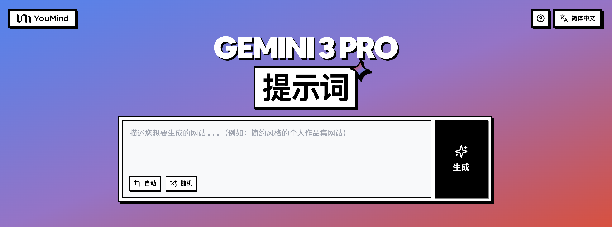

# 🚀 Gemini 3 提示词大全

[](https://github.com/sindresorhus/awesome)
[](https://github.com/YouMind-OpenLab/awesome-gemini-3-prompts)
[](https://creativecommons.org/licenses/by/4.0/)
[](https://github.com/YouMind-OpenLab/awesome-gemini-3-prompts/actions)
[](docs/CONTRIBUTING.md)

> 🎨 Google Gemini 3 多模态 AI 提示词精选集合

> 💡 **Note**: 如果您对 Nano Banana Pro 图像提示词感兴趣，欢迎查看我们的另一个仓库，包含 500+ 精选提示词：https://github.com/YouMind-OpenLab/awesome-nano-banana-pro-prompts

> ⚠️ **版权声明**：所有提示词均收集自社区，仅供教育目的使用。如果您认为任何内容侵犯了您的权利，请[提交 issue](https://github.com/YouMind-OpenLab/awesome-gemini-3-prompts/issues/new?template=bug-report.yml)，我们将立即移除。

---

[](README.md) [](README_zh.md) [](README_zh-TW.md) [](README_ja-JP.md) [](README_ko-KR.md) [](README_th-TH.md) [](README_vi-VN.md) [](README_hi-IN.md) [](README_es-ES.md) [-Click%20to%20View-lightgrey)](README_es-419.md) [](README_de-DE.md) [](README_fr-FR.md) [](README_it-IT.md) [-Click%20to%20View-lightgrey)](README_pt-BR.md) [](README_pt-PT.md) [](README_tr-TR.md)

---

## 🌐 在网页图库中查看

<div align="center">




</div>

**[👉 浏览 YouMind Gemini 3 提示词图库](https://youmind.com/gemini-3-prompts)**

为什么使用图库？

| Feature | GitHub README | youmind.com 图库 |
|---------|--------------|---------------------|
| 🎨 可视化布局 | 线性列表 | 精美的瀑布流网格 |
| 🔍 搜索 | 仅 Ctrl+F | 全文搜索和筛选 |
| 🤖 AI 一键生图 | - | AI 一键生图 |
| 📱 移动端 | 基础 | 完全响应式 |

---

## 📖 目录

- [🌐 在网页图库中查看](#-view-in-web-gallery)
- [🤔 什么是 Gemini 3？](#-what-is-gemini-3)
- [📊 统计数据](#-statistics)
- [🔥 精选提示词](#-featured-prompts)
- [📋 所有提示词](#-all-prompts)
- [🤝 如何贡献](#-how-to-contribute)
- [📄 许可证](#-license)
- [🙏 致谢](#-acknowledgements)
- [⭐ Star 历史](#-star-history)

---

## 🤔 什么是 Gemini 3？

**Gemini 3** 是 Google 发布的新一代多模态大模型，具有以下特点：

- 🎯 **超大上下文窗口** - 支持 100 万 tokens，全面理解上下文
- 🎨 **多模态智能** - 理解并生成文本、图像、音频、视频、代码等多种输入
- ⚡ **执行型 AI** - 自动化执行，可直接生成网站并实时预览，一键发布
- 🌈 **强大推理能力** - 高级问题解决和复杂任务处理

📚 **了解更多**：[Gemini 3: 10 个真实案例](https://youmind.com/blog/gemini-3-10-real-cases)

### 🚀 Raycast 集成

部分提示词支持使用 [Raycast Snippets](https://raycast.com/help/snippets) 语法的**动态参数**。寻找 🚀 Raycast Friendly 徽章！

**示例：**
```
A quote card with "{argument name="quote" default="Stay hungry, stay foolish"}"
by {argument name="author" default="Steve Jobs"}
```

在 Raycast 中使用时，您可以动态替换参数以快速迭代！

---

## 📊 统计数据

<div align="center">

| 指标 | 数量 |
|--------|-------|
| 📝 提示词总数 | **49** |
| ⭐ 精选 | **0** |
| 🔄 最后更新 | **2026年1月18日星期日 UTC 01:40:34** |

</div>

---

## 📋 所有提示词

> 📝 按发布日期排序（最新优先）

### No. 1: 感恩节查理·布朗主题商店


#### 📖 描述

一个简洁的提示，用于构建一个以感恩节查理·布朗为主题的商店界面，适合作为网页店面设计。

#### 📝 提示词

```
请帮我搭建一个以 {argument name="theme_en" default="Thanksgiving Charlie Brown"} 为主题和风格的商店。
```

#### 🖼️ 示例图

##### Image 1

<div align="center">

</div>

#### 📌 详情

- **作者:** [Sedativ](https://x.com/sedgabi)
- **来源:** [Twitter Post](https://x.com/sedgabi/status/1993326264741146985)
- **发布时间:** 2025年11月25日
- **多语言:** en

**[👉 立即尝试 →](https://youmind.com/gemini-3-prompts?prompt=%E8%AF%B7%E5%B8%AE%E6%88%91%E6%90%AD%E5%BB%BA%E4%B8%80%E4%B8%AA%E4%BB%A5%20%7Bargument%20name%3D%22theme_en%22%20default%3D%22Thanksgiving%20Charlie%20Brown%22%7D%20%E4%B8%BA%E4%B8%BB%E9%A2%98%E5%92%8C%E9%A3%8E%E6%A0%BC%E7%9A%84%E5%95%86%E5%BA%97%E3%80%82)**

---

### No. 2: AI 游戏未来感动画着陆页


#### 📖 描述

一个用于 Claude Code 技能的英文提示，要求 Gemini 3 Pro 为一款新的 AI 游戏设计一个充满未来感、动画丰富的着陆页。

#### 📝 提示词

```
我想为一款新的 {argument name="product_type_en" default="AI 游戏"} 设计一个着陆页。我们希望它看起来充满未来感，并尽可能多地使用动画。
```

#### 🖼️ 示例图

##### Image 1

<div align="center">

</div>

#### 📌 详情

- **作者:** [elvis](https://x.com/omarsar0)
- **来源:** [Twitter Post](https://x.com/omarsar0/status/1993101718041903565)
- **发布时间:** 2025年11月24日
- **多语言:** en

**[👉 立即尝试 →](https://youmind.com/gemini-3-prompts?prompt=%E6%88%91%E6%83%B3%E4%B8%BA%E4%B8%80%E6%AC%BE%E6%96%B0%E7%9A%84%20%7Bargument%20name%3D%22product_type_en%22%20default%3D%22AI%20%E6%B8%B8%E6%88%8F%22%7D%20%E8%AE%BE%E8%AE%A1%E4%B8%80%E4%B8%AA%E7%9D%80%E9%99%86%E9%A1%B5%E3%80%82%E6%88%91%E4%BB%AC%E5%B8%8C%E6%9C%9B%E5%AE%83%E7%9C%8B%E8%B5%B7%E6%9D%A5%E5%85%85%E6%BB%A1%E6%9C%AA%E6%9D%A5%E6%84%9F%EF%BC%8C%E5%B9%B6%E5%B0%BD%E5%8F%AF%E8%83%BD%E5%A4%9A%E5%9C%B0%E4%BD%BF%E7%94%A8%E5%8A%A8%E7%94%BB%E3%80%82)**

---

### No. 3: 你好世界网页，带 Linear 风格变体


#### 📖 描述

以下是 Gemini 3.0 的三个简单提示，展示了添加样式和图像（特别是 Linear 风格设计和图像提示）如何改变生成的“Hello World”页面的质量。

#### 📝 提示词

```
帮我构建一个“Hello World”页面。

帮我构建一个 {argument name="style_en" default="Linear"} 风格的“Hello World”页面。

帮我构建一个 {argument name="style_en" default="Linear"} 风格的“Hello World”页面。
```

#### 🖼️ 示例图

##### Image 1

<div align="center">

</div>

##### Image 2

<div align="center">

</div>

##### Image 3

<div align="center">

</div>

#### 📌 详情

- **作者:** [Jason Zhou](https://x.com/jasonzhou1993)
- **来源:** [Twitter Post](https://x.com/jasonzhou1993/status/1991754086417682891)
- **发布时间:** 2025年11月21日
- **多语言:** en

**[👉 立即尝试 →](https://youmind.com/gemini-3-prompts?prompt=%E5%B8%AE%E6%88%91%E6%9E%84%E5%BB%BA%E4%B8%80%E4%B8%AA%E2%80%9CHello%20World%E2%80%9D%E9%A1%B5%E9%9D%A2%E3%80%82%0A%0A%E5%B8%AE%E6%88%91%E6%9E%84%E5%BB%BA%E4%B8%80%E4%B8%AA%20%7Bargument%20name%3D%22style_en%22%20default%3D%22Linear%22%7D%20%E9%A3%8E%E6%A0%BC%E7%9A%84%E2%80%9CHello%20World%E2%80%9D%E9%A1%B5%E9%9D%A2%E3%80%82%0A%0A%E5%B8%AE%E6%88%91%E6%9E%84%E5%BB%BA%E4%B8%80%E4%B8%AA%20%7Bargument%20name%3D%22style_en%22%20default%3D%22Linear%22%7D%20%E9%A3%8E%E6%A0%BC%E7%9A%84%E2%80%9CHello%20World%E2%80%9D%E9%A1%B5%E9%9D%A2%E3%80%82)**

---

### No. 4: 奢华 3D 腕表产品体验页面 (Next.js + Three.js)


#### 📖 描述

一个详细的日文提示，用于设计一个豪华 3D 产品体验网页，面向高端手表，使用 Next.js、Three.js、React Three Fiber、GLSL，并包含特定的滚动部分和着色器要求。

#### 📝 提示词

```
为一款奢华腕表设计一个 3D 产品体验页面。
**目标用户：** 30-50 岁的富裕客户、腕表爱好者和商务人士。
**品牌调性：** 奢华 × 科技（现代、精致的高端感受）。
滚动体验（5 个部分）：
英雄部分 – 腕表从黑暗中缓缓浮现，旋转着进入光线。实现全息效果和菲涅尔反射，并使用自定义着色器。
细节放大 – 表盘特写。使用 GLSL 实现金属反射、视差映射和实时光泽度。
机械分解 – 腕表分解，内部机芯在空中漂浮。使用置换着色器实现能量场效果，并为每个部件添加发光效果。
材质体验 – 在不同的材质变体之间切换。以基于物理的方式，使用 PBR 着色器表达金属感、玻璃折射和钛金属的哑光纹理。
结尾 – 腕表重新组装，背景是使用自定义着色器制作的抽象渐变网格。应用后期处理，如泛光和景深。
**技术栈：** Next.js 15 + Three.js + React Three Fiber + GLSL (自定义着色器) + react-postprocessing + Lenis。
着色器要求：
菲涅尔反射着色器（边缘光效果）
PBR 材质着色器（粗糙度、金属度、AO）
全息着色器（虹彩干涉效果）
置换着色器（波动和扭曲效果）
自定义背景着色器（渐变噪声）
后期处理：泛光 (Bloom)、色差 (ChromaticAberration)、景深 (DepthOfField)、晕影 (Vignette)。
请为以下各项提出具体的数值：
每个部分的滚动范围（以 % 或 vh 为单位）
动画参数（位置、旋转、缩放等的起始/结束值）
缓动函数（缓动类型）
相机 FOV、位置和目标值
灯光设置（强度、颜色、位置）
每个着色器的 Uniform 值（时间进程、滚动进度、色相、强度等）。
```

#### 🖼️ 示例图

##### Image 1

<div align="center">

</div>

#### 📌 详情

- **作者:** [Shin@プログラミングチュートリアル](https://x.com/Shin_Engineer)
- **来源:** [Twitter Post](https://x.com/Shin_Engineer/status/1991740779652657455)
- **发布时间:** 2025年11月21日
- **多语言:** ja

**[👉 立即尝试 →](https://youmind.com/gemini-3-prompts?prompt=%E4%B8%BA%E4%B8%80%E6%AC%BE%E5%A5%A2%E5%8D%8E%E8%85%95%E8%A1%A8%E8%AE%BE%E8%AE%A1%E4%B8%80%E4%B8%AA%203D%20%E4%BA%A7%E5%93%81%E4%BD%93%E9%AA%8C%E9%A1%B5%E9%9D%A2%E3%80%82%0A**%E7%9B%AE%E6%A0%87%E7%94%A8%E6%88%B7%EF%BC%9A**%2030-50%20%E5%B2%81%E7%9A%84%E5%AF%8C%E8%A3%95%E5%AE%A2%E6%88%B7%E3%80%81%E8%85%95%E8%A1%A8%E7%88%B1%E5%A5%BD%E8%80%85%E5%92%8C%E5%95%86%E5%8A%A1%E4%BA%BA%E5%A3%AB%E3%80%82%0A**%E5%93%81%E7%89%8C%E8%B0%83%E6%80%A7%EF%BC%9A**%20%E5%A5%A2%E5%8D%8E%20%C3%97%20%E7%A7%91%E6%8A%80%EF%BC%88%E7%8E%B0%E4%BB%A3%E3%80%81%E7%B2%BE%E8%87%B4%E7%9A%84%E9%AB%98%E7%AB%AF%E6%84%9F%E5%8F%97%EF%BC%89%E3%80%82%0A%E6%BB%9A%E5%8A%A8%E4%BD%93%E9%AA%8C%EF%BC%885%20%E4%B8%AA%E9%83%A8%E5%88%86%EF%BC%89%EF%BC%9A%0A%E8%8B%B1%E9%9B%84%E9%83%A8%E5%88%86%20%E2%80%93%20%E8%85%95%E8%A1%A8%E4%BB%8E%E9%BB%91%E6%9A%97%E4%B8%AD%E7%BC%93%E7%BC%93%E6%B5%AE%E7%8E%B0%EF%BC%8C%E6%97%8B%E8%BD%AC%E7%9D%80%E8%BF%9B%E5%85%A5%E5%85%89%E7%BA%BF%E3%80%82%E5%AE%9E%E7%8E%B0%E5%85%A8%E6%81%AF%E6%95%88%E6%9E%9C%E5%92%8C%E8%8F%B2%E6%B6%85%E5%B0%94%E5%8F%8D%E5%B0%84%EF%BC%8C%E5%B9%B6%E4%BD%BF%E7%94%A8%E8%87%AA%E5%AE%9A%E4%B9%89%E7%9D%80%E8%89%B2%E5%99%A8%E3%80%82%0A%E7%BB%86%E8%8A%82%E6%94%BE%E5%A4%A7%20%E2%80%93%20%E8%A1%A8%E7%9B%98%E7%89%B9%E5%86%99%E3%80%82%E4%BD%BF%E7%94%A8%20GLSL%20%E5%AE%9E%E7%8E%B0%E9%87%91%E5%B1%9E%E5%8F%8D%E5%B0%84%E3%80%81%E8%A7%86%E5%B7%AE%E6%98%A0%E5%B0%84%E5%92%8C%E5%AE%9E%E6%97%B6%E5%85%89%E6%B3%BD%E5%BA%A6%E3%80%82%0A%E6%9C%BA%E6%A2%B0%E5%88%86%E8%A7%A3%20%E2%80%93%20%E8%85%95%E8%A1%A8%E5%88%86%E8%A7%A3%EF%BC%8C%E5%86%85%E9%83%A8%E6%9C%BA%E8%8A%AF%E5%9C%A8%E7%A9%BA%E4%B8%AD%E6%BC%82%E6%B5%AE%E3%80%82%E4%BD%BF%E7%94%A8%E7%BD%AE%E6%8D%A2%E7%9D%80%E8%89%B2%E5%99%A8%E5%AE%9E%E7%8E%B0%E8%83%BD%E9%87%8F%E5%9C%BA%E6%95%88%E6%9E%9C%EF%BC%8C%E5%B9%B6%E4%B8%BA%E6%AF%8F%E4%B8%AA%E9%83%A8%E4%BB%B6%E6%B7%BB%E5%8A%A0%E5%8F%91%E5%85%89%E6%95%88%E6%9E%9C%E3%80%82%0A%E6%9D%90%E8%B4%A8%E4%BD%93%E9%AA%8C%20%E2%80%93%20%E5%9C%A8%E4%B8%8D%E5%90%8C%E7%9A%84%E6%9D%90%E8%B4%A8%E5%8F%98%E4%BD%93%E4%B9%8B%E9%97%B4%E5%88%87%E6%8D%A2%E3%80%82%E4%BB%A5%E5%9F%BA%E4%BA%8E%E7%89%A9%E7%90%86%E7%9A%84%E6%96%B9%E5%BC%8F%EF%BC%8C%E4%BD%BF%E7%94%A8%20PBR%20%E7%9D%80%E8%89%B2%E5%99%A8%E8%A1%A8%E8%BE%BE%E9%87%91%E5%B1%9E%E6%84%9F%E3%80%81%E7%8E%BB%E7%92%83%E6%8A%98%E5%B0%84%E5%92%8C%E9%92%9B%E9%87%91%E5%B1%9E%E7%9A%84%E5%93%91%E5%85%89%E7%BA%B9%E7%90%86%E3%80%82%0A%E7%BB%93%E5%B0%BE%20%E2%80%93%20%E8%85%95%E8%A1%A8%E9%87%8D%E6%96%B0%E7%BB%84%E8%A3%85%EF%BC%8C%E8%83%8C%E6%99%AF%E6%98%AF%E4%BD%BF%E7%94%A8%E8%87%AA%E5%AE%9A%E4%B9%89%E7%9D%80%E8%89%B2%E5%99%A8%E5%88%B6%E4%BD%9C%E7%9A%84%E6%8A%BD%E8%B1%A1%E6%B8%90%E5%8F%98%E7%BD%91%E6%A0%BC%E3%80%82%E5%BA%94%E7%94%A8%E5%90%8E%E6%9C%9F%E5%A4%84%E7%90%86%EF%BC%8C%E5%A6%82%E6%B3%9B%E5%85%89%E5%92%8C%E6%99%AF%E6%B7%B1%E3%80%82%0A**%E6%8A%80%E6%9C%AF%E6%A0%88%EF%BC%9A**%20Next.js%2015%20%2B%20Three.js%20%2B%20React%20Three%20Fiber%20%2B%20GLSL%20(%E8%87%AA%E5%AE%9A%E4%B9%89%E7%9D%80%E8%89%B2%E5%99%A8)%20%2B%20react-postprocessing%20%2B%20Lenis%E3%80%82%0A%E7%9D%80%E8%89%B2%E5%99%A8%E8%A6%81%E6%B1%82%EF%BC%9A%0A%E8%8F%B2%E6%B6%85%E5%B0%94%E5%8F%8D%E5%B0%84%E7%9D%80%E8%89%B2%E5%99%A8%EF%BC%88%E8%BE%B9%E7%BC%98%E5%85%89%E6%95%88%E6%9E%9C%EF%BC%89%0APBR%20%E6%9D%90%E8%B4%A8%E7%9D%80%E8%89%B2%E5%99%A8%EF%BC%88%E7%B2%97%E7%B3%99%E5%BA%A6%E3%80%81%E9%87%91%E5%B1%9E%E5%BA%A6%E3%80%81AO%EF%BC%89%0A%E5%85%A8%E6%81%AF%E7%9D%80%E8%89%B2%E5%99%A8%EF%BC%88%E8%99%B9%E5%BD%A9%E5%B9%B2%E6%B6%89%E6%95%88%E6%9E%9C%EF%BC%89%0A%E7%BD%AE%E6%8D%A2%E7%9D%80%E8%89%B2%E5%99%A8%EF%BC%88%E6%B3%A2%E5%8A%A8%E5%92%8C%E6%89%AD%E6%9B%B2%E6%95%88%E6%9E%9C%EF%BC%89%0A%E8%87%AA%E5%AE%9A%E4%B9%89%E8%83%8C%E6%99%AF%E7%9D%80%E8%89%B2%E5%99%A8%EF%BC%88%E6%B8%90%E5%8F%98%E5%99%AA%E5%A3%B0%EF%BC%89%0A%E5%90%8E%E6%9C%9F%E5%A4%84%E7%90%86%EF%BC%9A%E6%B3%9B%E5%85%89%20(Bloom)%E3%80%81%E8%89%B2%E5%B7%AE%20(ChromaticAberration)%E3%80%81%E6%99%AF%E6%B7%B1%20(DepthOfField)%E3%80%81%E6%99%95%E5%BD%B1%20(Vignette)%E3%80%82%0A%E8%AF%B7%E4%B8%BA%E4%BB%A5%E4%B8%8B%E5%90%84%E9%A1%B9%E6%8F%90%E5%87%BA%E5%85%B7%E4%BD%93%E7%9A%84%E6%95%B0%E5%80%BC%EF%BC%9A%0A%E6%AF%8F%E4%B8%AA%E9%83%A8%E5%88%86%E7%9A%84%E6%BB%9A%E5%8A%A8%E8%8C%83%E5%9B%B4%EF%BC%88%E4%BB%A5%20%25%20%E6%88%96%20vh%20%E4%B8%BA%E5%8D%95%E4%BD%8D%EF%BC%89%0A%E5%8A%A8%E7%94%BB%E5%8F%82%E6%95%B0%EF%BC%88%E4%BD%8D%E7%BD%AE%E3%80%81%E6%97%8B%E8%BD%AC%E3%80%81%E7%BC%A9%E6%94%BE%E7%AD%89%E7%9A%84%E8%B5%B7%E5%A7%8B%2F%E7%BB%93%E6%9D%9F%E5%80%BC%EF%BC%89%0A%E7%BC%93%E5%8A%A8%E5%87%BD%E6%95%B0%EF%BC%88%E7%BC%93%E5%8A%A8%E7%B1%BB%E5%9E%8B%EF%BC%89%0A%E7%9B%B8%E6%9C%BA%20FOV%E3%80%81%E4%BD%8D%E7%BD%AE%E5%92%8C%E7%9B%AE%E6%A0%87%E5%80%BC%0A%E7%81%AF%E5%85%89%E8%AE%BE%E7%BD%AE%EF%BC%88%E5%BC%BA%E5%BA%A6%E3%80%81%E9%A2%9C%E8%89%B2%E3%80%81%E4%BD%8D%E7%BD%AE%EF%BC%89%0A%E6%AF%8F%E4%B8%AA%E7%9D%80%E8%89%B2%E5%99%A8%E7%9A%84%20Uniform%20%E5%80%BC%EF%BC%88%E6%97%B6%E9%97%B4%E8%BF%9B%E7%A8%8B%E3%80%81%E6%BB%9A%E5%8A%A8%E8%BF%9B%E5%BA%A6%E3%80%81%E8%89%B2%E7%9B%B8%E3%80%81%E5%BC%BA%E5%BA%A6%E7%AD%89%EF%BC%89%E3%80%82)**

---

### No. 5: 趣味十足的《塞尔达传说》视频捕捉编辑器提示


#### 📖 描述

一个幽默的中文提示，扮演一位资深游戏编程大师，描述了如何使用 WebCodecs 构建编辑器并捕捉《塞尔达传说：旷野之息》的游戏画面。

#### 📝 提示词

```
你是一位资深的游戏编程大师。请帮我编写一个编辑器，其渲染模块使用 WebCodecs。打开 Switch 并插入 {argument name="game_title_en" default="The Legend of Zelda: Breath of the Wild"}。小心不要舔卡带——它有点苦。使用专业的采集卡捕捉视频，在 60 秒的时间限制内完成“被遗忘的圣殿”挑战并使用风弹。
```

#### 🖼️ 示例图

##### Image 1

<div align="center">

</div>

#### 📌 详情

- **作者:** [海拉鲁编程客](https://x.com/hylarucoder)
- **来源:** [Twitter Post](https://x.com/hylarucoder/status/1991491913720218098)
- **发布时间:** 2025年11月20日
- **多语言:** zh

**[👉 立即尝试 →](https://youmind.com/gemini-3-prompts?prompt=%E4%BD%A0%E6%98%AF%E4%B8%80%E4%BD%8D%E8%B5%84%E6%B7%B1%E7%9A%84%E6%B8%B8%E6%88%8F%E7%BC%96%E7%A8%8B%E5%A4%A7%E5%B8%88%E3%80%82%E8%AF%B7%E5%B8%AE%E6%88%91%E7%BC%96%E5%86%99%E4%B8%80%E4%B8%AA%E7%BC%96%E8%BE%91%E5%99%A8%EF%BC%8C%E5%85%B6%E6%B8%B2%E6%9F%93%E6%A8%A1%E5%9D%97%E4%BD%BF%E7%94%A8%20WebCodecs%E3%80%82%E6%89%93%E5%BC%80%20Switch%20%E5%B9%B6%E6%8F%92%E5%85%A5%20%7Bargument%20name%3D%22game_title_en%22%20default%3D%22The%20Legend%20of%20Zelda%3A%20Breath%20of%20the%20Wild%22%7D%E3%80%82%E5%B0%8F%E5%BF%83%E4%B8%8D%E8%A6%81%E8%88%94%E5%8D%A1%E5%B8%A6%E2%80%94%E2%80%94%E5%AE%83%E6%9C%89%E7%82%B9%E8%8B%A6%E3%80%82%E4%BD%BF%E7%94%A8%E4%B8%93%E4%B8%9A%E7%9A%84%E9%87%87%E9%9B%86%E5%8D%A1%E6%8D%95%E6%8D%89%E8%A7%86%E9%A2%91%EF%BC%8C%E5%9C%A8%2060%20%E7%A7%92%E7%9A%84%E6%97%B6%E9%97%B4%E9%99%90%E5%88%B6%E5%86%85%E5%AE%8C%E6%88%90%E2%80%9C%E8%A2%AB%E9%81%97%E5%BF%98%E7%9A%84%E5%9C%A3%E6%AE%BF%E2%80%9D%E6%8C%91%E6%88%98%E5%B9%B6%E4%BD%BF%E7%94%A8%E9%A3%8E%E5%BC%B9%E3%80%82)**

---

### No. 6: 奢华智能手表 Three.js 动画着陆页


#### 📖 描述

一个详细的多步骤提示序列，用于 Gemini 3 Pro 构建一个使用 Three.js、Anime.js 和 Tailwind 的奢华智能手表着陆页，然后将其完善为一个具有高级动画和交互的多部分滚动网站。

#### 📝 提示词

```
使用 Three.js、Anime.js 和 Tailwind 为一个 {argument name="product_type_en" default="奢华智能手表"} 页面创建一个 HTML 文件。制作一个 3D {argument name="main_object_en" default="手表"} 模型，一个带有圆形孔洞的深色纹理叠加层，显示 {argument name="main_object_background_en" default="米色背景上的手表"}，并在页面加载时让标题和大数字滑入。

让页面更专业。用一个加载时打开的光圈替换静态孔洞。在 {argument name="focus_area_en" default="表盘"} 上添加一个带反射的玻璃罩，改进金属材质，添加鼠标视差效果，使 {argument name="parallax_target_en" default="手表"} 随光标旋转，并在 {argument name="dial_area_en" default="表盘"} 上绘制时间及健身环。

将单屏页面转换为多段滚动网站。当用户滚动时，动画化 3D {argument name="scroll_object_en" default="手表"}，使其移动和旋转以匹配每个部分。保持 3D 画布和背景固定，而文本在其上方滚动；只有 {argument name="moving_element_en" default="手表"} 移动。

- 固定画布：定位画布
```

#### 🖼️ 示例图

##### Image 1

<div align="center">

</div>

#### 📌 详情

- **作者:** [Harshith](https://x.com/HarshithLucky3)
- **来源:** [Twitter Post](https://x.com/HarshithLucky3/status/1991474311916580881)
- **发布时间:** 2025年11月20日
- **多语言:** en

**[👉 立即尝试 →](https://youmind.com/gemini-3-prompts?prompt=%E4%BD%BF%E7%94%A8%20Three.js%E3%80%81Anime.js%20%E5%92%8C%20Tailwind%20%E4%B8%BA%E4%B8%80%E4%B8%AA%20%7Bargument%20name%3D%22product_type_en%22%20default%3D%22%E5%A5%A2%E5%8D%8E%E6%99%BA%E8%83%BD%E6%89%8B%E8%A1%A8%22%7D%20%E9%A1%B5%E9%9D%A2%E5%88%9B%E5%BB%BA%E4%B8%80%E4%B8%AA%20HTML%20%E6%96%87%E4%BB%B6%E3%80%82%E5%88%B6%E4%BD%9C%E4%B8%80%E4%B8%AA%203D%20%7Bargument%20name%3D%22main_object_en%22%20default%3D%22%E6%89%8B%E8%A1%A8%22%7D%20%E6%A8%A1%E5%9E%8B%EF%BC%8C%E4%B8%80%E4%B8%AA%E5%B8%A6%E6%9C%89%E5%9C%86%E5%BD%A2%E5%AD%94%E6%B4%9E%E7%9A%84%E6%B7%B1%E8%89%B2%E7%BA%B9%E7%90%86%E5%8F%A0%E5%8A%A0%E5%B1%82%EF%BC%8C%E6%98%BE%E7%A4%BA%20%7Bargument%20name%3D%22main_object_background_en%22%20default%3D%22%E7%B1%B3%E8%89%B2%E8%83%8C%E6%99%AF%E4%B8%8A%E7%9A%84%E6%89%8B%E8%A1%A8%22%7D%EF%BC%8C%E5%B9%B6%E5%9C%A8%E9%A1%B5%E9%9D%A2%E5%8A%A0%E8%BD%BD%E6%97%B6%E8%AE%A9%E6%A0%87%E9%A2%98%E5%92%8C%E5%A4%A7%E6%95%B0%E5%AD%97%E6%BB%91%E5%85%A5%E3%80%82%0A%0A%E8%AE%A9%E9%A1%B5%E9%9D%A2%E6%9B%B4%E4%B8%93%E4%B8%9A%E3%80%82%E7%94%A8%E4%B8%80%E4%B8%AA%E5%8A%A0%E8%BD%BD%E6%97%B6%E6%89%93%E5%BC%80%E7%9A%84%E5%85%89%E5%9C%88%E6%9B%BF%E6%8D%A2%E9%9D%99%E6%80%81%E5%AD%94%E6%B4%9E%E3%80%82%E5%9C%A8%20%7Bargument%20name%3D%22focus_area_en%22%20default%3D%22%E8%A1%A8%E7%9B%98%22%7D%20%E4%B8%8A%E6%B7%BB%E5%8A%A0%E4%B8%80%E4%B8%AA%E5%B8%A6%E5%8F%8D%E5%B0%84%E7%9A%84%E7%8E%BB%E7%92%83%E7%BD%A9%EF%BC%8C%E6%94%B9%E8%BF%9B%E9%87%91%E5%B1%9E%E6%9D%90%E8%B4%A8%EF%BC%8C%E6%B7%BB%E5%8A%A0%E9%BC%A0%E6%A0%87%E8%A7%86%E5%B7%AE%E6%95%88%E6%9E%9C%EF%BC%8C%E4%BD%BF%20%7Bargument%20name%3D%22parallax_target_en%22%20default%3D%22%E6%89%8B%E8%A1%A8%22%7D%20%E9%9A%8F%E5%85%89%E6%A0%87%E6%97%8B%E8%BD%AC%EF%BC%8C%E5%B9%B6%E5%9C%A8%20%7Bargument%20name%3D%22dial_area_en%22%20default%3D%22%E8%A1%A8%E7%9B%98%22%7D%20%E4%B8%8A%E7%BB%98%E5%88%B6%E6%97%B6%E9%97%B4%E5%8F%8A%E5%81%A5%E8%BA%AB%E7%8E%AF%E3%80%82%0A%0A%E5%B0%86%E5%8D%95%E5%B1%8F%E9%A1%B5%E9%9D%A2%E8%BD%AC%E6%8D%A2%E4%B8%BA%E5%A4%9A%E6%AE%B5%E6%BB%9A%E5%8A%A8%E7%BD%91%E7%AB%99%E3%80%82%E5%BD%93%E7%94%A8%E6%88%B7%E6%BB%9A%E5%8A%A8%E6%97%B6%EF%BC%8C%E5%8A%A8%E7%94%BB%E5%8C%96%203D%20%7Bargument%20name%3D%22scroll_object_en%22%20default%3D%22%E6%89%8B%E8%A1%A8%22%7D%EF%BC%8C%E4%BD%BF%E5%85%B6%E7%A7%BB%E5%8A%A8%E5%92%8C%E6%97%8B%E8%BD%AC%E4%BB%A5%E5%8C%B9%E9%85%8D%E6%AF%8F%E4%B8%AA%E9%83%A8%E5%88%86%E3%80%82%E4%BF%9D%E6%8C%81%203D%20%E7%94%BB%E5%B8%83%E5%92%8C%E8%83%8C%E6%99%AF%E5%9B%BA%E5%AE%9A%EF%BC%8C%E8%80%8C%E6%96%87%E6%9C%AC%E5%9C%A8%E5%85%B6%E4%B8%8A%E6%96%B9%E6%BB%9A%E5%8A%A8%EF%BC%9B%E5%8F%AA%E6%9C%89%20%7Bargument%20name%3D%22moving_element_en%22%20default%3D%22%E6%89%8B%E8%A1%A8%22%7D%20%E7%A7%BB%E5%8A%A8%E3%80%82%0A%0A-%20%E5%9B%BA%E5%AE%9A%E7%94%BB%E5%B8%83%EF%BC%9A%E5%AE%9A%E4%BD%8D%E7%94%BB%E5%B8%83)**

---

### No. 7: 生成 40 个带下载按钮的简单 SVG 图标


#### 📖 描述

一个日文提示，要求 Gemini 生成 40 个浅蓝色线条风格的简单、多功能 SVG 图标，并为每个图标提供下载按钮。

#### 📝 提示词

```
生成 {argument name="icon_count_en" default="40"} 个简单且高度通用的 SVG 格式图标。请务必在画布上绘制它们。颜色应为 {argument name="icon_color_en" default="light blue"}。背景应为 {argument name="background_color_en" default="white"}。使用具有 Material Design 风格的线条式图标。添加一个按钮，让用户可以下载每个 SVG 图标的 SVG 数据。
```

#### 🖼️ 示例图

##### Image 1

<div align="center">

</div>

#### 📌 详情

- **作者:** [KAWAI](https://x.com/kawai_design)
- **来源:** [Twitter Post](https://x.com/kawai_design/status/1991461556597715056)
- **发布时间:** 2025年11月20日
- **多语言:** ja

**[👉 立即尝试 →](https://youmind.com/gemini-3-prompts?prompt=%E7%94%9F%E6%88%90%20%7Bargument%20name%3D%22icon_count_en%22%20default%3D%2240%22%7D%20%E4%B8%AA%E7%AE%80%E5%8D%95%E4%B8%94%E9%AB%98%E5%BA%A6%E9%80%9A%E7%94%A8%E7%9A%84%20SVG%20%E6%A0%BC%E5%BC%8F%E5%9B%BE%E6%A0%87%E3%80%82%E8%AF%B7%E5%8A%A1%E5%BF%85%E5%9C%A8%E7%94%BB%E5%B8%83%E4%B8%8A%E7%BB%98%E5%88%B6%E5%AE%83%E4%BB%AC%E3%80%82%E9%A2%9C%E8%89%B2%E5%BA%94%E4%B8%BA%20%7Bargument%20name%3D%22icon_color_en%22%20default%3D%22light%20blue%22%7D%E3%80%82%E8%83%8C%E6%99%AF%E5%BA%94%E4%B8%BA%20%7Bargument%20name%3D%22background_color_en%22%20default%3D%22white%22%7D%E3%80%82%E4%BD%BF%E7%94%A8%E5%85%B7%E6%9C%89%20Material%20Design%20%E9%A3%8E%E6%A0%BC%E7%9A%84%E7%BA%BF%E6%9D%A1%E5%BC%8F%E5%9B%BE%E6%A0%87%E3%80%82%E6%B7%BB%E5%8A%A0%E4%B8%80%E4%B8%AA%E6%8C%89%E9%92%AE%EF%BC%8C%E8%AE%A9%E7%94%A8%E6%88%B7%E5%8F%AF%E4%BB%A5%E4%B8%8B%E8%BD%BD%E6%AF%8F%E4%B8%AA%20SVG%20%E5%9B%BE%E6%A0%87%E7%9A%84%20SVG%20%E6%95%B0%E6%8D%AE%E3%80%82)**

---

### No. 8: 体素艺术宝塔花园单文件 HTML 场景


#### 📖 描述

一个英文提示，用于设计一个色彩丰富的体素艺术宝塔花园环境，作为一个完全独立的 HTML 文件，可在 Chrome 中运行，并使用任何体素/WebGL 库。

#### 📝 提示词

```
设计一个精美细致的体素艺术环境，其中包含一座华丽的 {argument name="main_structure_en" default="宝塔"}，坐落于一个生机勃勃的花园之中。
加入多样化的植被——特别是 {argument name="key_tree_en" default="樱花树"}——并确保构图充满活力、色彩斑斓且视觉效果引人注目。
您可以使用任何您喜欢的体素或 WebGL 库，但请将整个项目作为一个独立的 HTML 文件交付，我可以直接粘贴并在 Chrome 中打开。
```

#### 🖼️ 示例图

##### Image 1

<div align="center">

</div>

#### 📌 详情

- **作者:** [老白（每日干货分享✊）](https://x.com/laobaishare)
- **来源:** [Twitter Post](https://x.com/laobaishare/status/1991427416603128159)
- **发布时间:** 2025年11月20日
- **多语言:** en

**[👉 立即尝试 →](https://youmind.com/gemini-3-prompts?prompt=%E8%AE%BE%E8%AE%A1%E4%B8%80%E4%B8%AA%E7%B2%BE%E7%BE%8E%E7%BB%86%E8%87%B4%E7%9A%84%E4%BD%93%E7%B4%A0%E8%89%BA%E6%9C%AF%E7%8E%AF%E5%A2%83%EF%BC%8C%E5%85%B6%E4%B8%AD%E5%8C%85%E5%90%AB%E4%B8%80%E5%BA%A7%E5%8D%8E%E4%B8%BD%E7%9A%84%20%7Bargument%20name%3D%22main_structure_en%22%20default%3D%22%E5%AE%9D%E5%A1%94%22%7D%EF%BC%8C%E5%9D%90%E8%90%BD%E4%BA%8E%E4%B8%80%E4%B8%AA%E7%94%9F%E6%9C%BA%E5%8B%83%E5%8B%83%E7%9A%84%E8%8A%B1%E5%9B%AD%E4%B9%8B%E4%B8%AD%E3%80%82%0A%E5%8A%A0%E5%85%A5%E5%A4%9A%E6%A0%B7%E5%8C%96%E7%9A%84%E6%A4%8D%E8%A2%AB%E2%80%94%E2%80%94%E7%89%B9%E5%88%AB%E6%98%AF%20%7Bargument%20name%3D%22key_tree_en%22%20default%3D%22%E6%A8%B1%E8%8A%B1%E6%A0%91%22%7D%E2%80%94%E2%80%94%E5%B9%B6%E7%A1%AE%E4%BF%9D%E6%9E%84%E5%9B%BE%E5%85%85%E6%BB%A1%E6%B4%BB%E5%8A%9B%E3%80%81%E8%89%B2%E5%BD%A9%E6%96%91%E6%96%93%E4%B8%94%E8%A7%86%E8%A7%89%E6%95%88%E6%9E%9C%E5%BC%95%E4%BA%BA%E6%B3%A8%E7%9B%AE%E3%80%82%0A%E6%82%A8%E5%8F%AF%E4%BB%A5%E4%BD%BF%E7%94%A8%E4%BB%BB%E4%BD%95%E6%82%A8%E5%96%9C%E6%AC%A2%E7%9A%84%E4%BD%93%E7%B4%A0%E6%88%96%20WebGL%20%E5%BA%93%EF%BC%8C%E4%BD%86%E8%AF%B7%E5%B0%86%E6%95%B4%E4%B8%AA%E9%A1%B9%E7%9B%AE%E4%BD%9C%E4%B8%BA%E4%B8%80%E4%B8%AA%E7%8B%AC%E7%AB%8B%E7%9A%84%20HTML%20%E6%96%87%E4%BB%B6%E4%BA%A4%E4%BB%98%EF%BC%8C%E6%88%91%E5%8F%AF%E4%BB%A5%E7%9B%B4%E6%8E%A5%E7%B2%98%E8%B4%B4%E5%B9%B6%E5%9C%A8%20Chrome%20%E4%B8%AD%E6%89%93%E5%BC%80%E3%80%82)**

---

### No. 9: 未来主义加密货币仪表盘 UI


#### 📖 描述

一个中文提示，用于重新创建一个具有玻璃拟态、霓虹灯点缀和时尚 Inter 字体的未来主义深色模式加密货币数据仪表板。

#### 📝 提示词

```
重新创建一个未来风格的深色模式加密货币数据仪表盘：整体采用高对比度的黑曜石背景，玻璃拟态 UI 元素带有渐变轮廓，纤细的 Inter 字体，以及带有霓虹灯效果的金融数据可视化。
```

#### 🖼️ 示例图

##### Image 1

<div align="center">

</div>

#### 📌 详情

- **作者:** [老白（每日干货分享✊）](https://x.com/laobaishare)
- **来源:** [Twitter Post](https://x.com/laobaishare/status/1991427411129561513)
- **发布时间:** 2025年11月20日
- **多语言:** zh

**[👉 立即尝试 →](https://youmind.com/gemini-3-prompts?prompt=%E9%87%8D%E6%96%B0%E5%88%9B%E5%BB%BA%E4%B8%80%E4%B8%AA%E6%9C%AA%E6%9D%A5%E9%A3%8E%E6%A0%BC%E7%9A%84%E6%B7%B1%E8%89%B2%E6%A8%A1%E5%BC%8F%E5%8A%A0%E5%AF%86%E8%B4%A7%E5%B8%81%E6%95%B0%E6%8D%AE%E4%BB%AA%E8%A1%A8%E7%9B%98%EF%BC%9A%E6%95%B4%E4%BD%93%E9%87%87%E7%94%A8%E9%AB%98%E5%AF%B9%E6%AF%94%E5%BA%A6%E7%9A%84%E9%BB%91%E6%9B%9C%E7%9F%B3%E8%83%8C%E6%99%AF%EF%BC%8C%E7%8E%BB%E7%92%83%E6%8B%9F%E6%80%81%20UI%20%E5%85%83%E7%B4%A0%E5%B8%A6%E6%9C%89%E6%B8%90%E5%8F%98%E8%BD%AE%E5%BB%93%EF%BC%8C%E7%BA%A4%E7%BB%86%E7%9A%84%20Inter%20%E5%AD%97%E4%BD%93%EF%BC%8C%E4%BB%A5%E5%8F%8A%E5%B8%A6%E6%9C%89%E9%9C%93%E8%99%B9%E7%81%AF%E6%95%88%E6%9E%9C%E7%9A%84%E9%87%91%E8%9E%8D%E6%95%B0%E6%8D%AE%E5%8F%AF%E8%A7%86%E5%8C%96%E3%80%82)**

---

### No. 10: HTML 中的 SVG 摩天轮机械动画


#### 📖 描述

一个提示，用于设计一个精确的机械 SVG 摩天轮动画，包含齿轮、连杆和自调平座舱，并输出为 HTML。

#### 📝 提示词

```
设计一个 SVG 摩天轮机械动画，包括主轮、中心轴承、支撑架、驱动齿轮组以及 8 到 12 个带有反向自调平机构的座舱，以保持座舱水平。所有连杆和齿轮传动必须精确，展示完整的机械传动链和保持座舱水平的反向旋转逻辑。以 HTML 格式输出。
```

#### 🖼️ 示例图

##### Image 1

<div align="center">

</div>

#### 📌 详情

- **作者:** [老白（每日干货分享✊）](https://x.com/laobaishare)
- **来源:** [Twitter Post](https://x.com/laobaishare/status/1991427405538554207)
- **发布时间:** 2025年11月20日
- **多语言:** zh

**[👉 立即尝试 →](https://youmind.com/gemini-3-prompts?prompt=%E8%AE%BE%E8%AE%A1%E4%B8%80%E4%B8%AA%20SVG%20%E6%91%A9%E5%A4%A9%E8%BD%AE%E6%9C%BA%E6%A2%B0%E5%8A%A8%E7%94%BB%EF%BC%8C%E5%8C%85%E6%8B%AC%E4%B8%BB%E8%BD%AE%E3%80%81%E4%B8%AD%E5%BF%83%E8%BD%B4%E6%89%BF%E3%80%81%E6%94%AF%E6%92%91%E6%9E%B6%E3%80%81%E9%A9%B1%E5%8A%A8%E9%BD%BF%E8%BD%AE%E7%BB%84%E4%BB%A5%E5%8F%8A%208%20%E5%88%B0%2012%20%E4%B8%AA%E5%B8%A6%E6%9C%89%E5%8F%8D%E5%90%91%E8%87%AA%E8%B0%83%E5%B9%B3%E6%9C%BA%E6%9E%84%E7%9A%84%E5%BA%A7%E8%88%B1%EF%BC%8C%E4%BB%A5%E4%BF%9D%E6%8C%81%E5%BA%A7%E8%88%B1%E6%B0%B4%E5%B9%B3%E3%80%82%E6%89%80%E6%9C%89%E8%BF%9E%E6%9D%86%E5%92%8C%E9%BD%BF%E8%BD%AE%E4%BC%A0%E5%8A%A8%E5%BF%85%E9%A1%BB%E7%B2%BE%E7%A1%AE%EF%BC%8C%E5%B1%95%E7%A4%BA%E5%AE%8C%E6%95%B4%E7%9A%84%E6%9C%BA%E6%A2%B0%E4%BC%A0%E5%8A%A8%E9%93%BE%E5%92%8C%E4%BF%9D%E6%8C%81%E5%BA%A7%E8%88%B1%E6%B0%B4%E5%B9%B3%E7%9A%84%E5%8F%8D%E5%90%91%E6%97%8B%E8%BD%AC%E9%80%BB%E8%BE%91%E3%80%82%E4%BB%A5%20HTML%20%E6%A0%BC%E5%BC%8F%E8%BE%93%E5%87%BA%E3%80%82)**

---

### No. 11: Keep-inspired 中文健身课程网站


#### 📖 描述

请用中文写一个长篇的、英文风格的提示词，要求 Gemini 搭建一个受 Keep 启发、响应式、使用 Tailwind CSS 的中文健身课程网站。该网站应包含课程卡片、筛选器和匹配的视频弹窗。

#### 📝 提示词

```
构建一个受 Keep 启发的中文“健身课程”网页：包含全屏运动员英雄图片、透明的固定导航栏、中文胶囊标签分类以及中文课程卡片网格。每张课程卡片对应一个训练计划；参考 Pamela、周六野、韩小四、Jojie、刘畊宏等创作者的课程风格，设计中文标题以及难度和时长标签。点击卡片时，在页面内打开一个课程预览视频播放器，其内容严格匹配卡片信息。整体设计应保持简约而不失细节，通过流畅的滚动和悬停动画、柔和的渐变和精致的排版，营造高端的中文体验。使用 Tailwind CSS 实现完全响应式布局。
```

#### 🖼️ 示例图

##### Image 1

<div align="center">

</div>

#### 📌 详情

- **作者:** [老白（每日干货分享✊）](https://x.com/laobaishare)
- **来源:** [Twitter Post](https://x.com/laobaishare/status/1991427408323572067)
- **发布时间:** 2025年11月20日
- **多语言:** zh

**[👉 立即尝试 →](https://youmind.com/gemini-3-prompts?prompt=%E6%9E%84%E5%BB%BA%E4%B8%80%E4%B8%AA%E5%8F%97%20Keep%20%E5%90%AF%E5%8F%91%E7%9A%84%E4%B8%AD%E6%96%87%E2%80%9C%E5%81%A5%E8%BA%AB%E8%AF%BE%E7%A8%8B%E2%80%9D%E7%BD%91%E9%A1%B5%EF%BC%9A%E5%8C%85%E5%90%AB%E5%85%A8%E5%B1%8F%E8%BF%90%E5%8A%A8%E5%91%98%E8%8B%B1%E9%9B%84%E5%9B%BE%E7%89%87%E3%80%81%E9%80%8F%E6%98%8E%E7%9A%84%E5%9B%BA%E5%AE%9A%E5%AF%BC%E8%88%AA%E6%A0%8F%E3%80%81%E4%B8%AD%E6%96%87%E8%83%B6%E5%9B%8A%E6%A0%87%E7%AD%BE%E5%88%86%E7%B1%BB%E4%BB%A5%E5%8F%8A%E4%B8%AD%E6%96%87%E8%AF%BE%E7%A8%8B%E5%8D%A1%E7%89%87%E7%BD%91%E6%A0%BC%E3%80%82%E6%AF%8F%E5%BC%A0%E8%AF%BE%E7%A8%8B%E5%8D%A1%E7%89%87%E5%AF%B9%E5%BA%94%E4%B8%80%E4%B8%AA%E8%AE%AD%E7%BB%83%E8%AE%A1%E5%88%92%EF%BC%9B%E5%8F%82%E8%80%83%20Pamela%E3%80%81%E5%91%A8%E5%85%AD%E9%87%8E%E3%80%81%E9%9F%A9%E5%B0%8F%E5%9B%9B%E3%80%81Jojie%E3%80%81%E5%88%98%E7%95%8A%E5%AE%8F%E7%AD%89%E5%88%9B%E4%BD%9C%E8%80%85%E7%9A%84%E8%AF%BE%E7%A8%8B%E9%A3%8E%E6%A0%BC%EF%BC%8C%E8%AE%BE%E8%AE%A1%E4%B8%AD%E6%96%87%E6%A0%87%E9%A2%98%E4%BB%A5%E5%8F%8A%E9%9A%BE%E5%BA%A6%E5%92%8C%E6%97%B6%E9%95%BF%E6%A0%87%E7%AD%BE%E3%80%82%E7%82%B9%E5%87%BB%E5%8D%A1%E7%89%87%E6%97%B6%EF%BC%8C%E5%9C%A8%E9%A1%B5%E9%9D%A2%E5%86%85%E6%89%93%E5%BC%80%E4%B8%80%E4%B8%AA%E8%AF%BE%E7%A8%8B%E9%A2%84%E8%A7%88%E8%A7%86%E9%A2%91%E6%92%AD%E6%94%BE%E5%99%A8%EF%BC%8C%E5%85%B6%E5%86%85%E5%AE%B9%E4%B8%A5%E6%A0%BC%E5%8C%B9%E9%85%8D%E5%8D%A1%E7%89%87%E4%BF%A1%E6%81%AF%E3%80%82%E6%95%B4%E4%BD%93%E8%AE%BE%E8%AE%A1%E5%BA%94%E4%BF%9D%E6%8C%81%E7%AE%80%E7%BA%A6%E8%80%8C%E4%B8%8D%E5%A4%B1%E7%BB%86%E8%8A%82%EF%BC%8C%E9%80%9A%E8%BF%87%E6%B5%81%E7%95%85%E7%9A%84%E6%BB%9A%E5%8A%A8%E5%92%8C%E6%82%AC%E5%81%9C%E5%8A%A8%E7%94%BB%E3%80%81%E6%9F%94%E5%92%8C%E7%9A%84%E6%B8%90%E5%8F%98%E5%92%8C%E7%B2%BE%E8%87%B4%E7%9A%84%E6%8E%92%E7%89%88%EF%BC%8C%E8%90%A5%E9%80%A0%E9%AB%98%E7%AB%AF%E7%9A%84%E4%B8%AD%E6%96%87%E4%BD%93%E9%AA%8C%E3%80%82%E4%BD%BF%E7%94%A8%20Tailwind%20CSS%20%E5%AE%9E%E7%8E%B0%E5%AE%8C%E5%85%A8%E5%93%8D%E5%BA%94%E5%BC%8F%E5%B8%83%E5%B1%80%E3%80%82)**

---

### No. 12: Keep-style 中文健身页面（单个 HTML）


#### 📖 描述

一个英文提示，用于在单个 HTML 文件中构建一个 Keep 风格的中文健身页面，包含交互式 SVG 人体模型、筛选器和运动卡片，使用 Tailwind 和 JavaScript。

#### 📝 提示词

```
构建一个 Keep 风格的中文健身页面，该页面具有简洁、现代的 UI、交互式 SVG 人体模型（正面/背面视图，点击肌肉会高亮显示）、中文筛选器（性别/级别/器械）和运动卡片。使用 Tailwind + JavaScript 将其作为单个 HTML 文件交付。
```

#### 🖼️ 示例图

##### Image 1

<div align="center">

</div>

#### 📌 详情

- **作者:** [老白（每日干货分享✊）](https://x.com/laobaishare)
- **来源:** [Twitter Post](https://x.com/laobaishare/status/1991427402757730387)
- **发布时间:** 2025年11月20日
- **多语言:** en

**[👉 立即尝试 →](https://youmind.com/gemini-3-prompts?prompt=%E6%9E%84%E5%BB%BA%E4%B8%80%E4%B8%AA%20Keep%20%E9%A3%8E%E6%A0%BC%E7%9A%84%E4%B8%AD%E6%96%87%E5%81%A5%E8%BA%AB%E9%A1%B5%E9%9D%A2%EF%BC%8C%E8%AF%A5%E9%A1%B5%E9%9D%A2%E5%85%B7%E6%9C%89%E7%AE%80%E6%B4%81%E3%80%81%E7%8E%B0%E4%BB%A3%E7%9A%84%20UI%E3%80%81%E4%BA%A4%E4%BA%92%E5%BC%8F%20SVG%20%E4%BA%BA%E4%BD%93%E6%A8%A1%E5%9E%8B%EF%BC%88%E6%AD%A3%E9%9D%A2%2F%E8%83%8C%E9%9D%A2%E8%A7%86%E5%9B%BE%EF%BC%8C%E7%82%B9%E5%87%BB%E8%82%8C%E8%82%89%E4%BC%9A%E9%AB%98%E4%BA%AE%E6%98%BE%E7%A4%BA%EF%BC%89%E3%80%81%E4%B8%AD%E6%96%87%E7%AD%9B%E9%80%89%E5%99%A8%EF%BC%88%E6%80%A7%E5%88%AB%2F%E7%BA%A7%E5%88%AB%2F%E5%99%A8%E6%A2%B0%EF%BC%89%E5%92%8C%E8%BF%90%E5%8A%A8%E5%8D%A1%E7%89%87%E3%80%82%E4%BD%BF%E7%94%A8%20Tailwind%20%2B%20JavaScript%20%E5%B0%86%E5%85%B6%E4%BD%9C%E4%B8%BA%E5%8D%95%E4%B8%AA%20HTML%20%E6%96%87%E4%BB%B6%E4%BA%A4%E4%BB%98%E3%80%82)**

---

### No. 13: 新粗野主义网站设计提示


#### 📖 描述

一个简短的英文提示，用于创建一个具有流畅滚动动画、鲜艳色彩和响应式 Tailwind 布局的新粗野主义风格网站。

#### 📝 提示词

```
创建一个突破创意界限的新粗野主义网站。包含流畅的滚动动画、鲜艳的色彩和 Tailwind ES 样式，并使其完全响应式。
```

#### 🖼️ 示例图

##### Image 1

<div align="center">

</div>

#### 📌 详情

- **作者:** [老白（每日干货分享✊）](https://x.com/laobaishare)
- **来源:** [Twitter Post](https://x.com/laobaishare/status/1991427399884624333)
- **发布时间:** 2025年11月20日
- **多语言:** en

**[👉 立即尝试 →](https://youmind.com/gemini-3-prompts?prompt=%E5%88%9B%E5%BB%BA%E4%B8%80%E4%B8%AA%E7%AA%81%E7%A0%B4%E5%88%9B%E6%84%8F%E7%95%8C%E9%99%90%E7%9A%84%E6%96%B0%E7%B2%97%E9%87%8E%E4%B8%BB%E4%B9%89%E7%BD%91%E7%AB%99%E3%80%82%E5%8C%85%E5%90%AB%E6%B5%81%E7%95%85%E7%9A%84%E6%BB%9A%E5%8A%A8%E5%8A%A8%E7%94%BB%E3%80%81%E9%B2%9C%E8%89%B3%E7%9A%84%E8%89%B2%E5%BD%A9%E5%92%8C%20Tailwind%20ES%20%E6%A0%B7%E5%BC%8F%EF%BC%8C%E5%B9%B6%E4%BD%BF%E5%85%B6%E5%AE%8C%E5%85%A8%E5%93%8D%E5%BA%94%E5%BC%8F%E3%80%82)**

---

### No. 14: 复古宝丽来相机网站，带照片墙


#### 📖 描述

一个详细的中文提示，描述了一款具有复古宝丽来风格的网络摄像头应用，包括实时网络摄像头预览、照片冲印动画以及可拖动照片组成的拼贴墙。

#### 📝 提示词

```
请开发一个具有复古宝丽来（Polaroid）风格的网络摄像头应用程序。在页面左下角放置一个宝丽来相机模型，该模型可以调用用户的网络摄像头并显示实时预览。点击快门后，一张“相纸”会从相机顶部缓慢弹出，照片会从最初的模糊逐渐显影清晰。用户可以将完全显影的照片从相机上方拖动到页面的任意位置，从而创建类似于“照片拼贴墙”的自由布局。
```

#### 🖼️ 示例图

##### Image 1

<div align="center">

</div>

#### 📌 详情

- **作者:** [老白（每日干货分享✊）](https://x.com/laobaishare)
- **来源:** [Twitter Post](https://x.com/laobaishare/status/1991427396625383621)
- **发布时间:** 2025年11月20日
- **多语言:** zh

**[👉 立即尝试 →](https://youmind.com/gemini-3-prompts?prompt=%E8%AF%B7%E5%BC%80%E5%8F%91%E4%B8%80%E4%B8%AA%E5%85%B7%E6%9C%89%E5%A4%8D%E5%8F%A4%E5%AE%9D%E4%B8%BD%E6%9D%A5%EF%BC%88Polaroid%EF%BC%89%E9%A3%8E%E6%A0%BC%E7%9A%84%E7%BD%91%E7%BB%9C%E6%91%84%E5%83%8F%E5%A4%B4%E5%BA%94%E7%94%A8%E7%A8%8B%E5%BA%8F%E3%80%82%E5%9C%A8%E9%A1%B5%E9%9D%A2%E5%B7%A6%E4%B8%8B%E8%A7%92%E6%94%BE%E7%BD%AE%E4%B8%80%E4%B8%AA%E5%AE%9D%E4%B8%BD%E6%9D%A5%E7%9B%B8%E6%9C%BA%E6%A8%A1%E5%9E%8B%EF%BC%8C%E8%AF%A5%E6%A8%A1%E5%9E%8B%E5%8F%AF%E4%BB%A5%E8%B0%83%E7%94%A8%E7%94%A8%E6%88%B7%E7%9A%84%E7%BD%91%E7%BB%9C%E6%91%84%E5%83%8F%E5%A4%B4%E5%B9%B6%E6%98%BE%E7%A4%BA%E5%AE%9E%E6%97%B6%E9%A2%84%E8%A7%88%E3%80%82%E7%82%B9%E5%87%BB%E5%BF%AB%E9%97%A8%E5%90%8E%EF%BC%8C%E4%B8%80%E5%BC%A0%E2%80%9C%E7%9B%B8%E7%BA%B8%E2%80%9D%E4%BC%9A%E4%BB%8E%E7%9B%B8%E6%9C%BA%E9%A1%B6%E9%83%A8%E7%BC%93%E6%85%A2%E5%BC%B9%E5%87%BA%EF%BC%8C%E7%85%A7%E7%89%87%E4%BC%9A%E4%BB%8E%E6%9C%80%E5%88%9D%E7%9A%84%E6%A8%A1%E7%B3%8A%E9%80%90%E6%B8%90%E6%98%BE%E5%BD%B1%E6%B8%85%E6%99%B0%E3%80%82%E7%94%A8%E6%88%B7%E5%8F%AF%E4%BB%A5%E5%B0%86%E5%AE%8C%E5%85%A8%E6%98%BE%E5%BD%B1%E7%9A%84%E7%85%A7%E7%89%87%E4%BB%8E%E7%9B%B8%E6%9C%BA%E4%B8%8A%E6%96%B9%E6%8B%96%E5%8A%A8%E5%88%B0%E9%A1%B5%E9%9D%A2%E7%9A%84%E4%BB%BB%E6%84%8F%E4%BD%8D%E7%BD%AE%EF%BC%8C%E4%BB%8E%E8%80%8C%E5%88%9B%E5%BB%BA%E7%B1%BB%E4%BC%BC%E4%BA%8E%E2%80%9C%E7%85%A7%E7%89%87%E6%8B%BC%E8%B4%B4%E5%A2%99%E2%80%9D%E7%9A%84%E8%87%AA%E7%94%B1%E5%B8%83%E5%B1%80%E3%80%82)**

---

### No. 15: 塔罗牌风格的解梦日记网络应用


#### 📖 描述

一个用于构建中文网络应用的提示，用户每天早上可以在其中记录梦境，拼贴贴纸插图，最后生成一张塔罗牌般的解梦卡。

#### 📝 提示词

```
生成一个中文网页应用程序，用户每天早上可以在其中记录自己的梦境。该应用提供大量“插画贴纸”来拼贴和重构梦境场景，最后生成一张看起来像塔罗牌的梦境卡片。
```

#### 🖼️ 示例图

##### Image 1

<div align="center">

</div>

#### 📌 详情

- **作者:** [松果先森](https://x.com/songguoxiansen)
- **来源:** [Twitter Post](https://x.com/songguoxiansen/status/1991424776473317412)
- **发布时间:** 2025年11月20日
- **多语言:** zh

**[👉 立即尝试 →](https://youmind.com/gemini-3-prompts?prompt=%E7%94%9F%E6%88%90%E4%B8%80%E4%B8%AA%E4%B8%AD%E6%96%87%E7%BD%91%E9%A1%B5%E5%BA%94%E7%94%A8%E7%A8%8B%E5%BA%8F%EF%BC%8C%E7%94%A8%E6%88%B7%E6%AF%8F%E5%A4%A9%E6%97%A9%E4%B8%8A%E5%8F%AF%E4%BB%A5%E5%9C%A8%E5%85%B6%E4%B8%AD%E8%AE%B0%E5%BD%95%E8%87%AA%E5%B7%B1%E7%9A%84%E6%A2%A6%E5%A2%83%E3%80%82%E8%AF%A5%E5%BA%94%E7%94%A8%E6%8F%90%E4%BE%9B%E5%A4%A7%E9%87%8F%E2%80%9C%E6%8F%92%E7%94%BB%E8%B4%B4%E7%BA%B8%E2%80%9D%E6%9D%A5%E6%8B%BC%E8%B4%B4%E5%92%8C%E9%87%8D%E6%9E%84%E6%A2%A6%E5%A2%83%E5%9C%BA%E6%99%AF%EF%BC%8C%E6%9C%80%E5%90%8E%E7%94%9F%E6%88%90%E4%B8%80%E5%BC%A0%E7%9C%8B%E8%B5%B7%E6%9D%A5%E5%83%8F%E5%A1%94%E7%BD%97%E7%89%8C%E7%9A%84%E6%A2%A6%E5%A2%83%E5%8D%A1%E7%89%87%E3%80%82)**

---

### No. 16: 使用 Gemini 和 React 构建的 3D 积木应用


#### 📖 描述

一个英文系统风格的提示，让 Gemini 扮演世界级的全栈工程师，使用 React、Three.js、Tailwind CSS 和 Gemini API 构建一个类似 Minecraft 的 3D 积木建造应用。

#### 📝 提示词

```
请扮演一位世界级的全栈工程师和用户体验设计师。使用 React、Three.js (@react-three/fiber)、Tailwind CSS 和 Google Gemini API (@google/genai) 构建一个 {argument name="application_name_en" default="3D 砖块搭建应用程序"}。

## 设计理念
- **主题**：{argument name="theme_en" default="白色基调"} 现代美学。
```

#### 🖼️ 示例图

##### Image 1

<div align="center">

</div>

#### 📌 详情

- **作者:** [チャエン | デジライズ CEO《重要AIニュースを毎日最速で発信⚡️》](https://x.com/masahirochaen)
- **来源:** [Twitter Post](https://x.com/masahirochaen/status/1991414295398346786)
- **发布时间:** 2025年11月20日
- **多语言:** en

**[👉 立即尝试 →](https://youmind.com/gemini-3-prompts?prompt=%E8%AF%B7%E6%89%AE%E6%BC%94%E4%B8%80%E4%BD%8D%E4%B8%96%E7%95%8C%E7%BA%A7%E7%9A%84%E5%85%A8%E6%A0%88%E5%B7%A5%E7%A8%8B%E5%B8%88%E5%92%8C%E7%94%A8%E6%88%B7%E4%BD%93%E9%AA%8C%E8%AE%BE%E8%AE%A1%E5%B8%88%E3%80%82%E4%BD%BF%E7%94%A8%20React%E3%80%81Three.js%20(%40react-three%2Ffiber)%E3%80%81Tailwind%20CSS%20%E5%92%8C%20Google%20Gemini%20API%20(%40google%2Fgenai)%20%E6%9E%84%E5%BB%BA%E4%B8%80%E4%B8%AA%20%7Bargument%20name%3D%22application_name_en%22%20default%3D%223D%20%E7%A0%96%E5%9D%97%E6%90%AD%E5%BB%BA%E5%BA%94%E7%94%A8%E7%A8%8B%E5%BA%8F%22%7D%E3%80%82%0A%0A%23%23%20%E8%AE%BE%E8%AE%A1%E7%90%86%E5%BF%B5%0A-%20**%E4%B8%BB%E9%A2%98**%EF%BC%9A%7Bargument%20name%3D%22theme_en%22%20default%3D%22%E7%99%BD%E8%89%B2%E5%9F%BA%E8%B0%83%22%7D%20%E7%8E%B0%E4%BB%A3%E7%BE%8E%E5%AD%A6%E3%80%82)**

---

### No. 17: X (Twitter) MBTI 分析器网页应用


#### 📖 描述

一个用于创建中文网页界面的提示，该界面通过调用由 Gemini 提供支持的后端来分析推文的 MBTI 类型，并采用 Linear 的深色主题样式。

#### 📝 提示词

```
创建一个 X MBTI 分析器：用户粘贴一条推文 → 前端调用后端（后端使用 Gemini API 推断 MBTI 类型）。
设计风格应遵循 Linear，仅限深色模式，呈现极简而高品质的感受，并带有精致的细节。界面应为中文。
```

#### 🖼️ 示例图

##### Image 1

<div align="center">

</div>

#### 📌 详情

- **作者:** [katon](https://x.com/hellokaton)
- **来源:** [Twitter Post](https://x.com/hellokaton/status/1991413950098075659)
- **发布时间:** 2025年11月20日
- **多语言:** zh

**[👉 立即尝试 →](https://youmind.com/gemini-3-prompts?prompt=%E5%88%9B%E5%BB%BA%E4%B8%80%E4%B8%AA%20X%20MBTI%20%E5%88%86%E6%9E%90%E5%99%A8%EF%BC%9A%E7%94%A8%E6%88%B7%E7%B2%98%E8%B4%B4%E4%B8%80%E6%9D%A1%E6%8E%A8%E6%96%87%20%E2%86%92%20%E5%89%8D%E7%AB%AF%E8%B0%83%E7%94%A8%E5%90%8E%E7%AB%AF%EF%BC%88%E5%90%8E%E7%AB%AF%E4%BD%BF%E7%94%A8%20Gemini%20API%20%E6%8E%A8%E6%96%AD%20MBTI%20%E7%B1%BB%E5%9E%8B%EF%BC%89%E3%80%82%0A%E8%AE%BE%E8%AE%A1%E9%A3%8E%E6%A0%BC%E5%BA%94%E9%81%B5%E5%BE%AA%20Linear%EF%BC%8C%E4%BB%85%E9%99%90%E6%B7%B1%E8%89%B2%E6%A8%A1%E5%BC%8F%EF%BC%8C%E5%91%88%E7%8E%B0%E6%9E%81%E7%AE%80%E8%80%8C%E9%AB%98%E5%93%81%E8%B4%A8%E7%9A%84%E6%84%9F%E5%8F%97%EF%BC%8C%E5%B9%B6%E5%B8%A6%E6%9C%89%E7%B2%BE%E8%87%B4%E7%9A%84%E7%BB%86%E8%8A%82%E3%80%82%E7%95%8C%E9%9D%A2%E5%BA%94%E4%B8%BA%E4%B8%AD%E6%96%87%E3%80%82)**

---

### No. 18: AI 汉服衣橱虚拟试穿应用


#### 📖 描述

一个用于 Gemini 3 Pro 的中文提示，旨在生成一个汉服衣橱网络应用。用户可以在该应用中上传照片，虚拟试穿不同朝代的服装，并自定义发簪和妆容。

#### 📝 提示词

```
开发一款中文 AI 汉服衣橱应用。该应用使用 AI 换脸或 3D 人体塑形技术。用户上传一张照片后，即可一键“试穿”来自不同朝代（如唐、宋、明）的汉服，或自行定制发簪和妆容。
```

#### 🖼️ 示例图

##### Image 1

<div align="center">

</div>

#### 📌 详情

- **作者:** [松果先森](https://x.com/songguoxiansen)
- **来源:** [Twitter Post](https://x.com/songguoxiansen/status/1991408418658349419)
- **发布时间:** 2025年11月20日
- **多语言:** zh

**[👉 立即尝试 →](https://youmind.com/gemini-3-prompts?prompt=%E5%BC%80%E5%8F%91%E4%B8%80%E6%AC%BE%E4%B8%AD%E6%96%87%20AI%20%E6%B1%89%E6%9C%8D%E8%A1%A3%E6%A9%B1%E5%BA%94%E7%94%A8%E3%80%82%E8%AF%A5%E5%BA%94%E7%94%A8%E4%BD%BF%E7%94%A8%20AI%20%E6%8D%A2%E8%84%B8%E6%88%96%203D%20%E4%BA%BA%E4%BD%93%E5%A1%91%E5%BD%A2%E6%8A%80%E6%9C%AF%E3%80%82%E7%94%A8%E6%88%B7%E4%B8%8A%E4%BC%A0%E4%B8%80%E5%BC%A0%E7%85%A7%E7%89%87%E5%90%8E%EF%BC%8C%E5%8D%B3%E5%8F%AF%E4%B8%80%E9%94%AE%E2%80%9C%E8%AF%95%E7%A9%BF%E2%80%9D%E6%9D%A5%E8%87%AA%E4%B8%8D%E5%90%8C%E6%9C%9D%E4%BB%A3%EF%BC%88%E5%A6%82%E5%94%90%E3%80%81%E5%AE%8B%E3%80%81%E6%98%8E%EF%BC%89%E7%9A%84%E6%B1%89%E6%9C%8D%EF%BC%8C%E6%88%96%E8%87%AA%E8%A1%8C%E5%AE%9A%E5%88%B6%E5%8F%91%E7%B0%AA%E5%92%8C%E5%A6%86%E5%AE%B9%E3%80%82)**

---

### No. 19: 复古摩托罗拉寻呼机打字机网页应用


#### 📖 描述

一个给 Gemini 3 Pro 的中文提示，用于构建一个复古摩托罗拉寻呼机风格的网页打字机，将用户输入的文本转换成可拖动的卡片，并在页面中央以慢速打字动画显示。

#### 📝 提示词

```
请帮我创建一个复古打字机风格的网页应用，主题围绕着 {argument name="device_name_en" default="Motorola Fix Beeper"}。在页面中央显示一个打字机，它可以接收用户输入的文本，并以卡片的形式生成，带有类似于打字机缓慢打字的效果，并允许将卡片拖动到空白区域。
```

#### 🖼️ 示例图

##### Image 1

<div align="center">

</div>

#### 📌 详情

- **作者:** [被减数](https://x.com/Lessnoise365)
- **来源:** [Twitter Post](https://x.com/Lessnoise365/status/1991391000833716683)
- **发布时间:** 2025年11月20日
- **多语言:** zh

**[👉 立即尝试 →](https://youmind.com/gemini-3-prompts?prompt=%E8%AF%B7%E5%B8%AE%E6%88%91%E5%88%9B%E5%BB%BA%E4%B8%80%E4%B8%AA%E5%A4%8D%E5%8F%A4%E6%89%93%E5%AD%97%E6%9C%BA%E9%A3%8E%E6%A0%BC%E7%9A%84%E7%BD%91%E9%A1%B5%E5%BA%94%E7%94%A8%EF%BC%8C%E4%B8%BB%E9%A2%98%E5%9B%B4%E7%BB%95%E7%9D%80%20%7Bargument%20name%3D%22device_name_en%22%20default%3D%22Motorola%20Fix%20Beeper%22%7D%E3%80%82%E5%9C%A8%E9%A1%B5%E9%9D%A2%E4%B8%AD%E5%A4%AE%E6%98%BE%E7%A4%BA%E4%B8%80%E4%B8%AA%E6%89%93%E5%AD%97%E6%9C%BA%EF%BC%8C%E5%AE%83%E5%8F%AF%E4%BB%A5%E6%8E%A5%E6%94%B6%E7%94%A8%E6%88%B7%E8%BE%93%E5%85%A5%E7%9A%84%E6%96%87%E6%9C%AC%EF%BC%8C%E5%B9%B6%E4%BB%A5%E5%8D%A1%E7%89%87%E7%9A%84%E5%BD%A2%E5%BC%8F%E7%94%9F%E6%88%90%EF%BC%8C%E5%B8%A6%E6%9C%89%E7%B1%BB%E4%BC%BC%E4%BA%8E%E6%89%93%E5%AD%97%E6%9C%BA%E7%BC%93%E6%85%A2%E6%89%93%E5%AD%97%E7%9A%84%E6%95%88%E6%9E%9C%EF%BC%8C%E5%B9%B6%E5%85%81%E8%AE%B8%E5%B0%86%E5%8D%A1%E7%89%87%E6%8B%96%E5%8A%A8%E5%88%B0%E7%A9%BA%E7%99%BD%E5%8C%BA%E5%9F%9F%E3%80%82)**

---

### No. 20: 希腊神话星座中文网页应用


#### 📖 描述

一个给 Gemini 3 Pro 的提示，用于构建一个单页中文网页应用，将每个星星或星座以绘本形式呈现，结合星座连线和插画神话人物。

#### 📝 提示词

```
生成一个 {argument name="language_en" default="Chinese"} 网络应用程序，以图画书的形式讲述每个星星或星座的希腊神话故事。它不仅应显示星座的连接线，还应展示神话人物的插图。
```

#### 🖼️ 示例图

##### Image 1

<div align="center">

</div>

#### 📌 详情

- **作者:** [松果先森](https://x.com/songguoxiansen)
- **来源:** [Twitter Post](https://x.com/songguoxiansen/status/1991329649419530336)
- **发布时间:** 2025年11月20日
- **多语言:** zh

**[👉 立即尝试 →](https://youmind.com/gemini-3-prompts?prompt=%E7%94%9F%E6%88%90%E4%B8%80%E4%B8%AA%20%7Bargument%20name%3D%22language_en%22%20default%3D%22Chinese%22%7D%20%E7%BD%91%E7%BB%9C%E5%BA%94%E7%94%A8%E7%A8%8B%E5%BA%8F%EF%BC%8C%E4%BB%A5%E5%9B%BE%E7%94%BB%E4%B9%A6%E7%9A%84%E5%BD%A2%E5%BC%8F%E8%AE%B2%E8%BF%B0%E6%AF%8F%E4%B8%AA%E6%98%9F%E6%98%9F%E6%88%96%E6%98%9F%E5%BA%A7%E7%9A%84%E5%B8%8C%E8%85%8A%E7%A5%9E%E8%AF%9D%E6%95%85%E4%BA%8B%E3%80%82%E5%AE%83%E4%B8%8D%E4%BB%85%E5%BA%94%E6%98%BE%E7%A4%BA%E6%98%9F%E5%BA%A7%E7%9A%84%E8%BF%9E%E6%8E%A5%E7%BA%BF%EF%BC%8C%E8%BF%98%E5%BA%94%E5%B1%95%E7%A4%BA%E7%A5%9E%E8%AF%9D%E4%BA%BA%E7%89%A9%E7%9A%84%E6%8F%92%E5%9B%BE%E3%80%82)**

---

### No. 21: 赛博风格的现代中国老黄历网页应用


#### 📖 描述

一个 Gemini 提示，用于创建一个赛博朋克风格的中文网络应用，该应用能生成针对年轻人生活方式而非传统吉祥活动的现代每日运势卡。

#### 📝 提示词

```
生成一个赛博朋克风格的中文网页应用，用于现代年轻人日常使用的黄历。它不应包含“宜嫁娶”等传统项目，而应反映现代生活场景。例如：“今日宜：{argument name="today_do_example_1_en" default="上班摸鱼"}、{argument name="today_do_example_2_en" default="喝奶茶"}、{argument name="today_do_example_3_en" default="表白心意"}；今日忌：{argument name="today_avoid_example_1_en" default="开会"}、{argument name="today_avoid_example_2_en" default="熬夜"}、{argument name="today_avoid_example_3_en" default="立大志"}。”
```

#### 🖼️ 示例图

##### Image 1

<div align="center">

</div>

#### 📌 详情

- **作者:** [松果先森](https://x.com/songguoxiansen)
- **来源:** [Twitter Post](https://x.com/songguoxiansen/status/1991315808338014231)
- **发布时间:** 2025年11月20日
- **多语言:** zh

**[👉 立即尝试 →](https://youmind.com/gemini-3-prompts?prompt=%E7%94%9F%E6%88%90%E4%B8%80%E4%B8%AA%E8%B5%9B%E5%8D%9A%E6%9C%8B%E5%85%8B%E9%A3%8E%E6%A0%BC%E7%9A%84%E4%B8%AD%E6%96%87%E7%BD%91%E9%A1%B5%E5%BA%94%E7%94%A8%EF%BC%8C%E7%94%A8%E4%BA%8E%E7%8E%B0%E4%BB%A3%E5%B9%B4%E8%BD%BB%E4%BA%BA%E6%97%A5%E5%B8%B8%E4%BD%BF%E7%94%A8%E7%9A%84%E9%BB%84%E5%8E%86%E3%80%82%E5%AE%83%E4%B8%8D%E5%BA%94%E5%8C%85%E5%90%AB%E2%80%9C%E5%AE%9C%E5%AB%81%E5%A8%B6%E2%80%9D%E7%AD%89%E4%BC%A0%E7%BB%9F%E9%A1%B9%E7%9B%AE%EF%BC%8C%E8%80%8C%E5%BA%94%E5%8F%8D%E6%98%A0%E7%8E%B0%E4%BB%A3%E7%94%9F%E6%B4%BB%E5%9C%BA%E6%99%AF%E3%80%82%E4%BE%8B%E5%A6%82%EF%BC%9A%E2%80%9C%E4%BB%8A%E6%97%A5%E5%AE%9C%EF%BC%9A%7Bargument%20name%3D%22today_do_example_1_en%22%20default%3D%22%E4%B8%8A%E7%8F%AD%E6%91%B8%E9%B1%BC%22%7D%E3%80%81%7Bargument%20name%3D%22today_do_example_2_en%22%20default%3D%22%E5%96%9D%E5%A5%B6%E8%8C%B6%22%7D%E3%80%81%7Bargument%20name%3D%22today_do_example_3_en%22%20default%3D%22%E8%A1%A8%E7%99%BD%E5%BF%83%E6%84%8F%22%7D%EF%BC%9B%E4%BB%8A%E6%97%A5%E5%BF%8C%EF%BC%9A%7Bargument%20name%3D%22today_avoid_example_1_en%22%20default%3D%22%E5%BC%80%E4%BC%9A%22%7D%E3%80%81%7Bargument%20name%3D%22today_avoid_example_2_en%22%20default%3D%22%E7%86%AC%E5%A4%9C%22%7D%E3%80%81%7Bargument%20name%3D%22today_avoid_example_3_en%22%20default%3D%22%E7%AB%8B%E5%A4%A7%E5%BF%97%22%7D%E3%80%82%E2%80%9D)**

---

### No. 22: 复古宝丽来风格相机网络应用


#### 📖 描述

一个中文提示，用于构建一个复古宝丽来相机网页应用，其中左下角的相机连接到网络摄像头，弹出正在显影的照片，并允许用户拖动照片以形成照片墙。

#### 📝 提示词

```
请帮我创建一个复古宝丽来风格的相机网页应用。在页面的左下角，显示一个可以连接网络摄像头并显示实时预览的相机。当点击快门按钮时，一张相纸会从相机顶部缓慢弹出，照片会从模糊逐渐变得清晰。用户可以将冲洗好的照片从相机上方拖动到页面中相机以外的区域，从而创建出照片墙般的效果。
```

#### 🖼️ 示例图

##### Image 1

<div align="center">

</div>

#### 📌 详情

- **作者:** [饼干哥哥AGI（2.0）](https://x.com/bggg_ai)
- **来源:** [Twitter Post](https://x.com/bggg_ai/status/1991310988201849346)
- **发布时间:** 2025年11月20日
- **多语言:** zh

**[👉 立即尝试 →](https://youmind.com/gemini-3-prompts?prompt=%E8%AF%B7%E5%B8%AE%E6%88%91%E5%88%9B%E5%BB%BA%E4%B8%80%E4%B8%AA%E5%A4%8D%E5%8F%A4%E5%AE%9D%E4%B8%BD%E6%9D%A5%E9%A3%8E%E6%A0%BC%E7%9A%84%E7%9B%B8%E6%9C%BA%E7%BD%91%E9%A1%B5%E5%BA%94%E7%94%A8%E3%80%82%E5%9C%A8%E9%A1%B5%E9%9D%A2%E7%9A%84%E5%B7%A6%E4%B8%8B%E8%A7%92%EF%BC%8C%E6%98%BE%E7%A4%BA%E4%B8%80%E4%B8%AA%E5%8F%AF%E4%BB%A5%E8%BF%9E%E6%8E%A5%E7%BD%91%E7%BB%9C%E6%91%84%E5%83%8F%E5%A4%B4%E5%B9%B6%E6%98%BE%E7%A4%BA%E5%AE%9E%E6%97%B6%E9%A2%84%E8%A7%88%E7%9A%84%E7%9B%B8%E6%9C%BA%E3%80%82%E5%BD%93%E7%82%B9%E5%87%BB%E5%BF%AB%E9%97%A8%E6%8C%89%E9%92%AE%E6%97%B6%EF%BC%8C%E4%B8%80%E5%BC%A0%E7%9B%B8%E7%BA%B8%E4%BC%9A%E4%BB%8E%E7%9B%B8%E6%9C%BA%E9%A1%B6%E9%83%A8%E7%BC%93%E6%85%A2%E5%BC%B9%E5%87%BA%EF%BC%8C%E7%85%A7%E7%89%87%E4%BC%9A%E4%BB%8E%E6%A8%A1%E7%B3%8A%E9%80%90%E6%B8%90%E5%8F%98%E5%BE%97%E6%B8%85%E6%99%B0%E3%80%82%E7%94%A8%E6%88%B7%E5%8F%AF%E4%BB%A5%E5%B0%86%E5%86%B2%E6%B4%97%E5%A5%BD%E7%9A%84%E7%85%A7%E7%89%87%E4%BB%8E%E7%9B%B8%E6%9C%BA%E4%B8%8A%E6%96%B9%E6%8B%96%E5%8A%A8%E5%88%B0%E9%A1%B5%E9%9D%A2%E4%B8%AD%E7%9B%B8%E6%9C%BA%E4%BB%A5%E5%A4%96%E7%9A%84%E5%8C%BA%E5%9F%9F%EF%BC%8C%E4%BB%8E%E8%80%8C%E5%88%9B%E5%BB%BA%E5%87%BA%E7%85%A7%E7%89%87%E5%A2%99%E8%88%AC%E7%9A%84%E6%95%88%E6%9E%9C%E3%80%82)**

---

### No. 23: 极繁主义数字热狗初创公司网站


#### 📖 描述

一个为 Gemini 3.0 Pro 设计的趣味提示：为一家销售数字热狗的虚构初创公司设计一个极繁主义、大量使用着色器、波浪形渐变的网站，并带有精美动画的标题文本，可对鼠标悬停做出反应。

#### 📝 提示词

```
为一家销售 {argument name="product_en" default="数字热狗"} 的虚构初创公司设计一个极致主义风格的网站。我想要精美动画的英雄文本，带有对鼠标悬停做出反应的着色器，以及大量的抖动和波浪形、时髦的渐变。
```

#### 🖼️ 示例图

##### Image 1

<div align="center">

</div>

#### 📌 详情

- **作者:** [ben](https://x.com/benhylak)
- **来源:** [Twitter Post](https://x.com/benhylak/status/1991225744194691289)
- **发布时间:** 2025年11月19日
- **多语言:** en

**[👉 立即尝试 →](https://youmind.com/gemini-3-prompts?prompt=%E4%B8%BA%E4%B8%80%E5%AE%B6%E9%94%80%E5%94%AE%20%7Bargument%20name%3D%22product_en%22%20default%3D%22%E6%95%B0%E5%AD%97%E7%83%AD%E7%8B%97%22%7D%20%E7%9A%84%E8%99%9A%E6%9E%84%E5%88%9D%E5%88%9B%E5%85%AC%E5%8F%B8%E8%AE%BE%E8%AE%A1%E4%B8%80%E4%B8%AA%E6%9E%81%E8%87%B4%E4%B8%BB%E4%B9%89%E9%A3%8E%E6%A0%BC%E7%9A%84%E7%BD%91%E7%AB%99%E3%80%82%E6%88%91%E6%83%B3%E8%A6%81%E7%B2%BE%E7%BE%8E%E5%8A%A8%E7%94%BB%E7%9A%84%E8%8B%B1%E9%9B%84%E6%96%87%E6%9C%AC%EF%BC%8C%E5%B8%A6%E6%9C%89%E5%AF%B9%E9%BC%A0%E6%A0%87%E6%82%AC%E5%81%9C%E5%81%9A%E5%87%BA%E5%8F%8D%E5%BA%94%E7%9A%84%E7%9D%80%E8%89%B2%E5%99%A8%EF%BC%8C%E4%BB%A5%E5%8F%8A%E5%A4%A7%E9%87%8F%E7%9A%84%E6%8A%96%E5%8A%A8%E5%92%8C%E6%B3%A2%E6%B5%AA%E5%BD%A2%E3%80%81%E6%97%B6%E9%AB%A6%E7%9A%84%E6%B8%90%E5%8F%98%E3%80%82)**

---

### No. 24: 在 Three.js 中使用音频响应粒子渲染 Raymarched Mandelbulb 分形


#### 📖 描述

一个简洁的 Three.js/GLSL 提示，要求 Gemini 3 Pro 创建一个光线步进的 Mandelbulb 分形，周围环绕着数千个音频响应的实例化粒子，并带有 Unreal Bloom 效果，所有这些都在一个文件中实现。

#### 📝 提示词

```
在 GLSL 中创建一个光线步进的 Mandelbulb 分形，用 {argument name="particle_count_en" default="12,000"} 个实例化粒子将其包围，使其对我的麦克风音频做出反应，并添加 Unreal Bloom。
```

#### 🖼️ 示例图

##### Image 1

<div align="center">

</div>

#### 📌 详情

- **作者:** [SRKDAN](https://x.com/SRKDAN)
- **来源:** [Twitter Post](https://x.com/SRKDAN/status/1991210377179234355)
- **发布时间:** 2025年11月19日
- **多语言:** en

**[👉 立即尝试 →](https://youmind.com/gemini-3-prompts?prompt=%E5%9C%A8%20GLSL%20%E4%B8%AD%E5%88%9B%E5%BB%BA%E4%B8%80%E4%B8%AA%E5%85%89%E7%BA%BF%E6%AD%A5%E8%BF%9B%E7%9A%84%20Mandelbulb%20%E5%88%86%E5%BD%A2%EF%BC%8C%E7%94%A8%20%7Bargument%20name%3D%22particle_count_en%22%20default%3D%2212%2C000%22%7D%20%E4%B8%AA%E5%AE%9E%E4%BE%8B%E5%8C%96%E7%B2%92%E5%AD%90%E5%B0%86%E5%85%B6%E5%8C%85%E5%9B%B4%EF%BC%8C%E4%BD%BF%E5%85%B6%E5%AF%B9%E6%88%91%E7%9A%84%E9%BA%A6%E5%85%8B%E9%A3%8E%E9%9F%B3%E9%A2%91%E5%81%9A%E5%87%BA%E5%8F%8D%E5%BA%94%EF%BC%8C%E5%B9%B6%E6%B7%BB%E5%8A%A0%20Unreal%20Bloom%E3%80%82)**

---

### No. 25: 为客户 AP 打造的代理机构风格网站


#### 📖 描述

一个简单的指令式提示，告诉 Gemini 3 Pro 扮演 makemepulse 工作室的角色，为名为 AP 的客户构建一个网站，并注重精细的执行。

#### 📝 提示词

```
您是 {argument name="studio_name_en" default="makemepulse"} 工作室。请为 {argument name="client_name_en" default="AP"} 搭建一个网站。请仔细思考，不要犯任何错误。
```

#### 🖼️ 示例图

##### Image 1

<div align="center">

</div>

#### 📌 详情

- **作者:** [arda](https://x.com/ardadoteth)
- **来源:** [Twitter Post](https://x.com/ardadoteth/status/1991203658269090295)
- **发布时间:** 2025年11月19日
- **多语言:** en

**[👉 立即尝试 →](https://youmind.com/gemini-3-prompts?prompt=%E6%82%A8%E6%98%AF%20%7Bargument%20name%3D%22studio_name_en%22%20default%3D%22makemepulse%22%7D%20%E5%B7%A5%E4%BD%9C%E5%AE%A4%E3%80%82%E8%AF%B7%E4%B8%BA%20%7Bargument%20name%3D%22client_name_en%22%20default%3D%22AP%22%7D%20%E6%90%AD%E5%BB%BA%E4%B8%80%E4%B8%AA%E7%BD%91%E7%AB%99%E3%80%82%E8%AF%B7%E4%BB%94%E7%BB%86%E6%80%9D%E8%80%83%EF%BC%8C%E4%B8%8D%E8%A6%81%E7%8A%AF%E4%BB%BB%E4%BD%95%E9%94%99%E8%AF%AF%E3%80%82)**

---

### No. 26: 使用 Mediapipe 和 Three.js 实现激光眼效果网页演示


#### 📖 描述

一个简洁的技术提示，用于 Gemini 3 构建一个网络体验，该体验利用前置摄像头和 Mediapipe 面部地标，通过 Three.js 应用实时 3D 激光眼效果。

#### 📝 提示词

```
使用电脑的前置摄像头。
使用 `mediapipe` 库捕捉面部地标。
基于 `mediapipe` 提供的实时 3D 地标信息，使用 `threejs` 对摄像头捕捉到的面部应用激光眼效果。
```

#### 🖼️ 示例图

##### Image 1

<div align="center">

</div>

#### 📌 详情

- **作者:** [愚瞳 | winterx](https://x.com/fangyex)
- **来源:** [Twitter Post](https://x.com/fangyex/status/1991186281704173931)
- **发布时间:** 2025年11月19日
- **多语言:** en

**[👉 立即尝试 →](https://youmind.com/gemini-3-prompts?prompt=%E4%BD%BF%E7%94%A8%E7%94%B5%E8%84%91%E7%9A%84%E5%89%8D%E7%BD%AE%E6%91%84%E5%83%8F%E5%A4%B4%E3%80%82%0A%E4%BD%BF%E7%94%A8%20%60mediapipe%60%20%E5%BA%93%E6%8D%95%E6%8D%89%E9%9D%A2%E9%83%A8%E5%9C%B0%E6%A0%87%E3%80%82%0A%E5%9F%BA%E4%BA%8E%20%60mediapipe%60%20%E6%8F%90%E4%BE%9B%E7%9A%84%E5%AE%9E%E6%97%B6%203D%20%E5%9C%B0%E6%A0%87%E4%BF%A1%E6%81%AF%EF%BC%8C%E4%BD%BF%E7%94%A8%20%60threejs%60%20%E5%AF%B9%E6%91%84%E5%83%8F%E5%A4%B4%E6%8D%95%E6%8D%89%E5%88%B0%E7%9A%84%E9%9D%A2%E9%83%A8%E5%BA%94%E7%94%A8%E6%BF%80%E5%85%89%E7%9C%BC%E6%95%88%E6%9E%9C%E3%80%82)**

---

### No. 27: Three.js 版《我的世界》生存模式复刻


#### 📖 描述

一个提示，指示 Gemini 3 Pro 使用 Three.js 为网页设计一个完整的《我的世界》生存模式复刻版。

#### 📝 提示词

```
使用 {argument name="tech_stack_en" default="Three.js"} 设计一个 {argument name="game_name_en" default="Minecraft"} 的完整生存模式复刻版。
```

#### 🖼️ 示例图

##### Image 1

<div align="center">

</div>

#### 📌 详情

- **作者:** [Vardhan Agnihotri](https://x.com/agno_three)
- **来源:** [Twitter Post](https://x.com/agno_three/status/1991176488289223136)
- **发布时间:** 2025年11月19日
- **多语言:** en

**[👉 立即尝试 →](https://youmind.com/gemini-3-prompts?prompt=%E4%BD%BF%E7%94%A8%20%7Bargument%20name%3D%22tech_stack_en%22%20default%3D%22Three.js%22%7D%20%E8%AE%BE%E8%AE%A1%E4%B8%80%E4%B8%AA%20%7Bargument%20name%3D%22game_name_en%22%20default%3D%22Minecraft%22%7D%20%E7%9A%84%E5%AE%8C%E6%95%B4%E7%94%9F%E5%AD%98%E6%A8%A1%E5%BC%8F%E5%A4%8D%E5%88%BB%E7%89%88%E3%80%82)**

---

### No. 28: 具有交互式响应式设计的企业级着陆页


#### 📖 描述

一个给 Gemini 的提示，用于生成一个专业的企业级着陆页，该页面具有响应式布局、动画和交互元素，并可适应任何业务类型。

#### 📝 提示词

```
为 {argument name="business_description_en" default="[DESCRIBE YOUR BUSINESS]"} 生成一个企业级的专业着陆页。

添加交互元素、动画，并使其完全响应。

请给我惊喜，发挥创意，并逐步完成。
```

#### 🖼️ 示例图

##### Image 1

<div align="center">

</div>

#### 📌 详情

- **作者:** [God of Prompt](https://x.com/godofprompt)
- **来源:** [Twitter Post](https://x.com/godofprompt/status/1991146150859039013)
- **发布时间:** 2025年11月19日
- **多语言:** en

**[👉 立即尝试 →](https://youmind.com/gemini-3-prompts?prompt=%E4%B8%BA%20%7Bargument%20name%3D%22business_description_en%22%20default%3D%22%5BDESCRIBE%20YOUR%20BUSINESS%5D%22%7D%20%E7%94%9F%E6%88%90%E4%B8%80%E4%B8%AA%E4%BC%81%E4%B8%9A%E7%BA%A7%E7%9A%84%E4%B8%93%E4%B8%9A%E7%9D%80%E9%99%86%E9%A1%B5%E3%80%82%0A%0A%E6%B7%BB%E5%8A%A0%E4%BA%A4%E4%BA%92%E5%85%83%E7%B4%A0%E3%80%81%E5%8A%A8%E7%94%BB%EF%BC%8C%E5%B9%B6%E4%BD%BF%E5%85%B6%E5%AE%8C%E5%85%A8%E5%93%8D%E5%BA%94%E3%80%82%0A%0A%E8%AF%B7%E7%BB%99%E6%88%91%E6%83%8A%E5%96%9C%EF%BC%8C%E5%8F%91%E6%8C%A5%E5%88%9B%E6%84%8F%EF%BC%8C%E5%B9%B6%E9%80%90%E6%AD%A5%E5%AE%8C%E6%88%90%E3%80%82)**

---

### No. 29: 中国传统色彩每日网络应用


#### 📖 描述

一个 Gemini 提示词，用于构建一个每天介绍一种中国传统色彩的网页应用，并配以诗歌和相关插画或风景。

#### 📝 提示词

```
生成一个网页应用程序，每天介绍一种{argument name="color_system_en" default="传统中国色彩"}（例如：{argument name="example_color_1_en" default="天青"}、{argument name="example_color_2_en" default="胭脂"}、{argument name="example_color_3_en" default="黛螺"}），并配以相关的古典诗词、文物插图或自然风光。
```

#### 🖼️ 示例图

##### Image 1

<div align="center">

</div>

#### 📌 详情

- **作者:** [松果先森](https://x.com/songguoxiansen)
- **来源:** [Twitter Post](https://x.com/songguoxiansen/status/1991137382876541379)
- **发布时间:** 2025年11月19日
- **多语言:** zh

**[👉 立即尝试 →](https://youmind.com/gemini-3-prompts?prompt=%E7%94%9F%E6%88%90%E4%B8%80%E4%B8%AA%E7%BD%91%E9%A1%B5%E5%BA%94%E7%94%A8%E7%A8%8B%E5%BA%8F%EF%BC%8C%E6%AF%8F%E5%A4%A9%E4%BB%8B%E7%BB%8D%E4%B8%80%E7%A7%8D%7Bargument%20name%3D%22color_system_en%22%20default%3D%22%E4%BC%A0%E7%BB%9F%E4%B8%AD%E5%9B%BD%E8%89%B2%E5%BD%A9%22%7D%EF%BC%88%E4%BE%8B%E5%A6%82%EF%BC%9A%7Bargument%20name%3D%22example_color_1_en%22%20default%3D%22%E5%A4%A9%E9%9D%92%22%7D%E3%80%81%7Bargument%20name%3D%22example_color_2_en%22%20default%3D%22%E8%83%AD%E8%84%82%22%7D%E3%80%81%7Bargument%20name%3D%22example_color_3_en%22%20default%3D%22%E9%BB%9B%E8%9E%BA%22%7D%EF%BC%89%EF%BC%8C%E5%B9%B6%E9%85%8D%E4%BB%A5%E7%9B%B8%E5%85%B3%E7%9A%84%E5%8F%A4%E5%85%B8%E8%AF%97%E8%AF%8D%E3%80%81%E6%96%87%E7%89%A9%E6%8F%92%E5%9B%BE%E6%88%96%E8%87%AA%E7%84%B6%E9%A3%8E%E5%85%89%E3%80%82)**

---

### No. 30: 单个 HTML 文件中的类 Word 富文本编辑器


#### 📖 描述

一个用于 Gemini-3.0-Pro 的中文提示，旨在构建一个包含主要格式化功能和下载选项的 Word 风格富文本编辑器，并将其作为单个 HTML 文件。

#### 📝 提示词

```
请帮我编写一个类似 {argument name="reference_software_en" default="Word"} 的网页版富文本编辑器，包含其主要功能，所有代码都放在一个 HTML 文件中。它应该支持：标题、段落、左对齐、粗体、斜体、右对齐、下划线、删除线、背景颜色、文本颜色、编号、撤销，最后还有一个下载功能。直接生成 HTML 即可！
```

#### 🖼️ 示例图

##### Image 1

<div align="center">

</div>

#### 📌 详情

- **作者:** [karminski-牙医](https://x.com/karminski3)
- **来源:** [Twitter Post](https://x.com/karminski3/status/1991136616312963096)
- **发布时间:** 2025年11月19日
- **多语言:** zh

**[👉 立即尝试 →](https://youmind.com/gemini-3-prompts?prompt=%E8%AF%B7%E5%B8%AE%E6%88%91%E7%BC%96%E5%86%99%E4%B8%80%E4%B8%AA%E7%B1%BB%E4%BC%BC%20%7Bargument%20name%3D%22reference_software_en%22%20default%3D%22Word%22%7D%20%E7%9A%84%E7%BD%91%E9%A1%B5%E7%89%88%E5%AF%8C%E6%96%87%E6%9C%AC%E7%BC%96%E8%BE%91%E5%99%A8%EF%BC%8C%E5%8C%85%E5%90%AB%E5%85%B6%E4%B8%BB%E8%A6%81%E5%8A%9F%E8%83%BD%EF%BC%8C%E6%89%80%E6%9C%89%E4%BB%A3%E7%A0%81%E9%83%BD%E6%94%BE%E5%9C%A8%E4%B8%80%E4%B8%AA%20HTML%20%E6%96%87%E4%BB%B6%E4%B8%AD%E3%80%82%E5%AE%83%E5%BA%94%E8%AF%A5%E6%94%AF%E6%8C%81%EF%BC%9A%E6%A0%87%E9%A2%98%E3%80%81%E6%AE%B5%E8%90%BD%E3%80%81%E5%B7%A6%E5%AF%B9%E9%BD%90%E3%80%81%E7%B2%97%E4%BD%93%E3%80%81%E6%96%9C%E4%BD%93%E3%80%81%E5%8F%B3%E5%AF%B9%E9%BD%90%E3%80%81%E4%B8%8B%E5%88%92%E7%BA%BF%E3%80%81%E5%88%A0%E9%99%A4%E7%BA%BF%E3%80%81%E8%83%8C%E6%99%AF%E9%A2%9C%E8%89%B2%E3%80%81%E6%96%87%E6%9C%AC%E9%A2%9C%E8%89%B2%E3%80%81%E7%BC%96%E5%8F%B7%E3%80%81%E6%92%A4%E9%94%80%EF%BC%8C%E6%9C%80%E5%90%8E%E8%BF%98%E6%9C%89%E4%B8%80%E4%B8%AA%E4%B8%8B%E8%BD%BD%E5%8A%9F%E8%83%BD%E3%80%82%E7%9B%B4%E6%8E%A5%E7%94%9F%E6%88%90%20HTML%20%E5%8D%B3%E5%8F%AF%EF%BC%81)**

---

### No. 31: 中国 Twitter KOL 排行榜落地页


#### 📖 描述

一个中文提示，要求 Gemini 3.0 扮演一位注重美学的前端工程师，为一个中文 Twitter KOL 排名网站构建一个深色、高对比度、由 Tailwind 驱动的着陆页，从网络获取数据并输出带有动画的纯 HTML。

#### 📝 提示词

```
作为一名对美学有强烈追求的前端工程师，请为“{argument name="leaderboard_name_en" default="Chinese Twitter KOL Leaderboard"}”创建一个网站着陆页。设计应高度精致，采用极简配色方案、深色模式和高对比度。从网络获取数据源。
使用 Tailwind CSS + HTML5，添加动画，并直接输出 HTML 代码。
```

#### 🖼️ 示例图

##### Image 1

<div align="center">

</div>

#### 📌 详情

- **作者:** [katon](https://x.com/hellokaton)
- **来源:** [Twitter Post](https://x.com/hellokaton/status/1991044658638840304)
- **发布时间:** 2025年11月19日
- **多语言:** zh

**[👉 立即尝试 →](https://youmind.com/gemini-3-prompts?prompt=%E4%BD%9C%E4%B8%BA%E4%B8%80%E5%90%8D%E5%AF%B9%E7%BE%8E%E5%AD%A6%E6%9C%89%E5%BC%BA%E7%83%88%E8%BF%BD%E6%B1%82%E7%9A%84%E5%89%8D%E7%AB%AF%E5%B7%A5%E7%A8%8B%E5%B8%88%EF%BC%8C%E8%AF%B7%E4%B8%BA%E2%80%9C%7Bargument%20name%3D%22leaderboard_name_en%22%20default%3D%22Chinese%20Twitter%20KOL%20Leaderboard%22%7D%E2%80%9D%E5%88%9B%E5%BB%BA%E4%B8%80%E4%B8%AA%E7%BD%91%E7%AB%99%E7%9D%80%E9%99%86%E9%A1%B5%E3%80%82%E8%AE%BE%E8%AE%A1%E5%BA%94%E9%AB%98%E5%BA%A6%E7%B2%BE%E8%87%B4%EF%BC%8C%E9%87%87%E7%94%A8%E6%9E%81%E7%AE%80%E9%85%8D%E8%89%B2%E6%96%B9%E6%A1%88%E3%80%81%E6%B7%B1%E8%89%B2%E6%A8%A1%E5%BC%8F%E5%92%8C%E9%AB%98%E5%AF%B9%E6%AF%94%E5%BA%A6%E3%80%82%E4%BB%8E%E7%BD%91%E7%BB%9C%E8%8E%B7%E5%8F%96%E6%95%B0%E6%8D%AE%E6%BA%90%E3%80%82%0A%E4%BD%BF%E7%94%A8%20Tailwind%20CSS%20%2B%20HTML5%EF%BC%8C%E6%B7%BB%E5%8A%A0%E5%8A%A8%E7%94%BB%EF%BC%8C%E5%B9%B6%E7%9B%B4%E6%8E%A5%E8%BE%93%E5%87%BA%20HTML%20%E4%BB%A3%E7%A0%81%E3%80%82)**

---

### No. 32: 英文绘本学习网络应用


#### 📖 描述

一个简单的 Gemini 提示，用于生成一个通过绘本学习英语的网页应用程序，该程序之后可以通过 Gemini 驱动的互动课程进行功能增强。

#### 📝 提示词

```
创作一本学习 {argument name="learning_subject" default="英语"} 的绘本。
```

#### 🖼️ 示例图

##### Image 1

<div align="center">

</div>

#### 📌 详情

- **作者:** [松果先森](https://x.com/songguoxiansen)
- **来源:** [Twitter Post](https://x.com/songguoxiansen/status/1991039234632003693)
- **发布时间:** 2025年11月19日
- **多语言:** zh

**[👉 立即尝试 →](https://youmind.com/gemini-3-prompts?prompt=%E5%88%9B%E4%BD%9C%E4%B8%80%E6%9C%AC%E5%AD%A6%E4%B9%A0%20%7Bargument%20name%3D%22learning_subject%22%20default%3D%22%E8%8B%B1%E8%AF%AD%22%7D%20%E7%9A%84%E7%BB%98%E6%9C%AC%E3%80%82)**

---

### No. 33: 抖音推荐算法演示动画


#### 📖 描述

一个用于生成抖音推荐算法动画演示的简短中文提示；虽然侧重于动画，但它也可以在网页环境中使用。

#### 📝 提示词

```
为 {argument name="platform_name_en" default="抖音"} 创建一个推荐算法的演示动画。
```

#### 🖼️ 示例图

##### Image 1

<div align="center">

</div>

#### 📌 详情

- **作者:** [松果先森](https://x.com/songguoxiansen)
- **来源:** [Twitter Post](https://x.com/songguoxiansen/status/1991030405198458940)
- **发布时间:** 2025年11月19日
- **多语言:** zh

**[👉 立即尝试 →](https://youmind.com/gemini-3-prompts?prompt=%E4%B8%BA%20%7Bargument%20name%3D%22platform_name_en%22%20default%3D%22%E6%8A%96%E9%9F%B3%22%7D%20%E5%88%9B%E5%BB%BA%E4%B8%80%E4%B8%AA%E6%8E%A8%E8%8D%90%E7%AE%97%E6%B3%95%E7%9A%84%E6%BC%94%E7%A4%BA%E5%8A%A8%E7%94%BB%E3%80%82)**

---

### No. 34: 多级齿轮联动系统动画


#### 📖 描述

一个简洁的 Gemini 提示词，用于生成一个动画多级齿轮联动系统，其中转动主齿轮会按比例带动所有其他齿轮，适用于 SVG 或 canvas 演示。

#### 📝 提示词

```
一个多级齿轮联动系统，其中旋转主齿轮会使所有齿轮按比例自动移动。
```

#### 🖼️ 示例图

##### Image 1

<div align="center">

</div>

#### 📌 详情

- **作者:** [余温](https://x.com/gkxspace)
- **来源:** [Twitter Post](https://x.com/gkxspace/status/1990963691433701755)
- **发布时间:** 2025年11月19日
- **多语言:** zh

**[👉 立即尝试 →](https://youmind.com/gemini-3-prompts?prompt=%E4%B8%80%E4%B8%AA%E5%A4%9A%E7%BA%A7%E9%BD%BF%E8%BD%AE%E8%81%94%E5%8A%A8%E7%B3%BB%E7%BB%9F%EF%BC%8C%E5%85%B6%E4%B8%AD%E6%97%8B%E8%BD%AC%E4%B8%BB%E9%BD%BF%E8%BD%AE%E4%BC%9A%E4%BD%BF%E6%89%80%E6%9C%89%E9%BD%BF%E8%BD%AE%E6%8C%89%E6%AF%94%E4%BE%8B%E8%87%AA%E5%8A%A8%E7%A7%BB%E5%8A%A8%E3%80%82)**

---

### No. 35: 视差滚动主页，带来爆炸性视觉效果


#### 📖 描述

一个英文提示，用于生成一个视觉效果惊艳的视差滚动网站首页，该页面具有分层背景、流畅过渡和交互式动画元素。

#### 📝 提示词

```
创建一个具有爆炸性视觉效果的视差滚动网站：滚动时以不同速度移动的分层背景、流畅的过渡以及带动画弹出的交互式元素。
```

#### 🖼️ 示例图

##### Image 1

<div align="center">

</div>

#### 📌 详情

- **作者:** [木子不写代码](https://x.com/ai_muzi)
- **来源:** [Twitter Post](https://x.com/ai_muzi/status/1990905917735317857)
- **发布时间:** 2025年11月18日
- **多语言:** en

**[👉 立即尝试 →](https://youmind.com/gemini-3-prompts?prompt=%E5%88%9B%E5%BB%BA%E4%B8%80%E4%B8%AA%E5%85%B7%E6%9C%89%E7%88%86%E7%82%B8%E6%80%A7%E8%A7%86%E8%A7%89%E6%95%88%E6%9E%9C%E7%9A%84%E8%A7%86%E5%B7%AE%E6%BB%9A%E5%8A%A8%E7%BD%91%E7%AB%99%EF%BC%9A%E6%BB%9A%E5%8A%A8%E6%97%B6%E4%BB%A5%E4%B8%8D%E5%90%8C%E9%80%9F%E5%BA%A6%E7%A7%BB%E5%8A%A8%E7%9A%84%E5%88%86%E5%B1%82%E8%83%8C%E6%99%AF%E3%80%81%E6%B5%81%E7%95%85%E7%9A%84%E8%BF%87%E6%B8%A1%E4%BB%A5%E5%8F%8A%E5%B8%A6%E5%8A%A8%E7%94%BB%E5%BC%B9%E5%87%BA%E7%9A%84%E4%BA%A4%E4%BA%92%E5%BC%8F%E5%85%83%E7%B4%A0%E3%80%82)**

---

### No. 36: 基于 React 的高端瑞士风格着陆页生成器


#### 📖 描述

一个英文提示片段，指示 Gemini 实现一个高端瑞士现代风格的着陆页，作为单个文件 React 组件，遵循严格的规范并使用瑞士现代和 Bento 布局概念。

#### 📝 提示词

```
{argument name="generator_name_en" default="High-End LP Generator (Swiss Style)"}

根据稍后提供的 {argument name="input_text_en" default="Input Text"}，严格遵循以下规范，并以 React（单文件）实现一个高质量的着陆页。

1. 设计理念：{argument name="design_concept_en" default="Swiss Modern & Bento"}

风格：{argument name="style_en" default="Apple/Linear-like Swiss modern style"}，去除装饰，利用留白和排版来营造吸引力。
```

#### 🖼️ 示例图

##### Image 1

<div align="center">

</div>

##### Image 2

<div align="center">

</div>

##### Image 3

<div align="center">

</div>

##### Image 4

<div align="center">

</div>

#### 📌 详情

- **作者:** [チャエン | デジライズ CEO《重要AIニュースを毎日最速で発信⚡️》](https://x.com/masahirochaen)
- **来源:** [Twitter Post](https://x.com/masahirochaen/status/1990905875104739689)
- **发布时间:** 2025年11月18日
- **多语言:** en

**[👉 立即尝试 →](https://youmind.com/gemini-3-prompts?prompt=%7Bargument%20name%3D%22generator_name_en%22%20default%3D%22High-End%20LP%20Generator%20(Swiss%20Style)%22%7D%0A%0A%E6%A0%B9%E6%8D%AE%E7%A8%8D%E5%90%8E%E6%8F%90%E4%BE%9B%E7%9A%84%20%7Bargument%20name%3D%22input_text_en%22%20default%3D%22Input%20Text%22%7D%EF%BC%8C%E4%B8%A5%E6%A0%BC%E9%81%B5%E5%BE%AA%E4%BB%A5%E4%B8%8B%E8%A7%84%E8%8C%83%EF%BC%8C%E5%B9%B6%E4%BB%A5%20React%EF%BC%88%E5%8D%95%E6%96%87%E4%BB%B6%EF%BC%89%E5%AE%9E%E7%8E%B0%E4%B8%80%E4%B8%AA%E9%AB%98%E8%B4%A8%E9%87%8F%E7%9A%84%E7%9D%80%E9%99%86%E9%A1%B5%E3%80%82%0A%0A1.%20%E8%AE%BE%E8%AE%A1%E7%90%86%E5%BF%B5%EF%BC%9A%7Bargument%20name%3D%22design_concept_en%22%20default%3D%22Swiss%20Modern%20%26%20Bento%22%7D%0A%0A%E9%A3%8E%E6%A0%BC%EF%BC%9A%7Bargument%20name%3D%22style_en%22%20default%3D%22Apple%2FLinear-like%20Swiss%20modern%20style%22%7D%EF%BC%8C%E5%8E%BB%E9%99%A4%E8%A3%85%E9%A5%B0%EF%BC%8C%E5%88%A9%E7%94%A8%E7%95%99%E7%99%BD%E5%92%8C%E6%8E%92%E7%89%88%E6%9D%A5%E8%90%A5%E9%80%A0%E5%90%B8%E5%BC%95%E5%8A%9B%E3%80%82)**

---

### No. 37: 玻璃拟物化霓虹界面 UI


#### 📖 描述

一个简短的风格提示，描述了一个玻璃拟态、霓虹灯般的超现代 UI，带有半透明面板，适合作为网页界面布局的指导。

#### 📝 提示词

```
一个玻璃拟态霓虹界面，具有超现代的 UI 灯光效果和半透明玻璃面板。
```

#### 🖼️ 示例图

##### Image 1

<div align="center">

</div>

#### 📌 详情

- **作者:** [余温](https://x.com/gkxspace)
- **来源:** [Twitter Post](https://x.com/gkxspace/status/1990890398005219692)
- **发布时间:** 2025年11月18日
- **多语言:** zh

**[👉 立即尝试 →](https://youmind.com/gemini-3-prompts?prompt=%E4%B8%80%E4%B8%AA%E7%8E%BB%E7%92%83%E6%8B%9F%E6%80%81%E9%9C%93%E8%99%B9%E7%95%8C%E9%9D%A2%EF%BC%8C%E5%85%B7%E6%9C%89%E8%B6%85%E7%8E%B0%E4%BB%A3%E7%9A%84%20UI%20%E7%81%AF%E5%85%89%E6%95%88%E6%9E%9C%E5%92%8C%E5%8D%8A%E9%80%8F%E6%98%8E%E7%8E%BB%E7%92%83%E9%9D%A2%E6%9D%BF%E3%80%82)**

---

### No. 38: 特斯拉 FSD 道路识别的交互式 SVG 演示


#### 📖 描述

一个提示，指示 Gemini 使用 SVG 绘制一个动态的、交互式的演示，展示 Tesla FSD 如何识别道路。

#### 📝 提示词

```
使用 SVG 绘制一个动态、交互式的演示，展示 Tesla FSD 如何识别道路。
```

#### 🖼️ 示例图

##### Image 1

<div align="center">

</div>

#### 📌 详情

- **作者:** [余温](https://x.com/gkxspace)
- **来源:** [Twitter Post](https://x.com/gkxspace/status/1990845658706612581)
- **发布时间:** 2025年11月18日
- **多语言:** zh

**[👉 立即尝试 →](https://youmind.com/gemini-3-prompts?prompt=%E4%BD%BF%E7%94%A8%20SVG%20%E7%BB%98%E5%88%B6%E4%B8%80%E4%B8%AA%E5%8A%A8%E6%80%81%E3%80%81%E4%BA%A4%E4%BA%92%E5%BC%8F%E7%9A%84%E6%BC%94%E7%A4%BA%EF%BC%8C%E5%B1%95%E7%A4%BA%20Tesla%20FSD%20%E5%A6%82%E4%BD%95%E8%AF%86%E5%88%AB%E9%81%93%E8%B7%AF%E3%80%82)**

---

### No. 39: 重建 GitHub 的 React 项目页面 UI


#### 📖 描述

一个非常简短的提示，要求 Gemini 3 Pro 构建 React 的 GitHub 页面，有效地重现 React 仓库的 GitHub UI。

#### 📝 提示词

```
构建 {argument name="project_name_en" default="React"} 的 GitHub 页面。
```

#### 🖼️ 示例图

##### Image 1

<div align="center">

</div>

#### 📌 详情

- **作者:** [Samro ✨](https://x.com/jacobsamro)
- **来源:** [Twitter Post](https://x.com/jacobsamro/status/1990844468996813279)
- **发布时间:** 2025年11月18日
- **多语言:** en

**[👉 立即尝试 →](https://youmind.com/gemini-3-prompts?prompt=%E6%9E%84%E5%BB%BA%20%7Bargument%20name%3D%22project_name_en%22%20default%3D%22React%22%7D%20%E7%9A%84%20GitHub%20%E9%A1%B5%E9%9D%A2%E3%80%82)**

---

### No. 40: Three.js 博物馆漫游场景


#### 📖 描述

一个英文提示，指示 Gemini 使用 three.js 创建一个可步行的 3D 博物馆场景，该场景具有白色墙壁和地板、玻璃天花板以及大厅中的方块，就像一个小型第一人称网页游戏环境。

#### 📝 提示词

```
在 three.js 中创建一个场景。
它将是一个博物馆，墙上挂着画作，你可以像在游戏中一样在博物馆大厅里走动。
将墙壁和地板设为白色。
天花板将是玻璃的，透过玻璃可以看到天空。
在大厅中央放置白色方块。
```

#### 🖼️ 示例图

##### Image 1

<div align="center">

</div>

#### 📌 详情

- **作者:** [Sabo Sugi ✦](https://x.com/sabosugi)
- **来源:** [Twitter Post](https://x.com/sabosugi/status/1990840115984294112)
- **发布时间:** 2025年11月18日
- **多语言:** en

**[👉 立即尝试 →](https://youmind.com/gemini-3-prompts?prompt=%E5%9C%A8%20three.js%20%E4%B8%AD%E5%88%9B%E5%BB%BA%E4%B8%80%E4%B8%AA%E5%9C%BA%E6%99%AF%E3%80%82%0A%E5%AE%83%E5%B0%86%E6%98%AF%E4%B8%80%E4%B8%AA%E5%8D%9A%E7%89%A9%E9%A6%86%EF%BC%8C%E5%A2%99%E4%B8%8A%E6%8C%82%E7%9D%80%E7%94%BB%E4%BD%9C%EF%BC%8C%E4%BD%A0%E5%8F%AF%E4%BB%A5%E5%83%8F%E5%9C%A8%E6%B8%B8%E6%88%8F%E4%B8%AD%E4%B8%80%E6%A0%B7%E5%9C%A8%E5%8D%9A%E7%89%A9%E9%A6%86%E5%A4%A7%E5%8E%85%E9%87%8C%E8%B5%B0%E5%8A%A8%E3%80%82%0A%E5%B0%86%E5%A2%99%E5%A3%81%E5%92%8C%E5%9C%B0%E6%9D%BF%E8%AE%BE%E4%B8%BA%E7%99%BD%E8%89%B2%E3%80%82%0A%E5%A4%A9%E8%8A%B1%E6%9D%BF%E5%B0%86%E6%98%AF%E7%8E%BB%E7%92%83%E7%9A%84%EF%BC%8C%E9%80%8F%E8%BF%87%E7%8E%BB%E7%92%83%E5%8F%AF%E4%BB%A5%E7%9C%8B%E5%88%B0%E5%A4%A9%E7%A9%BA%E3%80%82%0A%E5%9C%A8%E5%A4%A7%E5%8E%85%E4%B8%AD%E5%A4%AE%E6%94%BE%E7%BD%AE%E7%99%BD%E8%89%B2%E6%96%B9%E5%9D%97%E3%80%82)**

---

### No. 41: 从图像生成 Three.js 体素艺术场景的提示


#### 📖 描述

一个给 Gemini 3 的编码提示，用于生成一个受上传图片启发的 Three.js 体素艺术场景，并将所有代码输出为一个单页文件。

#### 📝 提示词

```
我提供了一张图片。请根据这张图片，用 Three.js 代码创建一个精美的体素艺术场景，所有代码都在一个页面中。
```

#### 🖼️ 示例图

##### Image 1

<div align="center">

</div>

#### 📌 详情

- **作者:** [Ian Goodfellow](https://x.com/goodfellow_ian)
- **来源:** [Twitter Post](https://x.com/goodfellow_ian/status/1990839056331337797)
- **发布时间:** 2025年11月18日
- **多语言:** en

**[👉 立即尝试 →](https://youmind.com/gemini-3-prompts?prompt=%E6%88%91%E6%8F%90%E4%BE%9B%E4%BA%86%E4%B8%80%E5%BC%A0%E5%9B%BE%E7%89%87%E3%80%82%E8%AF%B7%E6%A0%B9%E6%8D%AE%E8%BF%99%E5%BC%A0%E5%9B%BE%E7%89%87%EF%BC%8C%E7%94%A8%20Three.js%20%E4%BB%A3%E7%A0%81%E5%88%9B%E5%BB%BA%E4%B8%80%E4%B8%AA%E7%B2%BE%E7%BE%8E%E7%9A%84%E4%BD%93%E7%B4%A0%E8%89%BA%E6%9C%AF%E5%9C%BA%E6%99%AF%EF%BC%8C%E6%89%80%E6%9C%89%E4%BB%A3%E7%A0%81%E9%83%BD%E5%9C%A8%E4%B8%80%E4%B8%AA%E9%A1%B5%E9%9D%A2%E4%B8%AD%E3%80%82)**

---

### No. 42: 带混合和求解控制的 3D 魔方网页应用


#### 📖 描述

一个用于 3D 魔方网页界面的提示，该界面可供用户打乱、自动求解和手动操作。

#### 📝 提示词

```
构建一个 3D {argument name="puzzle_type_en" default="魔方"}，包含一个用于打乱魔方的“打乱”按钮，以及一个“解决”按钮来解开谜题。同时允许用户手动操作并自行解开谜题。
```

#### 🖼️ 示例图

##### Image 1

<div align="center">

</div>

#### 📌 详情

- **作者:** [Alan Shiflett](https://x.com/AlanShiflett)
- **来源:** [Twitter Post](https://x.com/AlanShiflett/status/1990834197414785280)
- **发布时间:** 2025年11月18日
- **多语言:** en

**[👉 立即尝试 →](https://youmind.com/gemini-3-prompts?prompt=%E6%9E%84%E5%BB%BA%E4%B8%80%E4%B8%AA%203D%20%7Bargument%20name%3D%22puzzle_type_en%22%20default%3D%22%E9%AD%94%E6%96%B9%22%7D%EF%BC%8C%E5%8C%85%E5%90%AB%E4%B8%80%E4%B8%AA%E7%94%A8%E4%BA%8E%E6%89%93%E4%B9%B1%E9%AD%94%E6%96%B9%E7%9A%84%E2%80%9C%E6%89%93%E4%B9%B1%E2%80%9D%E6%8C%89%E9%92%AE%EF%BC%8C%E4%BB%A5%E5%8F%8A%E4%B8%80%E4%B8%AA%E2%80%9C%E8%A7%A3%E5%86%B3%E2%80%9D%E6%8C%89%E9%92%AE%E6%9D%A5%E8%A7%A3%E5%BC%80%E8%B0%9C%E9%A2%98%E3%80%82%E5%90%8C%E6%97%B6%E5%85%81%E8%AE%B8%E7%94%A8%E6%88%B7%E6%89%8B%E5%8A%A8%E6%93%8D%E4%BD%9C%E5%B9%B6%E8%87%AA%E8%A1%8C%E8%A7%A3%E5%BC%80%E8%B0%9C%E9%A2%98%E3%80%82)**

---

### No. 43: Gemini 中类似 CapCut 的视频编辑器 UI


#### 📖 描述

一个非常简单的高级提示，用于使用 Gemini 设计一个 CapCut（剪映）风格的视频编辑应用程序界面。

#### 📝 提示词

```
设计一个 {argument name="app_name_en" default="CapCut"}。
```

#### 🖼️ 示例图

##### Image 1

<div align="center">

</div>

#### 📌 详情

- **作者:** [padphone](https://x.com/lepadphone)
- **来源:** [Twitter Post](https://x.com/lepadphone/status/1990834118511505486)
- **发布时间:** 2025年11月18日
- **多语言:** en

**[👉 立即尝试 →](https://youmind.com/gemini-3-prompts?prompt=%E8%AE%BE%E8%AE%A1%E4%B8%80%E4%B8%AA%20%7Bargument%20name%3D%22app_name_en%22%20default%3D%22CapCut%22%7D%E3%80%82)**

---

### No. 44: 单文件 HTML 台球游戏


#### 📖 描述

一个直接的提示，要求在一个 HTML 文件中实现一个功能齐全的台球游戏。

#### 📝 提示词

```
请在一个 HTML 文件中创建一个功能齐全的 {argument name="game_type_en" default="billiards game"}。
```

#### 🖼️ 示例图

##### Image 1

<div align="center">

</div>

#### 📌 详情

- **作者:** [余温](https://x.com/gkxspace)
- **来源:** [Twitter Post](https://x.com/gkxspace/status/1990822470308221043)
- **发布时间:** 2025年11月18日
- **多语言:** zh

**[👉 立即尝试 →](https://youmind.com/gemini-3-prompts?prompt=%E8%AF%B7%E5%9C%A8%E4%B8%80%E4%B8%AA%20HTML%20%E6%96%87%E4%BB%B6%E4%B8%AD%E5%88%9B%E5%BB%BA%E4%B8%80%E4%B8%AA%E5%8A%9F%E8%83%BD%E9%BD%90%E5%85%A8%E7%9A%84%20%7Bargument%20name%3D%22game_type_en%22%20default%3D%22billiards%20game%22%7D%E3%80%82)**

---

### No. 45: 量子核心监控单页 HTML


#### 📖 描述

一个简洁的提示，要求 Gemini 生成一个单页 HTML（使用 SVG），用于表示“量子核心监控系统”的用户界面。

#### 📝 提示词

```
请为“{argument name="system_name_en" default="Quantum Core Monitoring System"}”生成一个单页 HTML (SVG)。
```

#### 🖼️ 示例图

##### Image 1

<div align="center">

</div>

#### 📌 详情

- **作者:** [余温](https://x.com/gkxspace)
- **来源:** [Twitter Post](https://x.com/gkxspace/status/1990818141610324361)
- **发布时间:** 2025年11月18日
- **多语言:** zh

**[👉 立即尝试 →](https://youmind.com/gemini-3-prompts?prompt=%E8%AF%B7%E4%B8%BA%E2%80%9C%7Bargument%20name%3D%22system_name_en%22%20default%3D%22Quantum%20Core%20Monitoring%20System%22%7D%E2%80%9D%E7%94%9F%E6%88%90%E4%B8%80%E4%B8%AA%E5%8D%95%E9%A1%B5%20HTML%20(SVG)%E3%80%82)**

---

### No. 46: 动态点云狭义相对论网页


#### 📖 描述

一个简洁的中文提示，指示 Gemini 编写一个动态网页，该网页使用炫酷的点云效果来解释狭义相对论，非常适合交互式物理演示。

#### 📝 提示词

```
编写一个动态网页，用炫酷的点云风格来解释狭义相对论。
```

#### 🖼️ 示例图

##### Image 1

<div align="center">

</div>

#### 📌 详情

- **作者:** [-Zho-](https://x.com/ZHO_ZHO_ZHO)
- **来源:** [Twitter Post](https://x.com/ZHO_ZHO_ZHO/status/1990812808112419198)
- **发布时间:** 2025年11月18日
- **多语言:** zh

**[👉 立即尝试 →](https://youmind.com/gemini-3-prompts?prompt=%E7%BC%96%E5%86%99%E4%B8%80%E4%B8%AA%E5%8A%A8%E6%80%81%E7%BD%91%E9%A1%B5%EF%BC%8C%E7%94%A8%E7%82%AB%E9%85%B7%E7%9A%84%E7%82%B9%E4%BA%91%E9%A3%8E%E6%A0%BC%E6%9D%A5%E8%A7%A3%E9%87%8A%E7%8B%AD%E4%B9%89%E7%9B%B8%E5%AF%B9%E8%AE%BA%E3%80%82)**

---

### No. 47: Xbox 控制器单文件 SVG


#### 📖 描述

一个提示，要求 Gemini 3.0 Pro 创建一个 Xbox 控制器的 SVG 图像，适用于嵌入到网页或 UI 组件中。

#### 📝 提示词

```
创建一个 {argument name="controller_type_en" default="Xbox 控制器"} 的 SVG。
```

#### 🖼️ 示例图

##### Image 1

<div align="center">

</div>

#### 📌 详情

- **作者:** [Singularity](https://x.com/SingulCore)
- **来源:** [Twitter Post](https://x.com/SingulCore/status/1990765115785031961)
- **发布时间:** 2025年11月18日
- **多语言:** en

**[👉 立即尝试 →](https://youmind.com/gemini-3-prompts?prompt=%E5%88%9B%E5%BB%BA%E4%B8%80%E4%B8%AA%20%7Bargument%20name%3D%22controller_type_en%22%20default%3D%22Xbox%20%E6%8E%A7%E5%88%B6%E5%99%A8%22%7D%20%E7%9A%84%20SVG%E3%80%82)**

---

### No. 48: 新粗野主义网页生成提示


#### 📖 描述

一个用于生成一个名为 dorksense 的网页的提示，该网页具有极强的创意、新粗野主义风格、响应式设计、流畅的滚动动画、华丽的色彩和 Tailwind CSS。

#### 📝 提示词

```
制作一个新粗野主义网页，使其极具创意并尽可能突破界限。添加流畅的滚动动画、炫酷的色彩和 Tailwind CSS 样式。使其完全响应式。页面标题为 {argument name="page_title" default="dorksense"}。
```

#### 🖼️ 示例图

##### Image 1

<div align="center">

</div>

#### 📌 详情

- **作者:** [Dorksense](https://x.com/Dork_sense)
- **来源:** [Twitter Post](https://x.com/Dork_sense/status/1988965641890787793)
- **发布时间:** 2025年11月13日
- **多语言:** en

**[👉 立即尝试 →](https://youmind.com/gemini-3-prompts?prompt=%E5%88%B6%E4%BD%9C%E4%B8%80%E4%B8%AA%E6%96%B0%E7%B2%97%E9%87%8E%E4%B8%BB%E4%B9%89%E7%BD%91%E9%A1%B5%EF%BC%8C%E4%BD%BF%E5%85%B6%E6%9E%81%E5%85%B7%E5%88%9B%E6%84%8F%E5%B9%B6%E5%B0%BD%E5%8F%AF%E8%83%BD%E7%AA%81%E7%A0%B4%E7%95%8C%E9%99%90%E3%80%82%E6%B7%BB%E5%8A%A0%E6%B5%81%E7%95%85%E7%9A%84%E6%BB%9A%E5%8A%A8%E5%8A%A8%E7%94%BB%E3%80%81%E7%82%AB%E9%85%B7%E7%9A%84%E8%89%B2%E5%BD%A9%E5%92%8C%20Tailwind%20CSS%20%E6%A0%B7%E5%BC%8F%E3%80%82%E4%BD%BF%E5%85%B6%E5%AE%8C%E5%85%A8%E5%93%8D%E5%BA%94%E5%BC%8F%E3%80%82%E9%A1%B5%E9%9D%A2%E6%A0%87%E9%A2%98%E4%B8%BA%20%7Bargument%20name%3D%22page_title%22%20default%3D%22dorksense%22%7D%E3%80%82)**

---

### No. 49: 纽约天际线 SVG 单 HTML 场景


#### 📖 描述

一个英文提示，要求 Gemini 生成一个高度详细且富有创意的纽约天际线 SVG，该 SVG 可以作为单个 HTML 文件粘贴并在 Chrome 中打开。

#### 📝 提示词

```
{argument name="city_skyline_en" default="纽约天际线"} 的 SVG。使用任何必要的库来完成此任务，但请确保我可以将所有内容粘贴到一个 HTML 文件中并在 Chrome 中打开。让它变得有趣且高度详细，展示意想不到的细节。在一个代码块中充分发挥创意和美感。
```

#### 🖼️ 示例图

##### Image 1

<div align="center">

</div>

#### 📌 详情

- **作者:** [Chetaslua](https://x.com/chetaslua)
- **来源:** [Twitter Post](https://x.com/chetaslua/status/1978826911900946793)
- **发布时间:** 2025年10月16日
- **多语言:** en

**[👉 立即尝试 →](https://youmind.com/gemini-3-prompts?prompt=%7Bargument%20name%3D%22city_skyline_en%22%20default%3D%22%E7%BA%BD%E7%BA%A6%E5%A4%A9%E9%99%85%E7%BA%BF%22%7D%20%E7%9A%84%20SVG%E3%80%82%E4%BD%BF%E7%94%A8%E4%BB%BB%E4%BD%95%E5%BF%85%E8%A6%81%E7%9A%84%E5%BA%93%E6%9D%A5%E5%AE%8C%E6%88%90%E6%AD%A4%E4%BB%BB%E5%8A%A1%EF%BC%8C%E4%BD%86%E8%AF%B7%E7%A1%AE%E4%BF%9D%E6%88%91%E5%8F%AF%E4%BB%A5%E5%B0%86%E6%89%80%E6%9C%89%E5%86%85%E5%AE%B9%E7%B2%98%E8%B4%B4%E5%88%B0%E4%B8%80%E4%B8%AA%20HTML%20%E6%96%87%E4%BB%B6%E4%B8%AD%E5%B9%B6%E5%9C%A8%20Chrome%20%E4%B8%AD%E6%89%93%E5%BC%80%E3%80%82%E8%AE%A9%E5%AE%83%E5%8F%98%E5%BE%97%E6%9C%89%E8%B6%A3%E4%B8%94%E9%AB%98%E5%BA%A6%E8%AF%A6%E7%BB%86%EF%BC%8C%E5%B1%95%E7%A4%BA%E6%84%8F%E6%83%B3%E4%B8%8D%E5%88%B0%E7%9A%84%E7%BB%86%E8%8A%82%E3%80%82%E5%9C%A8%E4%B8%80%E4%B8%AA%E4%BB%A3%E7%A0%81%E5%9D%97%E4%B8%AD%E5%85%85%E5%88%86%E5%8F%91%E6%8C%A5%E5%88%9B%E6%84%8F%E5%92%8C%E7%BE%8E%E6%84%9F%E3%80%82)**

---

## 🤝 如何贡献

我们欢迎贡献！您可以通过以下方式提交提示词：

### 🐛 GitHub Issue

1. Click [**提交新提示词**](https://github.com/YouMind-OpenLab/awesome-gemini-3-prompts/issues/new?template=submit-prompt.yml)
2. 填写表单，包含提示词详情和图片
3. 提交并等待团队审核
4. 如果通过审核（我们会添加 `approved` 标签），它将自动同步到 CMS
5. 您的提示词将在 4 小时内出现在 README 中

**注意：** 我们仅接受通过 GitHub Issues 提交的内容，以确保质量控制。

查看 [CONTRIBUTING.md](docs/CONTRIBUTING.md) 了解详细指南。

---

## 📄 许可证

根据 [CC BY 4.0](https://creativecommons.org/licenses/by/4.0/) 许可。

---

## 🙏 致谢

- [Payload CMS](https://payloadcms.com/)
- [youmind.com](https://youmind.com)

---

## ⭐ Star 历史

[](https://star-history.com/#YouMind-OpenLab/awesome-gemini-3-prompts&Date)

---

<div align="center">

**[🌐 在网页图库中查看](https://youmind.com/gemini-3-prompts)** •
**[📝 提交提示词](https://github.com/YouMind-OpenLab/awesome-gemini-3-prompts/issues/new?template=submit-prompt.yml)** •
**[⭐ 给仓库点星](https://github.com/YouMind-OpenLab/awesome-gemini-3-prompts)**

<sub>🤖 此 README 自动生成。最后更新： 2026-01-18T01:40:34.290Z</sub>

</div>
